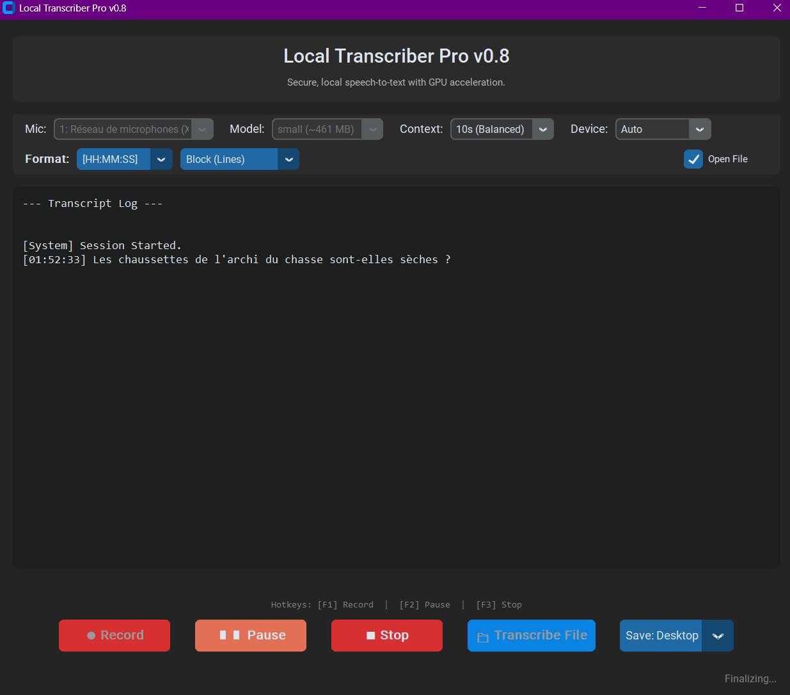

# Local Transcriber Pro 🎙️

[](https://github.com/vhaloo/LocalTranscriberPro/releases)
[](#-linux-setup)
[](#-mac-setup)




### **Reclaim Your Data. Restore Your Privacy.**

**Local Transcriber Pro is a tool for Digital Sovereignty.**
It breaks the chains of cloud dependency, bringing state-of-the-art AI directly to your own hardware. In an era of mass surveillance, data brokerage, and subscription fatigue, this application offers a sanctuary of absolute privacy.

**No Cloud. No Fees. No Internet required.**

---

## ✊ Core Philosophy & Features

*   **🛡️ Absolute Data Governance:** Your audio **never** leaves your physical machine. Whether you are a journalist protecting a source, a doctor handling patient data, or simply a private citizen, your data remains exclusively yours.
*   **🌱 Digital Ecology & Anti-Obsolescence:**
    *   **Sustainable Computing:** By utilizing the idle power of the hardware you *already own*, we reject the reliance on energy-hungry, always-on massive server farms.
    *   **Low-End Friendly:** Optimized to run on modest CPUs and older laptops (Intel/AMD), extending the lifespan of your devices and reducing electronic waste.
*   **🌍 Global Understanding (99 Languages):**
    *   The underlying AI (OpenAI Whisper) has been trained on **680,000 hours** of multilingual data.
    *   It fluently understands and transcribes **99 languages**, preserving dialects, accents, and technical jargon often ignored by commercial APIs.
*   **⚡ Zero-Latency Independence:** Once installed, unplug your ethernet cable. It works perfectly **offline**, ensuring your workflow is resilient to internet outages and bandwidth caps.

---

## 🛠️ Technical Capabilities

*   **🚀 Hardware Acceleration:**
    *   **NVIDIA CUDA:** Blazing fast transcription on Windows/Linux.
    *   **Apple Metal (MPS):** Native silicon support for M1/M2/M3 Macs.
*   **📂 File Transcription:** Drag & drop huge audio/video files (hours long) and let your machine process them in the background.
*   **🧠 Smart Optimization:** Automatically selects the best model ("Large" for accuracy, "Tiny" for speed) based on your hardware's capabilities.
*   **📝 Dynamic Formatting:** Switch between traditional timestamps, block paragraphs, or continuous stream text.

---

## 💻 System Requirements

| | **Minimum (CPU Mode)** | **Recommended (GPU Mode)** |
| :--- | :--- | :--- |
| **Philosophy** | *Accessibility & Longevity* | *Performance & Speed* |
| **Windows** | Intel i5 / AMD Ryzen 5<br>8GB RAM | NVIDIA GTX 1060+<br>16GB RAM |
| **Mac** | Intel MacBook (2018+)<br>8GB RAM | Apple M1 / M2 / M3<br>8GB RAM |
| **Linux** | Modern Quad-Core CPU<br>8GB RAM | NVIDIA GPU (CUDA 12)<br>16GB RAM |

---

## 📥 Installation (Choose One)

### Option 1: Automatic Web Installer (Recommended) 🏆
*The easiest way. It downloads and builds the app for you automatically.*

**Prerequisite:** [Download Python 3.12](https://www.python.org/downloads/release/python-3128/) (Check "Add to PATH" during install).

#### Windows
1.  **[Click here to download `Web_Builder.cmd`](https://github.com/vhaloo/LocalTranscriberPro/releases/latest/download/Web_Builder.cmd)**
2.  Double-click the downloaded file.
3.  Wait for the script to finish (~3GB download).
4.  The app will appear on your **Desktop**.

#### Linux / Raspberry Pi / Mac
Run this command in your terminal:
```bash
curl -sL https://github.com/vhaloo/LocalTranscriberPro/releases/latest/download/web_builder.sh | bash
```

### Option 2: Direct Download (Windows Standalone)
*If you prefer downloading the exe directly.*

1.  Go to the **[Releases Page](../../releases/latest)**.
2.  Download these **3 files**:
    *   `Merge_Installer_v0.8.cmd`
    *   `LocalTranscriberPro_v0.8.exe.001`
    *   `LocalTranscriberPro_v0.8.exe.002`
3.  Place them in the **same folder**.
4.  Double-click **`Merge_Installer_v0.8.cmd`**.
5.  Launch the resulting `LocalTranscriberPro.exe`.

### Option 3: Run from Source (Devs)

**Prerequisite:** [Python 3.12](https://www.python.org/downloads/release/python-3128/).

#### Windows
```bash
git clone https://github.com/vhaloo/LocalTranscriberPro.git
cd LocalTranscriberPro
create_installer.bat
```

#### Linux / macOS
```bash
git clone https://github.com/vhaloo/LocalTranscriberPro.git
cd LocalTranscriberPro
python3 -m venv venv
source venv/bin/activate
pip install torch torchvision torchaudio
pip install -r requirements.txt
python local_transcriber.py
```

---

## 📄 License
MIT License. Free to use and modify.
