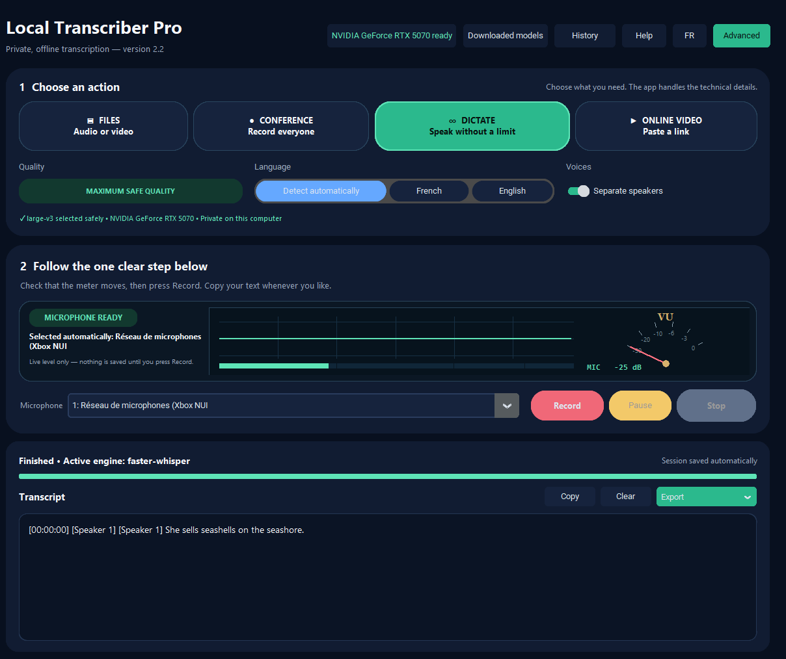

# Local Transcriber Pro 2.2

Private, offline transcription for Windows, macOS and Linux — with a genuinely simple interface when you want it and every professional control when you need it.

> Français : [lire la présentation française](#français)

## Simple interface / Interface simple



*Simple mode automatically selects the safest maximum quality, confirms the microphone visually and keeps the recording controls and transcript in one clear workspace. / Le mode simple choisit automatiquement la meilleure qualité sûre, confirme visuellement le microphone et réunit les commandes d’enregistrement et la transcription dans un seul espace clair.*

## What is new in 2.2

- **Crash-resistant automatic admission.** The app measures total and currently available RAM, free storage, CPU runtime, GPU runtime, total/free VRAM and architecture before admitting a model.
- **Unsafe models are visible but disabled.** Advanced mode shows the full catalogue, exact minimums and the reason an unavailable model is greyed out. A disabled model cannot be selected.
- **A second safety gate inside the engine.** Saved settings and changing system load are checked again immediately before model loading. If conditions changed, the engine safely chooses the best model that still fits.
- **Immediate startup feedback.** A responsive bilingual splash screen appears before heavy AI libraries load and explains memory, GPU and interface preparation step by step. Duplicate launches are blocked.
- **No missing FFmpeg surprise.** The platform-specific FFmpeg helper is now bundled for online-video extraction, alongside the Python, AI, audio and diarization runtimes already included.
- **Long operations explain themselves.** First model download, cache preparation, engine startup and safe fallback each have a plain-language status.
- **Record is armed before it is needed.** The maximum safe model loads during the startup splash. Changing a model or processor immediately preloads the replacement in the background.
- **Permanent session history.** Every completed job is indexed in the new History view, older exports are discovered automatically, and no Clear action deletes saved work.
- **Progressive recording safety.** Long microphone sessions continuously update TXT and JSON files under the user-owned `Documents/Transcriptions` folder before Stop is pressed.
- **Flexible readable text.** Advanced mode can switch between paragraphs and one phrase per line, with optional start times and durations in seconds.
- **Quality-first Simple mode.** Choosing Files, Conference, Dictation or Online Video automatically applies the largest safe model and the strongest stable accuracy settings for that computer.

## The 2.1 interface

- **A truly playful Simple mode.** Four large rounded choices lead to one clearly explained next step: Files, Conference, Endless Dictation or Online Video.
- **A live vintage recorder display.** The microphone card stays visible, confirms the automatically selected device, draws the waveform, lights a level bar and moves an analog VU needle before recording begins.
- **No technical quality decision in Simple mode.** The app chooses maximum stable quality automatically; Advanced mode still exposes the full catalogue and tuning controls.
- **Explanations everywhere.** Hover over the main controls to learn what they do; privacy and automatic choices are also stated directly on screen.

## The 2.0 foundation

- **Simple and Advanced interfaces.** Start with four clear tasks: files, conference, endless dictation or an online video. One button reveals every advanced setting.
- **Maximum local quality by default.** The default profile selects the largest safe model for the computer and prioritizes OpenAI Whisper `large-v3`. `large-v3-turbo` is available when speed matters more.
- **Every official Whisper size remains available.** Tiny, Base, Small, Medium, Large v1/v2/v3, Turbo and English-only variants.
- **Hardware-aware acceleration.** NVIDIA CUDA and CPU use `faster-whisper`/CTranslate2; Apple Silicon uses MLX when available. A PyTorch compatibility engine provides a safe GPU fallback.
- **Honest hardware proof.** The hardware panel shows the detected CPU, RAM, GPU, VRAM and which runtime is actually available — not merely whether a GPU name exists.
- **Useful ETA.** Before a file starts, the app estimates processing time from its duration and hardware. After one completed transcription it learns the measured speed of that model and computer.
- **English and French UI.** The first launch follows the operating-system language; language can be changed at any time.
- **Modern sessions.** Conference mode enables speaker labels, dictation runs without a time limit, files can be dropped in batches, online video audio can be downloaded explicitly, and History can reopen earlier work.
- **Complete exports.** Automatic TXT, SRT, VTT, JSON and CSV copies, editable transcript, one-click clipboard copy, crash recovery and smart subtitles beside videos.

All transcription remains local. The only network operations are the first download of a selected model and an online-video download explicitly requested by the user.

## Install

Download the package for your operating system from [GitHub Releases](https://github.com/vhaloo/LocalTranscriberPro/releases):

| System | Package | Minimum |
|---|---|---|
| Windows 11/10 x64 | `Windows-x64-Setup.exe` | 4 GB RAM for Tiny; NVIDIA GPU optional |
| macOS 12+ | `.dmg` | Apple Silicon recommended; Intel uses CPU fallback |
| Linux x86-64 | `.AppImage` or `.tar.gz` | Modern distribution, 4 GB RAM for Tiny |

The application is self-contained. Python, FFmpeg, AI runtimes and build tools do not need to be installed on the user's computer. Model weights are downloaded once, on demand, then reused offline. The Windows installer also shows a preflight page with detected RAM, free storage and every bundled prerequisite before copying files.

Unsigned community builds can trigger Windows SmartScreen or macOS Gatekeeper. Checksums are published as `SHA256SUMS.txt` with every 2.x release. Code-signing and notarization require maintainer certificates and are documented separately.

## Models and practical requirements

The values below are conservative working targets. Quantization and platform backends can change actual use.

| Model | Typical download | Recommended memory | Use |
|---|---:|---:|---|
| `large-v3`, `large-v2`, `large-v1` | ~3.1 GB | CPU: 12 GB RAM / GPU: 7 GB VRAM and 8 GB host RAM | Best local multilingual accuracy; v3 is the default when safe |
| `large-v3-turbo` | ~1.6 GB | CPU: 8 GB RAM / GPU: 5 GB VRAM and 5.2 GB host RAM | Much faster, small accuracy trade-off; no reliable speech translation |
| `medium` / `medium.en` | ~1.5 GB | CPU: 8 GB RAM / GPU: 4 GB VRAM and 5.2 GB host RAM | Strong quality on mid-range computers |
| `small` / `small.en` | ~0.5 GB | CPU: 5 GB RAM / GPU: 2 GB VRAM and 4 GB host RAM | Balanced quality and speed |
| `base` / `base.en` | ~0.15 GB | CPU: 4.5 GB RAM / GPU: 1 GB VRAM and 4 GB host RAM | Lightweight general use |
| `tiny` / `tiny.en` | ~0.08 GB | CPU: 3.5 GB RAM / GPU: 0.8 GB VRAM and 4 GB host RAM | Safe 4 GB-computer fallback; slow CPUs are supported |

The gate also requires currently available working memory and enough free space for a first download. Those live values and every decision are visible under **This computer** and **Models and minimum requirements**.

`gpt-4o-transcribe` is newer and more accurate than Whisper, but OpenAI currently provides it as a hosted API rather than downloadable local weights. Local Transcriber Pro therefore uses the strongest openly downloadable OpenAI checkpoint (`large-v3`) instead of pretending an API model is offline.

See [Hardware and model selection](docs/HARDWARE.md) for exact behavior.

## Preserved and expanded feature set

- live microphone recording, pause and stop shortcuts
- unlimited dictation and conference capture
- audio/video batch queue and drag-and-drop folders
- YouTube audio download and transcription
- automatic spoken-language detection and speech-to-English translation
- speaker diarization/labels
- silence removal (VAD) and repetition cleanup
- synchronized subtitles beside source videos
- model cache manager
- output-folder selection and open-on-complete
- permanent session history with earlier-export discovery
- progressive TXT/JSON recording saves in `Documents/Transcriptions`
- block/line layouts with optional timestamps and durations
- TXT, SRT, VTT, JSON and CSV export
- session autosave and recovery
- automatic CPU/GPU selection with manual override

## Developer setup

```powershell
py -3.12 -m venv .venv
.venv\Scripts\python -m pip install -r requirements-dev.txt
.venv\Scripts\python main.py
```

Speaker labeling adds the optional compatibility pack:

```powershell
.venv\Scripts\python -m pip install -r requirements-diarization.txt
```

Run the validation suite:

```powershell
.venv\Scripts\python -m ruff check main.py src tests
.venv\Scripts\python -m pytest
```

Build a Windows application folder:

```powershell
.\scripts\build_windows.ps1
```

Cross-platform packages are reproducibly built by `.github/workflows/desktop-build.yml`. Full instructions are in [Building and releasing](docs/BUILDING.md).

## Privacy and security

- No analytics, telemetry or cloud transcription is enabled by the app.
- TLS certificate verification is never disabled.
- Online downloads use an explicit YouTube host allowlist.
- Model deletion is restricted to known cache directories.
- The installer uses per-user installation and does not require administrator privileges.
- Release assets include SHA-256 checksums.

Read the complete [privacy and security note](docs/PRIVACY.md).

## Version 1 archive

The original 1.1 application remains permanently available at [`archive-v1.1-before-v2.0`](https://github.com/vhaloo/LocalTranscriberPro/releases/tag/archive-v1.1-before-v2.0) and the original [`v1.1`](https://github.com/vhaloo/LocalTranscriberPro/releases/tag/v1.1) release.

## Français

Local Transcriber Pro 2.2 transcrit des fichiers, des conférences, une dictée sans fin ou une vidéo en ligne, entièrement sur l'ordinateur. L'interface démarre automatiquement en français lorsque le système est français et peut basculer en anglais en un clic.

Le mode **Simple** propose quatre gros choix arrondis, puis une seule étape clairement expliquée. Un vumètre façon magnétophone montre en permanence que le microphone fonctionne, affiche son niveau en direct et confirme lorsque le microphone du système a été choisi automatiquement. Le mode **Avancé** redonne accès à tous les modèles, au choix CPU/GPU, à la langue parlée, à la traduction, aux personnes, aux silences, aux sous-titres et aux cinq formats d'export.

Le modèle choisi est maintenant chargé pendant l’écran de démarrage, puis rechargé automatiquement dès que le modèle ou le processeur change. Le bouton **Enregistrer** est donc normalement déjà armé. Si une préparation exceptionnelle reste nécessaire, un écran couvrant toute l’application explique clairement ce qui se passe.

Le nouvel **Historique** permet de revoir les sessions terminées et récupère aussi les anciens exports. Les enregistrements longs écrivent progressivement leur texte et leur JSON dans `Documents/Transcriptions`, sans attendre le bouton Arrêter. Le mode Avancé permet aussi de choisir blocs ou lignes, avec ou sans heure de départ et durée en secondes.

Le réglage par défaut **Qualité maximale (Auto)** choisit le plus gros modèle que la mémoire de l'ordinateur peut utiliser sans risque. Sur une machine adéquate, c'est `large-v3`, le plus gros modèle Whisper local d'OpenAI. Un ordinateur Windows 11 avec 4 Go de RAM reste pris en charge grâce au modèle Tiny, même si le traitement peut être lent.

La 2.2 vérifie aussi la RAM actuellement libre, le stockage, le moteur CPU, le moteur GPU ainsi que la VRAM totale et disponible. Le catalogue complet reste visible en mode Avancé, mais les modèles dangereux sont grisés avec une explication et ne peuvent pas être choisis. Un écran de démarrage immédiat détaille chaque étape pendant le chargement initial. Python, FFmpeg et les moteurs nécessaires sont déjà contenus dans les paquets.

Téléchargez l'installateur adapté dans les [releases GitHub](https://github.com/vhaloo/LocalTranscriberPro/releases). Au premier usage d'un modèle, son poids est téléchargé une seule fois; l'audio n'est jamais envoyé sur Internet.

## License

MIT — developed by [Vhaloo](https://github.com/vhaloo).
