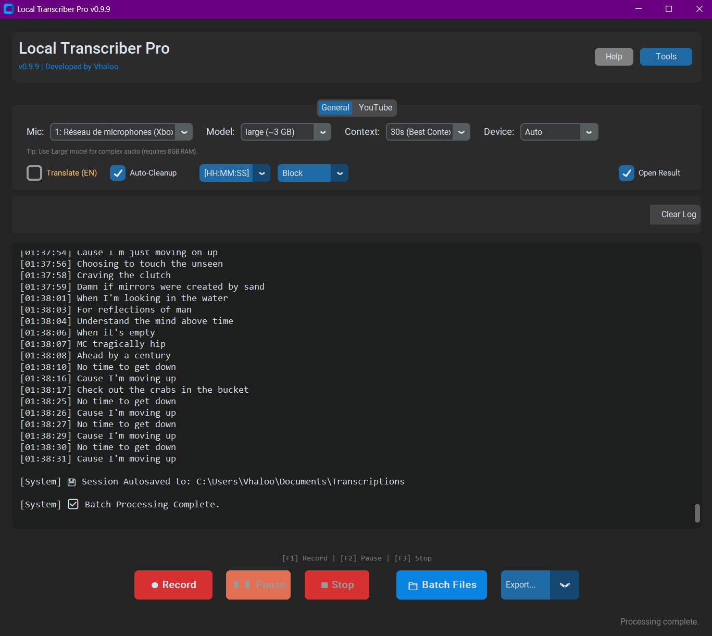

# Local Transcriber Pro 🎙️

[](https://github.com/vhaloo/LocalTranscriberPro/releases)
[](https://www.python.org/)


**Local Transcriber Pro** is a high-performance, private, and offline transcription tool developed by **Vhaloo**. It converts spoken audio from your microphone or existing files into text with extreme accuracy using OpenAI's Whisper models, running entirely on your own device.

LTP is the best choice for Windows users who want the "Professional" accuracy of the best voice recognition engine in the world (Exact same as ChatGPT), but with the privacy and zero-cost of local hardware and open-source software, with a one-click installation, on any computer.



---

## 🌟 Why Local Transcriber Pro?

### 🔒 **Uncompromised Privacy**
*   **100% Offline:** No data ever leaves your computer. No cloud APIs, no subscriptions, no tracking.
*   **Secure:** Perfect for confidential meetings, legal/medical dictation, or personal journals.

### 🎬 **Universal Subtitle Creator**
*   **Any Source:** Create subtitles for **ANY** video or audio file (Movies, TV Shows, Podcasts, Lectures).
*   **Export as .SRT:** Automatically generate time-synced subtitles for YouTube, VLC, or Premiere Pro.
*   **Batch Process:** Drag and drop an entire season of a show to subtitle it overnight.

### ⚡ **High Performance**
*   **GPU Acceleration:** Automatically detects NVIDIA GPUs (CUDA) for blazing fast transcription (up to 10x faster than CPU).
*   **Smart Queue:** Process unlimited files in the background without freezing your PC.

### 🚀 **Unbound Potential**
*   **No Limits:** Transcribe files of **ANY size or length**. From a 5-second voice memo to a 100-hour continuous recording.
*   **Universal Formats:** Supports virtually every audio and video format in existence. If it can be played, the app can transcribe it.
*   **AI Ready:** Perfect for processing massive "Brain dump" dictaphone recordings or week-long meeting logs to feed into LLMs (ChatGPT/Claude) for summarization and analysis.

---

## 🛠️ Features at a Glance

| Feature | Description |
| :--- | :--- |
| **Smart Subtitles** | **NEW!** Automatically creates `.srt` files next to videos for VLC. |
| **Drag & Drop** | **NEW!** Drag audio/video files into the window to start transcribing. |
| **YouTube Mode** | **NEW!** Paste a link to download & subtitle videos automatically. |
| **Autosave** | Sessions are automatically saved to `Documents/Transcriptions`. |
| **Live Recording** | Record meetings or ideas with a real-time waveform visualizer. |
| **Translation** | Instantly translate foreign audio into English text. |
| **Auto-Cleanup** | Smart AI filtering removes repetitive "hallucinations" and loops. |
| **Model Manager** | Easily manage disk space by deleting unused AI models. |
| **Formats** | Supports `.mp3`, `.wav`, `.mp4`, `.mkv`, `.mov`, `.flac`, and more. |

---

## 📥 Installation

### Option 1: One-Click Installer (Recommended for GPU)
This script will automatically download the latest version, check for prerequisites, and build the app optimized for your PC. **This is the only way to get full NVIDIA GPU (CUDA) acceleration.**

1.  **[Click here to download `Web_Builder.cmd`](https://github.com/vhaloo/LocalTranscriberPro/releases/latest/download/Web_Builder.cmd)**
2.  Double-click the downloaded file to install.
3.  The app will be placed directly on your **Desktop**.

*Note: If the installer fails to auto-detect your environment, ensure you have these installed:*
*   **[Python 3.12](https://www.python.org/downloads/release/python-3128/)** (Required - **IMPORTANT:** Tick "Add Python to PATH" during installation)
*   **[NVIDIA CUDA Toolkit 12.x](https://developer.nvidia.com/cuda-downloads)** (For NVIDIA GeForce users - highly recommended for speed)

### Option 2: Direct Download (CPU Only)
If you don't have an NVIDIA GPU or just want a quick setup without installing Python:
1.  **[Download `LocalTranscriberPro_v0.9.11_CPU_Only.exe`](https://github.com/vhaloo/LocalTranscriberPro/releases/download/v0.9.11/LocalTranscriberPro_v0.9.11_CPU_Only.exe)**
2.  Double-click to run.

⚠️ **CPU Version Limitations:**
*   **Speed:** Transcription is significantly slower (can take 5-10x longer than GPU).
*   **Resource Heavy:** High CPU usage during processing may slow down your computer.
*   **Models:** While it supports all models, the **"Large"** model may be extremely slow depending on your processor.
*   **No CUDA:** This version cannot utilize NVIDIA graphics cards even if they are present.

### Option 3: Command Line Installation (Windows)
For power users who prefer the terminal, run this single command in **Command Prompt (CMD)** to download and launch the installer:
```cmd
curl -sL https://github.com/vhaloo/LocalTranscriberPro/releases/latest/download/Web_Builder.cmd > LT_Installer.cmd && LT_Installer.cmd
```

### Option 4: Developer Setup (Build from Source)
If you want to contribute or modify the code:
1.  **Clone the Repo:**
    ```bash
    git clone https://github.com/vhaloo/LocalTranscriberPro.git
    cd LocalTranscriberPro
    ```
2.  **Setup Environment:**
    ```bash
    python -m venv venv
    call venv\Scripts\activate
    pip install -r requirements.txt
    ```
3.  **Run/Build:**
    *   To run: `python main.py`
    *   To build EXE: `build_exe.bat`

### 🍎 Mac Installation (Apple Silicon / Intel)
We provide scripts to easily build and run the app on macOS. This supports full hardware acceleration on M1/M2/M3 chips via Metal (MPS).

1.  **Clone the Repo:**
    ```bash
    git clone https://github.com/vhaloo/LocalTranscriberPro.git
    cd LocalTranscriberPro
    ```
2.  **Run Setup Script:**
    This script installs Python 3.12 (if missing), creates a virtual environment, and installs dependencies.
    ```bash
    chmod +x setup_mac.sh
    ./setup_mac.sh
    ```
3.  **Run the App:**
    ```bash
    source venv/bin/activate
    python main.py
    ```
4.  **Optional: Build Binary:**
    To create a standalone executable in the `dist/` folder:
    ```bash
    chmod +x build_mac.sh
    ./build_mac.sh
    ```

---

## 📖 User Guide

### 📺 YouTube Transcription
1.  Switch to the **"YouTube"** tab.
2.  Paste a video URL (e.g., `https://youtube.com/watch?v=...`).
3.  Click **Download & Transcribe**.
4.  The audio will be downloaded, processed, and the text will appear in the log.

### 🎙️ Live Recording
1.  Select your **Microphone** and **Model Size**. 
    *   **"Small"** is a good balance of speed and accuracy.
    *   **"Large"** offers the **most accurate** transcription (requires more VRAM/CPU).
2.  Click **Record** (or press `F1`).
3.  Speak! Text will appear in real-time blocks.
4.  Click **Stop** (`F3`) to finalize. The transcript is automatically saved to your Desktop.

### 📁 File Transcription & Subtitles
1.  Click **Batch Files**.
2.  Select one or more audio/video files (Shift+Click).
3.  The app will process them one by one.
4.  **Export:** Use the "Export..." menu to save as `.srt` (Subtitles) or `.txt` (Text).

---

## ❓ Troubleshooting

### **"This app can't run on your PC"**
*   **Cause:** This usually means the download was interrupted or the file is incomplete (0KB).
*   **Fix:** Re-run the `Web_Builder.cmd` installer. It includes an **Integrity Check** to ensure the build is complete before finishing.

### **"CUDA is not available / Running in CPU mode"**
*   **Cause:** The app cannot find an NVIDIA GPU or the correct drivers.
*   **Fix:** 
    1.  Ensure you have an NVIDIA GPU.
    2.  Update your GPU drivers via GeForce Experience.
    3.  Download and install the **[NVIDIA CUDA Toolkit 12.x](https://developer.nvidia.com/cuda-downloads)**.
    4.  Restart your computer.

### **"Antivirus flagged the file"**
*   **Cause:** This app is built with PyInstaller. Some antivirus software (like Windows Defender) generates "False Positives" for unsigned Python executables.
*   **Fix:** Add an exclusion for the folder where you keep the app, or click "Run Anyway" -> "More Info" if Windows SmartScreen blocks it. Since this is open source, you can verify the code yourself!

### **"Installer Failed"**
*   **Fix:** If `Web_Builder.cmd` fails, check your **Desktop** for a file named `LT_Install_Log.txt`. It contains the full error report to help diagnose the issue.

---

## 💻 Requirements
*   **OS:** Windows 10 or Windows 11 (64-bit).
*   **Processor:** Intel Core i5 / AMD Ryzen 5 or better.
*   **RAM:** 8GB recommended (4GB minimum).
*   **Storage:** ~500MB initial space + space for downloaded models (1GB-3GB).

---

## 👨‍💻 Developer
**Developed by Vhaloo**
*   [GitHub Profile](https://github.com/vhaloo)

---

## 📄 License
MIT License. Free to use, modify, and distribute.
