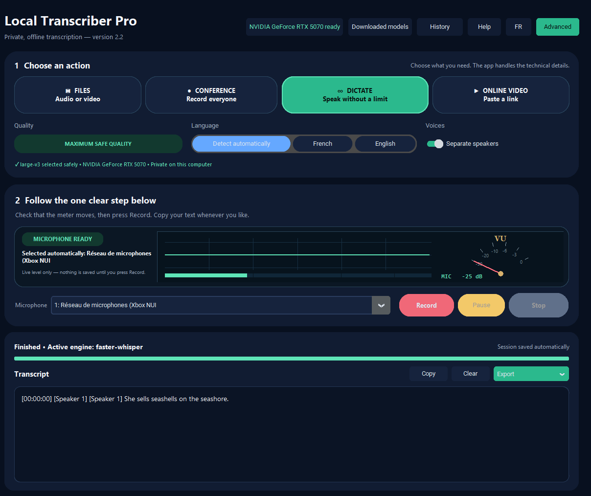

# Local Transcriber Pro 3.0

Private, offline transcription for Windows, macOS and Linux — with a genuinely simple interface when you want it and every professional control when you need it.

> **[↓ PRÉSENTATION COMPLÈTE EN FRANÇAIS ↓](#francais)**

## New in 3.0

- **Qwen3-ASR 1.7B and 0.6B**, with a local forced aligner. Accuracy automatically selects 1.7B when a compatible GPU has sufficient free memory; otherwise it chooses a smaller admitted engine. No cloud transcription.
- **Accuracy first** by default: the model selector ranks multilingual models and displays separate estimated accuracy and speed indices out of 10. English-only variants remain available at the end; these are indicative scores, not accuracy percentages.
- **Parakeet TDT 0.6B v3**, a multilingual int8 ONNX engine for fast CPU transcription. The Speed profile can use it without an NVIDIA GPU.
- **Every Whisper model remains available**, including speech-to-English translation and languages outside the newer engines' selected-language support. Translation automatically selects a compatible Whisper model; Turbo is excluded for translation.
- **Updates at startup**, plus a manual ↻ check. A newer official stable release is proposed, never forced. Accepting downloads the installer, verifies its exact size and SHA-256, saves the session, replaces the Windows application for the current user, then relaunches it. Offline startup remains usable. The option can be disabled in Advanced mode.
- **Safer long sessions**: bounded audio decoding, continuous WAV recording on disk, TXT/JSON checkpoints, serialized model changes, cancellation and safe closing. A corrupt batch file is reported while later files continue.
- **Useful editing**: corrections propagate to TXT/SRT/VTT/JSON/CSV, a vocabulary/context field guides Qwen and Whisper, and completed exports remain in History.

No model is best for every voice, accent, language or recording. The defaults combine current local engines with conservative resource checks. Qwen supports 30 languages; its word aligner supports 11, including French and English. Other Qwen languages receive approximate window timestamps. Parakeet supports 25 European languages. Select the spoken language explicitly when using languages outside these newer engines' coverage so Automatic can route to Whisper.

**Distribution status:** this branch contains the 3.0 source and Windows build recipe. The download links below intentionally refer to the previously published 2.2.0 release until a maintainer publishes 3.0. Never rename an older installer as 3.0. Windows has been validated locally; macOS and Linux builds require their own runtime validation before release.

**Shortcuts:** Ctrl+O opens files, Ctrl+S exports TXT, Ctrl+Shift+S exports SRT, Ctrl+Shift+R starts/stops dictation, Ctrl+P pauses/resumes, Esc cancels or stops the current task.

See [model selection](docs/HARDWARE.md), [updates](docs/UPDATES.md), and [validation](docs/VALIDATION_3.0.md).

## Simple interface

*Simple mode automatically selects the safest maximum quality, confirms the microphone visually and keeps the recording controls and transcript in one clear workspace.*

## Install — start here

You do **not** need to know how to program. You do **not** need to install Python, FFmpeg, CUDA or any other technical prerequisite. Choose the package for your computer, install it, then let Local Transcriber Pro configure itself.

### Step 1 — Download the correct file

1. Click the download link that matches your computer in the table below.
2. If your browser asks whether to save or keep the file, choose **Save** or **Keep**.
3. You can also open the [official Local Transcriber Pro Releases page](https://github.com/vhaloo/LocalTranscriberPro/releases/latest), expand **Assets** and select the same filename there.

| Your computer | File to download | Minimum |
|---|---|---|
| Windows 11 or Windows 10, 64-bit | **[Download for Windows](https://github.com/vhaloo/LocalTranscriberPro/releases/download/v2.2.0/LocalTranscriberPro-2.2.0-Windows-x64-Setup.exe)** <code>LocalTranscriberPro-2.2.0-Windows-x64-Setup.exe</code> | 4 GB RAM for Tiny; NVIDIA GPU optional |
| Mac with macOS 12 or newer | **[Download for macOS](https://github.com/vhaloo/LocalTranscriberPro/releases/download/v2.2.0/LocalTranscriberPro-2.2.0-macOS.dmg)** <code>LocalTranscriberPro-2.2.0-macOS.dmg</code> | Apple Silicon recommended; Intel uses the CPU |
| Linux, 64-bit | **[Download the Linux AppImage](https://github.com/vhaloo/LocalTranscriberPro/releases/download/v2.2.0/LocalTranscriberPro-2.2.0-Linux-x86_64.AppImage)** <code>LocalTranscriberPro-2.2.0-Linux-x86_64.AppImage</code> | Modern distribution and 4 GB RAM for Tiny |
| Linux portable archive | **[Download the Linux archive](https://github.com/vhaloo/LocalTranscriberPro/releases/download/v2.2.0/LocalTranscriberPro-2.2.0-Linux-x86_64.tar.gz)** <code>LocalTranscriberPro-2.2.0-Linux-x86_64.tar.gz</code> | Use only if AppImage is unsuitable |

Choose a file whose name begins with **LocalTranscriberPro**. The automatically generated **Source code** files are for developers and do not install the application.

### Step 2 — Install it

#### Windows

1. Open **Downloads** and double-click <code>LocalTranscriberPro-2.2.0-Windows-x64-Setup.exe</code>.
2. Windows may display a SmartScreen warning because this community application does not yet use a paid commercial signing certificate. Confirm that the file came from this repository. If Windows shows **Windows protected your PC**, click **More info**, then **Run anyway**.
3. The installer checks your RAM and free storage before copying anything. Read the summary, then continue with **Next** and **Install**.
4. No administrator password is normally required. The application is installed for your Windows account and can add a desktop shortcut.
5. Click **Finish** to launch Local Transcriber Pro.

#### macOS

1. Open **Downloads** and double-click <code>LocalTranscriberPro-2.2.0-macOS.dmg</code>.
2. Drag **Local Transcriber Pro** into the **Applications** folder shown in the window.
3. Open **Applications**, then double-click **Local Transcriber Pro**.
4. macOS may say that it cannot verify the developer. Control-click the application, choose **Open**, then choose **Open** again. You only need to approve this once.
5. Eject the Local Transcriber Pro disk image after the application opens.

#### Linux

1. Download <code>LocalTranscriberPro-2.2.0-Linux-x86_64.AppImage</code>.
2. Right-click the file, open **Properties**, then open **Permissions**.
3. Enable **Allow executing file as program**, or the equivalent option used by your distribution.
4. Double-click the AppImage.

If your file manager does not show that permission, open a terminal in the download folder and run:

    chmod +x LocalTranscriberPro-2.2.0-Linux-x86_64.AppImage
    ./LocalTranscriberPro-2.2.0-Linux-x86_64.AppImage

The <code>.tar.gz</code> package is a portable alternative: extract it, open the resulting <code>LocalTranscriberPro</code> folder and run the <code>LocalTranscriberPro</code> executable inside it.

### Step 3 — Complete the first launch

1. A startup screen appears immediately. **Do not double-click the application again.** It is detecting your CPU, memory and GPU, then preparing the best model that can run safely.
2. The interface follows the language of your operating system. Use **FR** or **EN** at the top to change it at any time.
3. The first use of a speech model requires an Internet connection while its files are downloaded. This can take several minutes. The status on screen explains every stage. The model is downloaded only once and is reused offline afterward.
4. If your system asks for microphone access, choose **Allow**. File transcription still works without it, but live recording cannot hear you.
5. Wait until the application says that the model and microphone are ready. Check that the level meter moves when you speak, then choose **Files**, **Conference**, **Dictate** or **Online video**.

Local Transcriber Pro automatically selects the largest model that fits safely. A powerful compatible GPU normally receives <code>qwen3-asr-1.7b</code>; a 4 GB computer falls back to Tiny. Quality and stability take priority over speed.

### Where your work is saved

- Completed and in-progress transcriptions are saved automatically under <code>Documents/Transcriptions</code>.
- **History** reopens earlier sessions.
- Model files are stored in the application cache and reused instead of being downloaded for every transcription.
- Your audio and transcription stay on this computer. Model downloads, requested online-video downloads and enabled update checks use the Internet. Audio is never sent for transcription.

### If the first launch seems slow

- The interface opens before the background model download/load finishes. It remains closeable. Loading a large model can take from a few seconds to several minutes on a small CPU.
- Keep enough free storage for the model: approximately 0.08 GB for Tiny up to 6.2 GB including the Qwen 1.7B aligner, plus temporary working space.
- If a model cannot run safely, the application disables it and selects a smaller one instead of risking a crash.
- Installation files are unsigned community builds. Every release includes <code>SHA256SUMS.txt</code> so advanced users can verify the downloads.

## What is new in 2.2

- **Crash-resistant automatic admission.** The app measures total and currently available RAM, free storage, CPU runtime, GPU runtime, total/free VRAM and architecture before admitting a model.
- **Unsafe models are visible but disabled.** Advanced mode shows the full catalogue, exact minimums and the reason an unavailable model is greyed out. A disabled model cannot be selected.
- **A second safety gate inside the engine.** Saved settings and changing system load are checked again immediately before model loading. If conditions changed, the engine safely chooses the best model that still fits.
- **Immediate startup feedback.** A responsive bilingual splash screen appears before heavy AI libraries load and explains memory, GPU and interface preparation step by step. Duplicate launches are blocked.
- **No missing FFmpeg surprise.** The platform-specific FFmpeg helper is bundled for online-video extraction, alongside the Python, AI, audio and diarization runtimes already included.
- **Long operations explain themselves.** First model download, cache preparation, engine startup and safe fallback each have a plain-language status.
- **Record is armed before it is needed.** The maximum safe model loads during the startup splash. Changing a model or processor immediately preloads the replacement in the background.
- **Permanent session history.** Every completed job is indexed in History, older exports are discovered automatically, and no Clear action deletes saved work.
- **Progressive recording safety.** Long microphone sessions continuously update TXT and JSON files under <code>Documents/Transcriptions</code> before Stop is pressed.
- **Flexible readable text.** Advanced mode can switch between paragraphs and one phrase per line, with optional start times and durations in seconds.
- **Quality-first Simple mode.** Choosing Files, Conference, Dictation or Online Video automatically applies the largest safe model and the strongest stable accuracy settings for that computer.

## The 2.1 interface

- **A truly playful Simple mode.** Four large rounded choices lead to one clearly explained next step: Files, Conference, Endless Dictation or Online Video.
- **A live vintage recorder display.** The microphone card stays visible, confirms the automatically selected device, draws the waveform, lights a level bar and moves an analog VU needle before recording begins.
- **No technical quality decision in Simple mode.** The app chooses maximum stable quality automatically; Advanced mode still exposes the full catalogue and tuning controls.
- **Explanations everywhere.** Hover over the main controls to learn what they do; privacy and automatic choices are also stated directly on screen.

## The 2.0 foundation

- **Simple and Advanced interfaces.** Start with four clear tasks: files, conference, endless dictation or an online video. One button reveals every advanced setting.
- **Maximum local quality by default.** The default profile selects the largest safe model for the computer and prioritizes OpenAI Whisper <code>large-v3</code>. <code>large-v3-turbo</code> is available when speed matters more.
- **Every official Whisper size remains available.** Tiny, Base, Small, Medium, Large v1/v2/v3, Turbo and English-only variants.
- **Hardware-aware acceleration.** NVIDIA CUDA and CPU use <code>faster-whisper</code>/CTranslate2; Apple Silicon uses MLX when available. A PyTorch compatibility engine provides a safe GPU fallback.
- **Honest hardware proof.** The hardware panel shows the detected CPU, RAM, GPU, VRAM and which runtime is actually available — not merely whether a GPU name exists.
- **Useful ETA.** Before a file starts, the app estimates processing time from its duration and hardware. After one completed transcription it learns the measured speed of that model and computer.
- **English and French UI.** The first launch follows the operating-system language; language can be changed at any time.
- **Modern sessions.** Conference mode enables speaker labels, dictation runs without a time limit, files can be dropped in batches, online video audio can be downloaded explicitly, and History can reopen earlier work.
- **Complete exports.** Automatic TXT, SRT, VTT, JSON and CSV copies, editable transcript, one-click clipboard copy, crash recovery and smart subtitles beside videos.

All transcription remains local. Network operations are model downloads, requested online-video downloads and enabled update checks/downloads.

## Models and practical requirements

The values below are conservative working targets. Quantization and platform backends can change actual use.

| Model | Typical download | Recommended memory | Use |
|---|---:|---:|---|
| <code>qwen3-asr-1.7b</code> | ~6.2 GB with aligner | GPU: 7.5 GB free VRAM / CPU manual: 20 GB RAM | Default accuracy on a compatible powerful GPU; 30 languages |
| <code>qwen3-asr-0.6b</code> | ~2.9 GB with aligner | GPU: 5.5 GB free VRAM / CPU manual: 12 GB RAM | Compact Qwen fallback; 30 languages |
| <code>parakeet-tdt-0.6b-v3</code> | ~0.64 GB | CPU: 4 GB RAM | Fast CPU transcription; 25 European languages |
| <code>large-v3</code>, <code>large-v2</code>, <code>large-v1</code> | ~3.1 GB | CPU: 12 GB RAM / GPU: 7 GB VRAM and 8 GB host RAM | Broad language coverage and speech translation; fallback for newer engines |
| <code>large-v3-turbo</code> | ~1.6 GB | CPU: 8 GB RAM / GPU: 5 GB VRAM and 5.2 GB host RAM | Much faster, small accuracy trade-off; no reliable speech translation |
| <code>medium</code> / <code>medium.en</code> | ~1.5 GB | CPU: 8 GB RAM / GPU: 4 GB VRAM and 5.2 GB host RAM | Strong quality on mid-range computers |
| <code>small</code> / <code>small.en</code> | ~0.5 GB | CPU: 5 GB RAM / GPU: 2 GB VRAM and 4 GB host RAM | Balanced quality and speed |
| <code>base</code> / <code>base.en</code> | ~0.15 GB | CPU: 4.5 GB RAM / GPU: 1 GB VRAM and 4 GB host RAM | Lightweight general use |
| <code>tiny</code> / <code>tiny.en</code> | ~0.08 GB | CPU: 3.5 GB RAM / GPU: 0.8 GB VRAM and 4 GB host RAM | Safe 4 GB-computer fallback; slow CPUs are supported |

The gate also requires currently available working memory and enough free space for a first download. Those live values and every decision are visible under **This computer** and **Models and minimum requirements**.

The OpenAI Whisper catalogue remains included. The new Qwen and NVIDIA Parakeet models are separate local engines, developed by their respective publishers. No OpenAI API key or paid transcription service is required.

See [Hardware and model selection](docs/HARDWARE.md) for exact behavior.

## Preserved and expanded feature set

- live microphone recording, pause and stop shortcuts
- unlimited dictation and conference capture
- audio/video batch queue and drag-and-drop folders
- YouTube audio download and transcription
- automatic spoken-language detection and speech-to-English translation
- speaker diarization/labels
- silence removal (VAD) and repetition cleanup
- synchronized subtitles beside source videos
- model cache manager
- output-folder selection and open-on-complete
- permanent session history with earlier-export discovery
- progressive TXT/JSON recording saves in <code>Documents/Transcriptions</code>
- block/line layouts with optional timestamps and durations
- TXT, SRT, VTT, JSON and CSV export
- session autosave and recovery
- automatic CPU/GPU selection with manual override

## Developer setup

    py -3.12 -m venv .venv
    ./.venv/Scripts/python -m pip install -r requirements-dev.txt
    ./.venv/Scripts/python main.py

Speaker labeling adds the optional compatibility pack:

    ./.venv/Scripts/python -m pip install -r requirements-diarization.txt

Run the validation suite:

    ./.venv/Scripts/python -m ruff check main.py src tests
    ./.venv/Scripts/python -m pytest

Build a Windows application folder:

    ./scripts/build_windows.ps1

Cross-platform packages are reproducibly built by <code>.github/workflows/desktop-build.yml</code>. Full instructions are in [Building and releasing](docs/BUILDING.md).

## Privacy and security

- No analytics, telemetry or cloud transcription is enabled by the app.
- TLS certificate verification is never disabled.
- Online downloads use an explicit YouTube host allowlist.
- Model deletion is restricted to known cache directories.
- The installer uses per-user installation and does not require administrator privileges.
- Release assets include SHA-256 checksums.

Read the complete [privacy and security note](docs/PRIVACY.md).

## Version 1 archive

The original 1.1 application remains permanently available at [<code>archive-v1.1-before-v2.0</code>](https://github.com/vhaloo/LocalTranscriberPro/releases/tag/archive-v1.1-before-v2.0) and the original [<code>v1.1</code>](https://github.com/vhaloo/LocalTranscriberPro/releases/tag/v1.1) release.

## License

MIT — developed by [Vhaloo](https://github.com/vhaloo).

---

# LOCAL TRANSCRIBER PRO 3.0 — FRANÇAIS

Transcription privée et hors ligne pour Windows, macOS et Linux — avec une interface réellement simple quand vous le souhaitez et tous les réglages professionnels quand vous en avez besoin.

> **[↑ BACK TO THE ENGLISH VERSION / RETOUR À LA VERSION ANGLAISE ↑](#local-transcriber-pro-30)**

## Nouveautés de la 3.0

- **Qwen3-ASR 1.7B et 0.6B**, avec alignement local des mots. Précision sélectionne automatiquement 1.7B lorsqu'un GPU compatible possède assez de mémoire libre, puis un moteur plus léger si nécessaire.
- **Priorité à la précision** par défaut : la liste classe les modèles multilingues et affiche deux indices estimés sur 10, précision et rapidité. Les variantes anglaises restent disponibles à la fin. Ces indices sont indicatifs et ne sont pas des pourcentages de réussite.
- **Parakeet TDT 0.6B v3**, moteur multilingue ONNX int8 pour transcrire rapidement sur CPU. Le profil Rapidité peut l'utiliser sans GPU NVIDIA.
- **Tous les modèles Whisper sont conservés**, avec traduction vers l'anglais et langues complémentaires. Traduire choisit automatiquement un modèle Whisper compatible ; Turbo est exclu pour cette tâche.
- **Vérification des mises à jour au démarrage** et bouton ↻. Une nouvelle version stable officielle est proposée. Accepter télécharge l'installateur, vérifie sa taille et son SHA-256, sauvegarde la session, remplace l'application Windows pour ce compte et la relance. Une connexion indisponible ne bloque pas l'application. L'option se désactive en mode Avancé.
- **Sessions longues plus robustes** : décodage par fenêtres, WAV écrit progressivement sur disque, sauvegardes TXT/JSON, changements de modèle sérialisés, annulation et fermeture avec sauvegarde. Un fichier défectueux n'interrompt plus les fichiers suivants du lot.
- **Édition pratique** : corrections reprises dans les cinq formats d'export, vocabulaire/contexte pour guider Qwen et Whisper, historique conservé.

Aucun modèle ne gagne sur toutes les voix, langues ou conditions d'enregistrement. Qwen couvre 30 langues ; son alignement précis des mots en couvre 11, dont le français et l'anglais. Les autres langues Qwen reçoivent des heures approximatives par fenêtre. Parakeet couvre 25 langues européennes. Pour les langues complémentaires, sélectionnez explicitement la langue parlée afin que le mode Automatique utilise Whisper.

**Disponibilité :** cette branche contient le code 3.0 et la procédure de construction Windows. Les liens ci-dessous pointent vers la version publique précédente, 2.2.0, tant qu'une release 3.0 n'est pas publiée. La version Windows a été vérifiée localement ; macOS et Linux restent à valider avant publication.

**Raccourcis :** Ctrl+O ouvre des fichiers, Ctrl+S exporte TXT, Ctrl+Shift+S exporte SRT, Ctrl+Shift+R démarre/arrête la dictée, Ctrl+P met en pause/reprend, Échap annule ou arrête la tâche.

Consultez [les modèles](docs/HARDWARE.md), [les mises à jour](docs/UPDATES.md) et [la validation](docs/VALIDATION_3.0.md).

## Interface simple

*Le mode simple choisit automatiquement la meilleure qualité sûre, confirme visuellement le microphone et réunit les commandes d’enregistrement et la transcription dans un seul espace clair.*

## Installation — commencez ici

Vous n’avez **pas** besoin de savoir programmer. Vous n’avez **pas** besoin d’installer Python, FFmpeg, CUDA ni aucun autre prérequis technique. Choisissez le paquet correspondant à votre ordinateur, installez-le, puis laissez Local Transcriber Pro se configurer automatiquement.

### Étape 1 — Téléchargez le bon fichier

1. Cliquez dans le tableau ci-dessous sur le lien de téléchargement correspondant à votre ordinateur.
2. Si votre navigateur demande s’il faut enregistrer ou conserver le fichier, choisissez **Enregistrer** ou **Conserver**.
3. Vous pouvez également ouvrir la [page officielle des releases de Local Transcriber Pro](https://github.com/vhaloo/LocalTranscriberPro/releases/latest), déplier **Assets** et y sélectionner le même nom de fichier.

| Votre ordinateur | Fichier à télécharger | Minimum |
|---|---|---|
| Windows 11 ou Windows 10, 64 bits | **[Télécharger pour Windows](https://github.com/vhaloo/LocalTranscriberPro/releases/download/v2.2.0/LocalTranscriberPro-2.2.0-Windows-x64-Setup.exe)** <code>LocalTranscriberPro-2.2.0-Windows-x64-Setup.exe</code> | 4 Go de RAM pour Tiny; GPU NVIDIA facultatif |
| Mac avec macOS 12 ou plus récent | **[Télécharger pour macOS](https://github.com/vhaloo/LocalTranscriberPro/releases/download/v2.2.0/LocalTranscriberPro-2.2.0-macOS.dmg)** <code>LocalTranscriberPro-2.2.0-macOS.dmg</code> | Apple Silicon recommandé; Intel utilise le CPU |
| Linux, 64 bits | **[Télécharger l’AppImage Linux](https://github.com/vhaloo/LocalTranscriberPro/releases/download/v2.2.0/LocalTranscriberPro-2.2.0-Linux-x86_64.AppImage)** <code>LocalTranscriberPro-2.2.0-Linux-x86_64.AppImage</code> | Distribution moderne et 4 Go de RAM pour Tiny |
| Archive Linux portable | **[Télécharger l’archive Linux](https://github.com/vhaloo/LocalTranscriberPro/releases/download/v2.2.0/LocalTranscriberPro-2.2.0-Linux-x86_64.tar.gz)** <code>LocalTranscriberPro-2.2.0-Linux-x86_64.tar.gz</code> | À utiliser seulement si AppImage ne convient pas |

Choisissez un fichier dont le nom commence par **LocalTranscriberPro**. Les fichiers **Source code** générés automatiquement sont destinés aux développeurs et n’installent pas l’application.

### Étape 2 — Installez l’application

#### Windows

1. Ouvrez **Téléchargements** et double-cliquez sur <code>LocalTranscriberPro-2.2.0-Windows-x64-Setup.exe</code>.
2. Windows peut afficher un avertissement SmartScreen parce que cette application communautaire n’utilise pas encore de certificat commercial payant. Vérifiez que le fichier vient bien de ce dépôt. Si Windows affiche **Windows a protégé votre ordinateur**, cliquez sur **Informations complémentaires**, puis sur **Exécuter quand même**.
3. L’installateur vérifie votre mémoire vive et votre espace libre avant de copier quoi que ce soit. Lisez le résumé, puis continuez avec **Suivant** et **Installer**.
4. Aucun mot de passe administrateur n’est normalement nécessaire. L’application est installée pour votre compte Windows et peut ajouter un raccourci au bureau.
5. Cliquez sur **Terminer** pour lancer Local Transcriber Pro.

#### macOS

1. Ouvrez **Téléchargements** et double-cliquez sur <code>LocalTranscriberPro-2.2.0-macOS.dmg</code>.
2. Faites glisser **Local Transcriber Pro** vers le dossier **Applications** affiché dans la fenêtre.
3. Ouvrez **Applications**, puis double-cliquez sur **Local Transcriber Pro**.
4. macOS peut indiquer qu’il ne peut pas vérifier le développeur. Faites un clic avec la touche Contrôle sur l’application, choisissez **Ouvrir**, puis choisissez encore **Ouvrir**. Cette autorisation n’est nécessaire qu’une seule fois.
5. Éjectez l’image disque Local Transcriber Pro après l’ouverture de l’application.

#### Linux

1. Téléchargez <code>LocalTranscriberPro-2.2.0-Linux-x86_64.AppImage</code>.
2. Faites un clic droit sur le fichier, ouvrez **Propriétés**, puis **Permissions**.
3. Activez **Autoriser l’exécution du fichier comme un programme**, ou l’option équivalente de votre distribution.
4. Double-cliquez sur l’AppImage.

Si votre gestionnaire de fichiers n’affiche pas cette autorisation, ouvrez un terminal dans le dossier de téléchargement et exécutez :

    chmod +x LocalTranscriberPro-2.2.0-Linux-x86_64.AppImage
    ./LocalTranscriberPro-2.2.0-Linux-x86_64.AppImage

Le paquet <code>.tar.gz</code> est une solution portable de remplacement : décompressez-le, ouvrez le dossier <code>LocalTranscriberPro</code> obtenu et lancez l’exécutable <code>LocalTranscriberPro</code> qu’il contient.

### Étape 3 — Terminez le premier lancement

1. Un écran de démarrage apparaît immédiatement. **Ne double-cliquez pas une deuxième fois sur l’application.** Elle détecte votre processeur, votre mémoire et votre GPU, puis prépare le meilleur modèle capable de fonctionner sans risque.
2. L’interface suit la langue de votre système d’exploitation. Utilisez **FR** ou **EN** en haut de la fenêtre pour changer de langue à tout moment.
3. La première utilisation d’un modèle vocal nécessite une connexion Internet pendant le téléchargement de ses fichiers. Cela peut prendre plusieurs minutes. L’état affiché à l’écran explique chaque étape. Le modèle n’est téléchargé qu’une seule fois et sera ensuite réutilisé hors ligne.
4. Si votre système demande l’autorisation d’utiliser le microphone, choisissez **Autoriser**. La transcription de fichiers fonctionne toujours sans cette permission, mais l’enregistrement en direct ne peut pas vous entendre.
5. Attendez que l’application indique que le modèle et le microphone sont prêts. Vérifiez que le vumètre bouge lorsque vous parlez, puis choisissez **Fichiers**, **Conférence**, **Dicter** ou **Vidéo en ligne**.

Local Transcriber Pro sélectionne automatiquement le plus gros modèle qui peut fonctionner sans risque. Un GPU puissant et compatible reçoit normalement <code>qwen3-asr-1.7b</code>; un ordinateur avec 4 Go de RAM se replie sur Tiny. La qualité et la stabilité sont prioritaires sur la vitesse.

### Où votre travail est enregistré

- Les transcriptions terminées et en cours sont enregistrées automatiquement dans <code>Documents/Transcriptions</code>.
- **Historique** permet de rouvrir les sessions précédentes.
- Les fichiers des modèles sont conservés dans le cache de l’application et réutilisés au lieu d’être téléchargés à chaque transcription.
- Votre audio et votre transcription restent sur cet ordinateur. Les téléchargements de modèles, les vidéos demandées et la vérification activée des mises à jour utilisent Internet. L’audio n’est jamais envoyé pour être transcrit.

### Si le premier lancement semble lent

- L’interface s’ouvre avant la fin du téléchargement/chargement du modèle en arrière-plan et reste fermable. Le chargement d’un gros modèle peut demander de quelques secondes à plusieurs minutes sur un petit processeur.
- Conservez assez d’espace libre pour le modèle : environ 0,08 Go pour Tiny jusqu’à 6,2 Go avec l’alignement Qwen 1.7B, en plus de l’espace de travail temporaire.
- Si un modèle ne peut pas fonctionner sans risque, l’application le désactive et en choisit un plus petit au lieu de risquer un plantage.
- Les fichiers d’installation sont des versions communautaires non signées. Chaque release comprend <code>SHA256SUMS.txt</code> afin que les utilisateurs avancés puissent vérifier les téléchargements.

## Nouveautés de la 2.2

- **Admission automatique résistante aux plantages.** L’application mesure la RAM totale et actuellement disponible, le stockage libre, le moteur CPU, le moteur GPU, la VRAM totale et libre ainsi que l’architecture avant d’autoriser un modèle.
- **Les modèles dangereux restent visibles, mais sont désactivés.** Le mode Avancé affiche le catalogue complet, les minimums exacts et la raison pour laquelle un modèle indisponible est grisé. Un modèle désactivé ne peut pas être sélectionné.
- **Une deuxième barrière de sécurité dans le moteur.** Les réglages enregistrés et la charge changeante du système sont vérifiés de nouveau juste avant le chargement du modèle. Si les conditions ont changé, le moteur choisit sans risque le meilleur modèle qui tient encore en mémoire.
- **Retour immédiat au démarrage.** Un écran de démarrage bilingue et réactif apparaît avant le chargement des lourdes bibliothèques d’IA et explique étape par étape la préparation de la mémoire, du GPU et de l’interface. Les doubles lancements sont bloqués.
- **Plus de mauvaise surprise liée à FFmpeg.** L’outil FFmpeg propre à la plateforme est inclus pour extraire les vidéos en ligne, avec les moteurs Python, IA, audio et d’identification des personnes déjà fournis.
- **Les opérations longues s’expliquent.** Le premier téléchargement du modèle, la préparation du cache, le démarrage du moteur et le repli sûr possèdent chacun un message en langage clair.
- **L’enregistrement est armé avant d’être nécessaire.** Le meilleur modèle sûr est chargé pendant l’écran de démarrage. Changer de modèle ou de processeur précharge immédiatement son remplaçant en arrière-plan.
- **Historique permanent des sessions.** Chaque tâche terminée est indexée dans Historique, les anciens exports sont découverts automatiquement et aucune action Effacer ne supprime le travail enregistré.
- **Sécurité progressive des enregistrements.** Les longues sessions au microphone actualisent continuellement leurs fichiers TXT et JSON dans <code>Documents/Transcriptions</code>, avant même d’appuyer sur Arrêter.
- **Texte lisible et flexible.** Le mode Avancé peut alterner entre des paragraphes et une phrase par ligne, avec des heures de départ et des durées en secondes facultatives.
- **Le mode Simple donne la priorité à la qualité.** Choisir Fichiers, Conférence, Dictée ou Vidéo en ligne applique automatiquement le plus gros modèle sûr et les réglages de précision stables les plus élevés pour cet ordinateur.

## L’interface de la 2.1

- **Un mode Simple réellement ludique.** Quatre grands choix arrondis conduisent à une seule prochaine étape clairement expliquée : Fichiers, Conférence, Dictée sans fin ou Vidéo en ligne.
- **Un affichage d’enregistreur rétro en direct.** La carte du microphone reste visible, confirme le périphérique sélectionné automatiquement, dessine la forme d’onde, allume une barre de niveau et déplace l’aiguille d’un vumètre analogique avant même le début de l’enregistrement.
- **Aucune décision technique de qualité en mode Simple.** L’application choisit automatiquement la qualité stable maximale; le mode Avancé expose toujours le catalogue complet et les réglages fins.
- **Des explications partout.** Survolez les commandes principales pour apprendre ce qu’elles font; la confidentialité et les choix automatiques sont également indiqués directement à l’écran.

## Les fondations de la 2.0

- **Interfaces Simple et Avancée.** Commencez avec quatre tâches claires : fichiers, conférence, dictée sans fin ou vidéo en ligne. Un bouton révèle tous les réglages avancés.
- **Qualité locale maximale par défaut.** Le profil par défaut sélectionne le plus gros modèle sûr pour l’ordinateur et donne la priorité à OpenAI Whisper <code>large-v3</code>. <code>large-v3-turbo</code> reste disponible lorsque la vitesse compte davantage.
- **Toutes les tailles officielles de Whisper restent disponibles.** Tiny, Base, Small, Medium, Large v1/v2/v3, Turbo et leurs variantes uniquement anglaises.
- **Accélération adaptée au matériel.** NVIDIA CUDA et le CPU utilisent <code>faster-whisper</code>/CTranslate2; Apple Silicon utilise MLX lorsqu’il est disponible. Un moteur de compatibilité PyTorch fournit un repli GPU sûr.
- **Preuve honnête du matériel.** Le panneau matériel affiche le CPU, la RAM, le GPU et la VRAM détectés ainsi que le moteur réellement disponible — pas seulement la présence d’un nom de GPU.
- **Estimation utile du temps.** Avant de commencer un fichier, l’application estime la durée du traitement à partir de sa durée et du matériel. Après une transcription terminée, elle apprend la vitesse mesurée de ce modèle sur cet ordinateur.
- **Interface anglaise et française.** Le premier lancement suit la langue du système d’exploitation; la langue peut être modifiée à tout moment.
- **Sessions modernes.** Le mode Conférence active les étiquettes de personnes, la dictée fonctionne sans limite de temps, les fichiers peuvent être déposés par lots, l’audio d’une vidéo en ligne peut être téléchargé explicitement et Historique peut rouvrir un ancien travail.
- **Exports complets.** Copies automatiques TXT, SRT, VTT, JSON et CSV, transcription modifiable, copie dans le presse-papiers en un clic, récupération après plantage et sous-titres intelligents à côté des vidéos.

Les transcriptions restent locales. Le réseau sert aux modèles, aux vidéos demandées et aux vérifications ou téléchargements de mises à jour activés.

## Modèles et prérequis pratiques

Les valeurs ci-dessous sont des objectifs de fonctionnement prudents. La quantification et les moteurs propres à chaque plateforme peuvent modifier l’utilisation réelle.

| Modèle | Téléchargement typique | Mémoire recommandée | Utilisation |
|---|---:|---:|---|
| <code>qwen3-asr-1.7b</code> | ~6,2 Go avec alignement | GPU : 7,5 Go de VRAM libre / CPU manuel : 20 Go de RAM | Précision par défaut sur GPU puissant compatible ; 30 langues |
| <code>qwen3-asr-0.6b</code> | ~2,9 Go avec alignement | GPU : 5,5 Go de VRAM libre / CPU manuel : 12 Go de RAM | Repli Qwen compact ; 30 langues |
| <code>parakeet-tdt-0.6b-v3</code> | ~0,64 Go | CPU : 4 Go de RAM | Transcription CPU rapide ; 25 langues européennes |
| <code>large-v3</code>, <code>large-v2</code>, <code>large-v1</code> | ~3,1 Go | CPU : 12 Go de RAM / GPU : 7 Go de VRAM et 8 Go de RAM | Large couverture linguistique et traduction ; complément des nouveaux moteurs |
| <code>large-v3-turbo</code> | ~1,6 Go | CPU : 8 Go de RAM / GPU : 5 Go de VRAM et 5,2 Go de RAM | Beaucoup plus rapide, avec une petite perte de précision; pas de traduction vocale fiable |
| <code>medium</code> / <code>medium.en</code> | ~1,5 Go | CPU : 8 Go de RAM / GPU : 4 Go de VRAM et 5,2 Go de RAM | Grande qualité sur les ordinateurs intermédiaires |
| <code>small</code> / <code>small.en</code> | ~0,5 Go | CPU : 5 Go de RAM / GPU : 2 Go de VRAM et 4 Go de RAM | Bon équilibre entre qualité et vitesse |
| <code>base</code> / <code>base.en</code> | ~0,15 Go | CPU : 4,5 Go de RAM / GPU : 1 Go de VRAM et 4 Go de RAM | Usage général léger |
| <code>tiny</code> / <code>tiny.en</code> | ~0,08 Go | CPU : 3,5 Go de RAM / GPU : 0,8 Go de VRAM et 4 Go de RAM | Repli sûr pour les ordinateurs de 4 Go; les CPU lents sont pris en charge |

La barrière de sécurité exige également assez de mémoire de travail actuellement disponible et suffisamment d’espace libre pour un premier téléchargement. Ces valeurs en direct et chaque décision sont visibles sous **Cet ordinateur** et **Modèles et prérequis minimums**.

Le catalogue OpenAI Whisper reste inclus. Qwen et NVIDIA Parakeet sont des moteurs locaux distincts, développés par leurs éditeurs respectifs. Aucune clé API OpenAI ni aucun service payant de transcription n’est nécessaire.

Consultez [Matériel et sélection du modèle](docs/HARDWARE.md) pour connaître le comportement exact.

## Fonctionnalités conservées et enrichies

- enregistrement du microphone en direct, pause et raccourcis d’arrêt
- dictée sans limite et enregistrement de conférences
- file de fichiers audio/vidéo et dépôt de dossiers par glisser-déposer
- téléchargement et transcription de l’audio YouTube
- détection automatique de la langue parlée et traduction de la parole vers l’anglais
- identification et étiquettes des personnes
- suppression des silences (VAD) et nettoyage des répétitions
- sous-titres synchronisés à côté des vidéos sources
- gestionnaire du cache des modèles
- sélection du dossier de sortie et ouverture à la fin
- historique permanent des sessions avec découverte des anciens exports
- sauvegardes progressives TXT/JSON dans <code>Documents/Transcriptions</code>
- présentations en blocs ou en lignes avec heures et durées facultatives
- exports TXT, SRT, VTT, JSON et CSV
- sauvegarde automatique et récupération des sessions
- sélection automatique CPU/GPU avec remplacement manuel

## Configuration pour les développeurs

    py -3.12 -m venv .venv
    ./.venv/Scripts/python -m pip install -r requirements-dev.txt
    ./.venv/Scripts/python main.py

L’identification des personnes ajoute le paquet de compatibilité facultatif :

    ./.venv/Scripts/python -m pip install -r requirements-diarization.txt

Lancez la suite de validation :

    ./.venv/Scripts/python -m ruff check main.py src tests
    ./.venv/Scripts/python -m pytest

Construisez un dossier d’application Windows :

    ./scripts/build_windows.ps1

Les paquets multiplateformes sont construits de manière reproductible par <code>.github/workflows/desktop-build.yml</code>. Les instructions complètes se trouvent dans [Construction et publication](docs/BUILDING.md).

## Confidentialité et sécurité

- Aucune analytique, télémétrie ni transcription dans le nuage n’est activée par l’application.
- La vérification des certificats TLS n’est jamais désactivée.
- Les téléchargements en ligne utilisent une liste d’hôtes YouTube explicitement autorisés.
- La suppression des modèles est limitée aux dossiers de cache connus.
- L’installateur fonctionne par utilisateur et ne nécessite pas de privilèges administrateur.
- Les fichiers des releases comprennent des sommes de contrôle SHA-256.

Lisez la [note complète sur la confidentialité et la sécurité](docs/PRIVACY.md).

## Archive de la version 1

L’application 1.1 originale reste disponible de façon permanente dans [<code>archive-v1.1-before-v2.0</code>](https://github.com/vhaloo/LocalTranscriberPro/releases/tag/archive-v1.1-before-v2.0) ainsi que dans la release originale [<code>v1.1</code>](https://github.com/vhaloo/LocalTranscriberPro/releases/tag/v1.1).

## Licence

MIT — développé par [Vhaloo](https://github.com/vhaloo).
