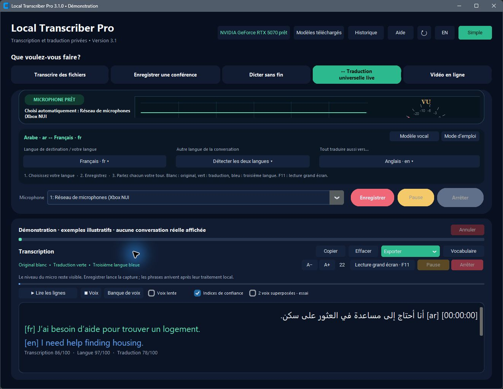

# Local Transcriber Pro 3.1.0

**Private transcription. Offline conversation translation. Readable, speakable results.**

[Français](#francais) · [Download Windows 3.1.0](https://github.com/vhaloo/LocalTranscriberPro/releases/download/v3.1.0/LocalTranscriberPro-3.1.0-Windows-x64-Setup.exe) · [All releases](https://github.com/vhaloo/LocalTranscriberPro/releases) · [Conversation guide](docs/TRANSLATION.md) · [Complete language list and measured error rates](#langues) · [Validation](docs/VALIDATION_3.1.md)



*Real Windows application, illustrative demonstration text. No private conversation is shown.*

Local Transcriber Pro turns microphone recordings, audio/video files and explicitly requested online videos into text on your own computer. Version 3.1 adds **Universal live translation**: original speech in white, translation underneath in green, an optional third language in blue, automatic two-language routing, local speech playback and a large reading view.

No API key, subscription or cloud inference is required. Download speech/translation models once; prepared models work offline. English and French reading voices are included in the desktop packages. Other voices are downloaded individually with your acceptance.

## Install

| Platform | Recommended package | Status |
|---|---|---|
| Windows 10/11 x64 | [3.1.0 installer](https://github.com/vhaloo/LocalTranscriberPro/releases/download/v3.1.0/LocalTranscriberPro-3.1.0-Windows-x64-Setup.exe) | Self-contained, per-user installation; CUDA and CPU runtimes included |
| macOS, Apple Silicon (arm64) | [3.1.0 experimental DMG](https://github.com/vhaloo/LocalTranscriberPro/releases/download/v3.1.0/LocalTranscriberPro-3.1.0-macOS-arm64-experimental.dmg) | Experimental; macOS 14 recommended, automated CPU/voice checks; no Intel package |
| Linux x86-64 | [3.1.0 experimental AppImage](https://github.com/vhaloo/LocalTranscriberPro/releases/download/v3.1.0/LocalTranscriberPro-3.1.0-Linux-x86_64-experimental.AppImage) · [Portable archive](https://github.com/vhaloo/LocalTranscriberPro/releases/download/v3.1.0/LocalTranscriberPro-3.1.0-Linux-x86_64-experimental.tar.gz) | Experimental; built and checked on Ubuntu 24.04; other distributions unverified |

**macOS/Linux are experimental distributions.** Native CPU recognition and bundled French/English voices pass automated checks, but physical installation, microphones and GPU acceleration have not been validated on these platforms. The Mac app has an ad-hoc signature and is not Apple-notarized. [Installation, first launch and known limits](docs/EXPERIMENTAL_DESKTOP_3.1.md). Windows retains its validated stable installer.

Run the Windows installer, then choose **Files**, **Conference**, **Dictation**, **Universal live translation**, or **Online video**. Python, FFmpeg and a CUDA toolkit do not need separate installation. An installed NVIDIA driver is still needed for NVIDIA acceleration. Allow storage for the application runtime and selected models. The first download can take several minutes; the interface stays responsive and explains preparation.

Windows checks the official GitHub release at startup and proposes a newer stable version. Accepting downloads and verifies its size and SHA-256, saves the session, installs and relaunches. The check can be disabled. macOS/Linux currently open the release page for manual installation. [How updates work](docs/UPDATES.md).

## Universal live translation

1. Choose your destination language and, optionally, the other person's language. Both selectors are searchable.
2. Leave the conversation partner on **Detect both languages** when unknown. The first two sufficiently confident supported detections form the conversation pair; each side then translates into the other language. You can fix the pair manually before recording.
3. Optionally select **Also translate everything into…** for a third-language record.
4. Record and take turns. The app ends a speech chunk after a pause, shows the original before translation, and displays capture/processing/queue status.
5. Use **A− / A+**, **F11** or **Escape** for a readable, adjustable conversation view. Select lines and choose **Read lines**, or right-click to read/replay audio.

The default multilingual profile favors Omnilingual CTC 1B v2 on a compatible computer, falling back to the strongest compatible Whisper model. **Omnilingual CTC 1B v2** adds 1,600+ language recognition for broader coverage. Choosing a conversation language outside Whisper's language list selects Omnilingual when the computer can run it. Its separate GlotLID v3 text detector covers 2,000+ language/script labels; recognition and automatic identification have distinct coverage and limitations. Recognition, translation and speech synthesis have different coverage and quality. [Language coverage and priorities](docs/LANGUAGES.md).

The translation catalogue exposes **452 MADLAD language tokens/variants**. This is a catalogue count, not a claim of equal accuracy in 452 languages. Short speech, code-switching, dialects, names, numbers, noisy microphones and underrepresented languages can fail. Our small tests include Haitian Creole, South Asian and African languages, East/Southeast Asian languages and eight Arabic dialect groups; results and weaknesses are published in the [validation report](docs/VALIDATION_3.1.md).

[Every supported language, model coverage, voice and available measurement is listed in this README](#langues). Per-language semantic reliability percentages have not been established; unmeasured entries are labelled explicitly. Available recognition character error rates are shown with their sample sizes and limitations.

## Voices, indices and overlapping speech

- **Voice bank:** 47 downloadable local voice choices, plus compatible voices already installed in Windows/macOS/Linux. Auto chooses a prepared matching local voice, then a matching installed system voice; an available missing voice is offered for download. No voice is promised for an unsupported language.
- **English/French included:** bundled Piper voices need no first-use download in the desktop packages. Slow reading, stop playback and selected-line reading are available. Microphone capture pauses during playback to avoid retranscribing the app's voice.
- **Optional confidence indices:** small transcription/translation/language captions can be hidden. They are model-derived, uncalibrated indications, **not a probability that the meaning is correct**. A model without a score shows unavailable rather than an invented number.
- **Two overlapping voices (experimental, off by default):** an optional local SepFormer model attempts two-source separation. Channels are temporary hypotheses, not stable speaker identities; the model was trained on English and can omit or duplicate speech. Taking turns remains the dependable workflow.

Piper voice licences vary by model; model cards are kept with downloads. MMS voices are labelled **CC BY-NC 4.0** and their download prompt explains the noncommercial restriction. The application code's MIT licence does not replace model licences. [Third-party models and licences](docs/MODELS_AND_LICENSES.md).

## Existing workflows retained

- Audio/video batches, folder drag-and-drop and optional neighbouring video subtitles.
- Live microphone waveform, level and VU meter; automatic input selection; pause/resume/stop.
- Unlimited dictation and conference recording; optional speaker labels.
- Online video audio retrieval through the bundled FFmpeg/Node/yt-dlp stack.
- All Whisper sizes, local Qwen3-ASR and Parakeet, automatic CPU/GPU selection and manual model/device controls.
- Model list ordered by indicative multilingual accuracy, with separate relative speed and language-coverage scores and hardware admission reasons.
- Plain transcript corrections, custom vocabulary, block/line layouts, timestamps and durations.
- Automatic TXT, SRT, VTT, CSV and JSON exports; bilingual exports keep the original and translations together, with logical Unicode text.
- Session history, output-folder selection, crash recovery and progressive TXT/JSON recording checkpoints.
- Cancellation, bounded live queues and preserved captured audio when processing fails.
- English/French interface, contextual explanations and in-app conversation help.

Bilingual text is protected against accidental rewriting of original/translation associations. Export JSON to preserve all structured metadata. Translator-produced timings correspond to source speech segments, not translated word-level alignment.

## Local models and hardware

| Recognizer | Coverage advertised by publisher | Typical model download | Practical role |
|---|---:|---:|---|
| Qwen3-ASR 1.7B | 30 languages | ~6.2 GB including aligner | General accuracy auto on a compatible strong GPU; manual CPU choice |
| Qwen3-ASR 0.6B | 30 languages | ~2.9 GB including aligner | Smaller Qwen option |
| Whisper large-v3 | 100 language IDs | ~3.1 GB | Broad multilingual alternative; preferred on smaller compatible computers |
| Omnilingual CTC 1B v2 | 1,600+ recognition languages | ~5.60 GB including GlotLID | Universal auto on capable computers; CPU, 16 GB total RAM / 10 GB available |
| Parakeet TDT v3 int8 | 25 European languages | ~0.64 GB | Fast CPU profile |
| Whisper Tiny → Medium, Large v1/v2, Turbo and English variants | Model dependent | ~0.08–3.1 GB | All previous choices remain available |

Universal translation adds **MADLAD-400 3B int8 (~2.96 GB)** and requires at least 12 GB total / 6 GB currently available system RAM. It uses a compatible GPU if enough VRAM remains after loading recognition; otherwise it runs on CPU. A CPU-only computer can be slower than conversation speed. Optional separation adds ~113 MB; downloadable voices typically add ~60–150 MB each.

Admission checks total and available RAM, disk space, usable backends and free VRAM before loading. Accuracy/speed/coverage scores are relative catalogue guides, not measured cross-language accuracy percentages. [Exact hardware policy](docs/HARDWARE.md).

## Privacy

Speech, transcript, translation, voice synthesis and speaker analysis run locally. Models, requested videos and enabled update checks use Internet; no audio/text is sent to an inference service. Prepared models can be required offline. Settings/history/recovery remain outside the application runtime and survive upgrades. Exports and optional saved audio are ordinary local files under your chosen output folder (default `Documents/Transcriptions`).

No application analytics or telemetry is enabled. TLS verification stays enabled. Releases have SHA-256 manifests; Windows installers currently have no Authenticode signature. [Privacy details](docs/PRIVACY.md).

## Developers and releases

Python 3.12, Git and Node 22+ are the supported build baseline:

```text
py -3.12 -m venv .venv
.venv/Scripts/python -m pip install -r requirements-dev.txt
.venv/Scripts/python -m pip install -r requirements-diarization.txt
.venv/Scripts/python main.py
.venv/Scripts/python -m ruff check main.py src tests scripts
.venv/Scripts/python -m pytest
.venv/Scripts/python scripts/check_release_docs.py
```

`scripts/build_windows.ps1` prepares icons, the video JavaScript runtime and bundled English/French voices, then builds the app. Inno Setup builds the installer. Documentation/version/screenshot checks fail a release whose GitHub instructions are stale. [Build, validation and release procedure](docs/BUILDING.md) · [Changelog](CHANGELOG.md).

<a id="francais"></a>
## Français

**Transcrire, traduire et relire à voix haute sur votre ordinateur.** La 3.1.0 conserve les fonctions de transcription existantes et ajoute **Traduction universelle live**. [Installer Windows 3.1.0](https://github.com/vhaloo/LocalTranscriberPro/releases/download/v3.1.0/LocalTranscriberPro-3.1.0-Windows-x64-Setup.exe).

**Paquets expérimentaux 3.1.0 :** [Mac Apple Silicon](https://github.com/vhaloo/LocalTranscriberPro/releases/download/v3.1.0/LocalTranscriberPro-3.1.0-macOS-arm64-experimental.dmg), [Linux x86-64 AppImage](https://github.com/vhaloo/LocalTranscriberPro/releases/download/v3.1.0/LocalTranscriberPro-3.1.0-Linux-x86_64-experimental.AppImage) et [archive Linux](https://github.com/vhaloo/LocalTranscriberPro/releases/download/v3.1.0/LocalTranscriberPro-3.1.0-Linux-x86_64-experimental.tar.gz). La reconnaissance CPU et les voix livrées passent les contrôles automatisés natifs ; installation réelle, microphone et accélération GPU restent à valider. macOS 14 et Ubuntu 24.04 servent de référence. Le Mac Intel n'est pas couvert, et le paquet Mac n'est pas notarisé par Apple. [Guide d'installation et limites](docs/EXPERIMENTAL_DESKTOP_3.1.md).

Choisissez votre langue, lancez l'enregistrement et parlez chacun votre tour. L'original apparaît en blanc, la traduction juste dessous en vert. Deux langues détectées avec suffisamment de confiance forment automatiquement une paire : chaque interlocuteur est traduit vers l'autre. Vous pouvez fixer l'autre langue et ajouter une troisième traduction en bleu. Les menus permettent une recherche par nom ou code de langue.

**A− / A+** règlent la taille du texte de 14 à 48 ; **F11** agrandit la lecture sur l'écran courant et **Échap** revient à l'interface. Les indicateurs montrent l'écoute, le découpage après une pause, la transcription, la traduction et le nombre de fragments en attente. L'original s'affiche avant la fin de la traduction.

Sélectionnez une ou plusieurs lignes, puis **Lire les lignes**, ou utilisez le clic droit. La banque propose 47 voix locales et les voix compatibles déjà installées dans le système. Le français et l'anglais sont inclus dans les paquets de bureau ; les autres voix se téléchargent au besoin avec votre accord. Une lecture lente et un bouton d'arrêt sont disponibles. Pendant la lecture, le microphone est mis en pause puis reprend s'il n'avait pas été mis en pause manuellement.

Les petits **indices de confiance** s'activent ou se masquent. Ils reflètent les scores internes disponibles, pas une certitude sur le sens. **2 voix superposées · essai** est une option expérimentale désactivée par défaut : elle tente de séparer deux voix, sans garantir leur reconstruction ni leur identité.

La reconnaissance utilise Whisper, Qwen, Parakeet ou le nouveau **Omnilingual 1B v2**, selon le profil choisi et le matériel. Omnilingual annonce plus de 1 600 langues de reconnaissance ; la traduction expose 452 langues/variantes MADLAD. Ces nombres décrivent des couvertures différentes, avec une précision variable. La sélection automatique multilingue privilégie Omnilingual sur une machine compatible, avec repli vers Whisper ; les autres modèles restent sélectionnables. Les langues fréquemment utiles au Canada sont placées en accès rapide, avec des essais réels en créole haïtien, en langues sud-asiatiques et africaines, dans huit groupes de dialectes arabes et en langues asiatiques. [Couverture, priorités et limites](docs/LANGUAGES.md).

L'application conserve les fichiers audio/vidéo, les conférences, la dictée sans fin, les vidéos en ligne, les étiquettes de personnes, le vocabulaire, l'historique, la récupération et les exports TXT/SRT/VTT/CSV/JSON. Les modèles préparés fonctionnent hors ligne ; seul leur téléchargement initial, les vidéos explicitement demandées et la vérification activée des mises à jour utilisent Internet. Les voix MMS ont une licence non commerciale indiquée dans la banque.

Au démarrage, une nouvelle version officielle est proposée. Sous Windows, accepter lance le téléchargement vérifié, la sauvegarde, l'installation et le redémarrage de l'application. Les données existantes sont conservées. [Mode d'emploi complet](docs/TRANSLATION.md) · [Résultats des tests 3.1.0](docs/VALIDATION_3.1.md).

<!-- BEGIN GENERATED LANGUAGE INVENTORY -->
<a id="langues"></a>
## Liste complète des langues et fiabilité

**Complete language inventory / Inventaire intégral — version 3.1.0, sources vérifiées le 2026-10-08.** Toutes les listes figurent ci-dessous dans ce README. Dépliez les tableaux pour parcourir les langues ; les codes permettent de distinguer les variantes et écritures.

[Mesures disponibles](#mesures-langues) · [Omnilingual](#langues-omnilingual) · [Whisper / Qwen / Parakeet](#langues-autres-asr) · [Traduction](#langues-traduction) · [Voix](#langues-voix)

**Un pourcentage de fiabilité par langue n'est pas disponible.** « Non mesurée » signifie qu'aucune probabilité validée de restitution correcte du sens n'a été établie pour cette entrée. Cela ne signifie ni 0 %, ni 100 %. Les pourcentages réellement mesurés ci-dessous sont des **taux d'erreur en caractères (CER)** sur de petits échantillons de reconnaissance, pas une garantie de compréhension ou de traduction. Les notes relatives de l'application et ses indices de confiance ne sont pas des taux de fiabilité.

| Fonction | Inventaire complet | Fiabilité sémantique (%) |
|---|---:|---|
| Reconnaissance Omnilingual CTC 1B v2 | 1 650 codes de langue ; 1 672 entrées langue/écriture/variété | Non mesurée par langue |
| Whisper large-v3 / Turbo | 100 identifiants ; autres Whisper multilingues : 99 | Non mesurée par langue |
| Qwen3-ASR 1.7B et 0.6B | 30 langues et 22 variétés chinoises annoncées | Non mesurée par langue/variété |
| Parakeet TDT v3 | 25 langues | Non mesurée par langue |
| Traduction MADLAD | 452 jetons langue/écriture/région | Non mesurée par direction |
| Lecture vocale locale | 47 choix, 36 Piper + 11 MMS | Prononciation non mesurée |

Ces couvertures **ne s'additionnent pas**. Une langue reconnue par Omnilingual peut ne pas avoir de traduction, de détection automatique exploitable ou de voix dans l'application. Les 2 000+ étiquettes du détecteur textuel GlotLID ne sont pas une liste supplémentaire de langues transcrites. Le matériel, le modèle préparé et les langues disponibles à chaque étape limitent le parcours complet.

<a id="mesures-langues"></a>
### Pourcentages mesurés : reconnaissance, 35 groupes

**Deux extraits par groupe, 70 extraits au total**, identiques pour les deux moteurs ; Whisper large-v3 sur CUDA et Omnilingual CTC 1B v2 sur CPU, réseau bloqué pendant l'inférence. FLEURS correspond principalement à de la parole lue ; Casablanca fournit huit groupes arabes, et CMU deux extraits haïtiens. Les pays ci-dessous décrivent les corpus, pas l'origine déduite d'une personne.

**CER plus bas = moins d'erreurs.** Il compte insertions, suppressions et substitutions après normalisation, divisées par les caractères de référence, avec pondération par longueur. Il peut dépasser 100 %. Même 0 % sur deux extraits ne donne pas une fiabilité générale de 100 %. Ces résultats ne valident pas tous les accents, locuteurs, niveaux de bruit ou conversations spontanées. [Méthode, sources, limites et reproduction](docs/VALIDATION_3.1.md).

| Langue / groupe de corpus | Extraits | CER Whisper large-v3 (%) ↓ | CER Omnilingual 1B v2 (%) ↓ | Fiabilité du sens (%) |
|---|---:|---:|---:|---|
| Créole haïtien | 2 | 10.0 | 23.6 | Non mesurée |
| Espagnol (Amérique latine) | 2 | 0.4 | 0.9 | Non mesurée |
| Persan (Iran) | 2 | 4.5 | 1.9 | Non mesurée |
| Pendjabi (Inde) | 2 | 29.0 | 8.4 | Non mesurée |
| Lingala (RDC) | 2 | 14.0 | 6.5 | Non mesurée |
| Yoruba (Nigeria) | 2 | 35.8 | 14.9 | Non mesurée |
| Somali (Somalie) | 2 | 100.0 | 9.1 | Non mesurée |
| Haoussa (Nigeria) | 2 | 23.7 | 7.6 | Non mesurée |
| Igbo (Nigeria) | 2 | 59.5 | 7.7 | Non mesurée |
| Amharique (Éthiopie) | 2 | 107.5 | 8.9 | Non mesurée |
| Swahili (Kenya) | 2 | 3.6 | 0.6 | Non mesurée |
| Turc (Turquie) | 2 | 5.4 | 6.0 | Non mesurée |
| Gujarati (Inde) | 2 | 12.3 | 6.2 | Non mesurée |
| Français (France) | 2 | 2.2 | 3.5 | Non mesurée |
| Anglais (États-Unis) | 2 | 2.4 | 3.0 | Non mesurée |
| Arabe - groupe Algérie | 2 | 17.9 | 10.7 | Non mesurée |
| Arabe - groupe Égypte | 2 | 45.1 | 28.0 | Non mesurée |
| Arabe - groupe Jordanie | 2 | 20.6 | 21.6 | Non mesurée |
| Arabe - groupe Mauritanie | 2 | 50.0 | 61.8 | Non mesurée |
| Arabe - groupe Maroc | 2 | 30.9 | 25.4 | Non mesurée |
| Arabe - groupe Palestine | 2 | 17.3 | 9.5 | Non mesurée |
| Arabe - groupe Émirats arabes unis | 2 | 25.6 | 18.0 | Non mesurée |
| Arabe - groupe Yémen | 2 | 25.6 | 22.3 | Non mesurée |
| Mandarin (Chine, simplifié) | 2 | 0.0 | 13.6 | Non mesurée |
| Cantonais (Hong Kong, traditionnel) | 2 | 3.9 | 11.8 | Non mesurée |
| Hindi (Inde) | 2 | 102.0 | 2.6 | Non mesurée |
| Ourdou (Pakistan) | 2 | 38.5 | 36.7 | Non mesurée |
| Tamoul (Inde) | 2 | 11.9 | 7.9 | Non mesurée |
| Bengali (Inde) | 2 | 14.9 | 5.0 | Non mesurée |
| Pachto (Afghanistan) | 2 | 74.6 | 15.9 | Non mesurée |
| Thaï (Thaïlande) | 2 | 14.7 | 23.9 | Non mesurée |
| Vietnamien (Vietnam) | 2 | 1.6 | 11.1 | Non mesurée |
| Indonésien (Indonésie) | 2 | 0.0 | 0.0 | Non mesurée |
| Japonais (Japon) | 2 | 8.6 | 26.7 | Non mesurée |
| Coréen (Corée du Sud) | 2 | 5.3 | 5.3 | Non mesurée |

La traduction MADLAD a produit des sorties françaises pendant ces essais, mais sans références bilingues ni notation humaine du sens : **aucun pourcentage de fiabilité de traduction n'en est tiré**. Les scores publiés par Meta pour son modèle **7B LLM** ne sont pas attribués au **1B CTC v2** intégré ici.

<a id="langues-omnilingual"></a>
### Reconnaissance étendue : 1 672 entrées Omnilingual

Liste de couverture de l'éditeur : [Meta, `supported_langs`, révision `a7fb36017a46`](https://raw.githubusercontent.com/facebookresearch/omnilingual-asr/a7fb36017a46eee8953f76bd628c174d51aefeef/src/omnilingual_asr/models/wav2vec2_llama/lang_ids.py). Les noms viennent des données ISO de [pycountry](https://github.com/pycountry/pycountry), traduits en français lorsqu'un nom est disponible ; les autres conservent leur nom anglais. Chaque code officiel `{langue}_{écriture}` reste visible ; quatre entrées ont aussi un suffixe de variété (`cypr1249`, `gherd`, `valbadia`, `surs1244`). Il s'agit de couverture annoncée du modèle, pas de 1 672 langues testées dans cette application.

Écritures fréquentes : `Latn` latin, `Arab` arabe, `Cyrl` cyrillique, `Deva` devanagari, `Ethi` éthiopien, `Beng` bengali, `Guru` gurmukhi, `Gujr` gujarati, `Taml` tamoul, `Hans` chinois simplifié, `Hant` chinois traditionnel, `Jpan` japonais, `Hang` hangul. Plusieurs écritures d'une même langue constituent des lignes distinctes, sans garantir une conversion d'écriture. [Essais chiffrés disponibles](#mesures-langues).

<details>
<summary>Afficher les 1 672 entrées langue/écriture/variété</summary>

| Langue | Code officiel langue/écriture/variété | Fiabilité (%) |
|---|---|---|
| Abadi | `kbt_Latn` | Non mesurée |
| Abidji | `abi_Latn` | Non mesurée |
| Abkhaze / Abkhazian | `abk_Cyrl` | Non mesurée |
| Abron | `abr_Latn` | Non mesurée |
| Abua | `abn_Latn` | Non mesurée |
| Aceh / Achinese | `ace_Latn` | Non mesurée |
| Achagua | `aca_Latn` | Non mesurée |
| Achang | `acn_Latn` | Non mesurée |
| Aché | `guq_Latn` | Non mesurée |
| Achi | `acr_Latn` | Non mesurée |
| Achuar-shiwiar / Achuar-Shiwiar | `acu_Latn` | Non mesurée |
| Acoli | `ach_Latn` | Non mesurée |
| Adele | `ade_Latn` | Non mesurée |
| Adhola | `adh_Latn` | Non mesurée |
| Adilabad gondî / Adilabad Gondi | `wsg_Telu` | Non mesurée |
| Adioukrou | `adj_Latn` | Non mesurée |
| Adyguéen / Adyghe | `ady_Cyrl` | Non mesurée |
| Afade | `aal_Latn` | Non mesurée |
| Afrikaans | `afr_Latn` | Non mesurée |
| Agarabi | `agd_Latn` | Non mesurée |
| Aguacatèque / Aguacateco | `agu_Latn` | Non mesurée |
| Aguaruna | `agr_Latn` | Non mesurée |
| Agul / Aghul | `agx_Cyrl` | Non mesurée |
| Agutaynen | `agn_Latn` | Non mesurée |
| Agwagwune | `yay_Latn` | Non mesurée |
| Ahanta | `aha_Latn` | Non mesurée |
| Aja-gbe / Aja (Benin) | `ajg_Latn` | Non mesurée |
| Akan | `aka_Latn` | Non mesurée |
| Akawaio | `ake_Latn` | Non mesurée |
| Akebu | `keu_Latn` | Non mesurée |
| Akeu | `aeu_Latn` | Non mesurée |
| Akha | `ahk_Latn` | Non mesurée |
| Akoose | `bss_Latn` | Non mesurée |
| Alago | `ala_Latn` | Non mesurée |
| Alangan | `alj_Latn` | Non mesurée |
| Albanais d'Arbëreshë / Arbëreshë Albanian | `aae_Latn` | Non mesurée |
| Albanais de Gheg / Gheg Albanian | `aln_Latn` | Non mesurée |
| Albanais de Tosk / Tosk Albanian | `als_Latn` | Non mesurée |
| Allemand / German | `deu_Latn` | Non mesurée |
| Altaï méridional / Southern Altai | `alt_Cyrl` | Non mesurée |
| Alune | `alp_Latn` | Non mesurée |
| Alur | `alz_Latn` | Non mesurée |
| Amba (Ouganda) / Amba (Uganda) | `rwm_Latn` | Non mesurée |
| Ambai | `amk_Latn` | Non mesurée |
| Ambrym septentrional / North Ambrym | `mmg_Latn` | Non mesurée |
| Amharique / Amharic | `amh_Ethi` | Non mesurée |
| Amis | `ami_Latn` | Non mesurée |
| Amuzgo de Guerrero / Guerrero Amuzgo | `amu_Latn` | Non mesurée |
| Amuzgo de San Pedro Amuzgos / San Pedro Amuzgos Amuzgo | `azg_Latn` | Non mesurée |
| Anaang | `anw_Latn` | Non mesurée |
| Angika | `anp_Deva` | Non mesurée |
| Angkola batak / Batak Angkola | `akb_Latn` | Non mesurée |
| Anglais / English | `eng_Latn` | Non mesurée |
| Anglais du Libéria / Liberian English | `lir_Latn` | Non mesurée |
| Angor | `agg_Latn` | Non mesurée |
| Anjam | `boj_Latn` | Non mesurée |
| Ankwé / Goemai | `ank_Latn` | Non mesurée |
| Anufo | `cko_Latn` | Non mesurée |
| Anyin | `any_Latn` | Non mesurée |
| Arabe algérien / Algerian Arabic | `arq_Arab` | Non mesurée |
| Arabe d'Hijazi / Hijazi Arabic | `acw_Arab` | Non mesurée |
| Arabe de Mésopotamie du Nord / North Mesopotamian Arabic | `ayp_Arab` | Non mesurée |
| Arabe du Golfe / Gulf Arabic | `afb_Arab` | Non mesurée |
| Arabe égyptien / Egyptian Arabic | `arz_Arab` | Non mesurée |
| Arabe libyen / Libyan Arabic | `ayl_Arab` | Non mesurée |
| Arabe marocain / Moroccan Arabic | `ary_Arab` | Non mesurée |
| Arabe mésopotamien / Mesopotamian Arabic | `acm_Arab` | Non mesurée |
| Arabe Najdi / Najdi Arabic | `ars_Arab` | Non mesurée |
| Arabe saidi / Saidi Arabic | `aec_Arab` | Non mesurée |
| Arabe soudanais / Sudanese Arabic | `apd_Arab` | Non mesurée |
| Arabe standard / Standard Arabic | `arb_Arab` | Non mesurée |
| Arabe tunisien / Tunisian Arabic | `aeb_Arab` | Non mesurée |
| Arabela | `arl_Latn` | Non mesurée |
| Aragonais / Aragonese | `arg_Latn` | Non mesurée |
| Aralle-tabulahan / Aralle-Tabulahan | `atq_Latn` | Non mesurée |
| Aringa | `luc_Latn` | Non mesurée |
| Arménien / Armenian | `hye_Armn` | Non mesurée |
| Arménien occidental / Western Armenian | `hyw_Armn` | Non mesurée |
| Arop-lokep / Arop-Lokep | `apr_Latn` | Non mesurée |
| Arosi | `aia_Latn` | Non mesurée |
| Aruamu | `msy_Latn` | Non mesurée |
| Asháninka | `cni_Latn` | Non mesurée |
| Ashe | `ahs_Latn` | Non mesurée |
| Ashéninka d'Ucayali méridional / South Ucayali Ashéninka | `cpy_Latn` | Non mesurée |
| Ashéninka d'Ucayali-Yurúa / Ucayali-Yurúa Ashéninka | `cpb_Latn` | Non mesurée |
| Ashéninka de Pichis / Pichis Ashéninka | `cpu_Latn` | Non mesurée |
| Ashéninka Pajonal | `cjo_Latn` | Non mesurée |
| Ashéninka Perené | `prq_Latn` | Non mesurée |
| Askopan | `eiv_Latn` | Non mesurée |
| Assamais / Assamese | `asm_Beng` | Non mesurée |
| Asturien / Asturian | `ast_Latn` | Non mesurée |
| Asu (Tanzanie) / Asu (Tanzania) | `asa_Latn` | Non mesurée |
| Atayal | `tay_Latn` | Non mesurée |
| Attié | `ati_Latn` | Non mesurée |
| Avar / Avaric | `ava_Cyrl` | Non mesurée |
| Avatime | `avn_Latn` | Non mesurée |
| Avokaya | `avu_Latn` | Non mesurée |
| Awa (Papouasie-Nouvelle-Guinée) / Awa (Papua New Guinea) | `awb_Latn` | Non mesurée |
| Awa-cuaiquer / Awa-Cuaiquer | `kwi_Latn` | Non mesurée |
| Awadhi | `awa_Deva` | Non mesurée |
| Awak | `awo_Latn` | Non mesurée |
| Aymara central / Central Aymara | `ayr_Latn` | Non mesurée |
| Ayoreo | `ayo_Latn` | Non mesurée |
| Ayta d'Abellen / Abellen Ayta | `abp_Latn` | Non mesurée |
| Ayta de Mag-antsi / Mag-antsi Ayta | `sgb_Latn` | Non mesurée |
| Ayta de Mag-Indi / Mag-Indi Ayta | `blx_Latn` | Non mesurée |
| Azéri / Azerbaijani | `aze_Arab` | Non mesurée |
| Azéri / Azerbaijani | `aze_Cyrl` | Non mesurée |
| Azéri / Azerbaijani | `aze_Latn` | Non mesurée |
| Baatonum | `bba_Latn` | Non mesurée |
| Bacama | `bcy_Latn` | Non mesurée |
| Bachkir / Bashkir | `bak_Cyrl` | Non mesurée |
| Bada (Indonésie) / Bada (Indonesia) | `bhz_Latn` | Non mesurée |
| Bade | `bde_Latn` | Non mesurée |
| Baelelea | `bvc_Latn` | Non mesurée |
| Bafia | `ksf_Latn` | Non mesurée |
| Bafut | `bfd_Latn` | Non mesurée |
| Bagheli | `bfy_Deva` | Non mesurée |
| Bago-kusuntu / Bago-Kusuntu | `bqg_Latn` | Non mesurée |
| Bagri | `bgq_Deva` | Non mesurée |
| Bahnar | `bdq_Latn` | Non mesurée |
| Bainouk-gunyaamolo / Bainouk-Gunyaamolo | `bcz_Latn` | Non mesurée |
| Baka (Soudan du Sud) / Baka (South Sudan) | `bdh_Latn` | Non mesurée |
| Bakhtiare / Bakhtiari | `bqi_Arab` | Non mesurée |
| Bakoko | `bkh_Latn` | Non mesurée |
| Bakwé | `bjw_Latn` | Non mesurée |
| Balanta-ganja / Balanta-Ganja | `bjt_Latn` | Non mesurée |
| Balanta-kentohe / Balanta-Kentohe | `ble_Latn` | Non mesurée |
| Balantak | `blz_Latn` | Non mesurée |
| Balinais / Balinese | `ban_Latn` | Non mesurée |
| Balochi méridional / Southern Balochi | `bcc_Arab` | Non mesurée |
| Balochi méridional / Southern Balochi | `bcc_Latn` | Non mesurée |
| Baloutchi oriental / Eastern Balochi | `bgp_Arab` | Non mesurée |
| Balti | `bft_Arab` | Non mesurée |
| Bambam | `ptu_Latn` | Non mesurée |
| Bambara | `bam_Latn` | Non mesurée |
| Bamenyam | `bce_Latn` | Non mesurée |
| Bamun | `bax_Latn` | Non mesurée |
| Bana | `bcw_Latn` | Non mesurée |
| Bandial | `bqj_Latn` | Non mesurée |
| Bangwinji | `bsj_Latn` | Non mesurée |
| Banjar | `bjn_Latn` | Non mesurée |
| Bankon | `abb_Latn` | Non mesurée |
| Bantoanon | `bno_Latn` | Non mesurée |
| Baoulé | `bci_Latn` | Non mesurée |
| Barai | `bbb_Latn` | Non mesurée |
| Bari | `bfa_Latn` | Non mesurée |
| Barok | `bjk_Latn` | Non mesurée |
| Baruga | `bjz_Latn` | Non mesurée |
| Baruya | `byr_Latn` | Non mesurée |
| Bas-Sorabe / Lower Sorbian | `dsb_Latn` | Non mesurée |
| Basa (Cameroun) / Basa (Cameroon) | `bas_Latn` | Non mesurée |
| Basa (Nigéria) / Basa (Nigeria) | `bzw_Latn` | Non mesurée |
| Basque | `eus_Latn` | Non mesurée |
| Bassa | `bsq_Latn` | Non mesurée |
| Bassari | `bsc_Latn` | Non mesurée |
| Batak Dairi | `btd_Latn` | Non mesurée |
| Batak Karo | `btx_Latn` | Non mesurée |
| Batak Mandailing | `btm_Latn` | Non mesurée |
| Batak Simalungun | `bts_Latn` | Non mesurée |
| Batak Toba | `bbc_Latn` | Non mesurée |
| Batanga | `bnm_Latn` | Non mesurée |
| Bateri | `btv_Arab` | Non mesurée |
| Bats | `bbl_Geor` | Non mesurée |
| Bauzi | `bvz_Latn` | Non mesurée |
| Bayot | `bda_Latn` | Non mesurée |
| Bebele | `beb_Latn` | Non mesurée |
| Bedjond | `bjv_Latn` | Non mesurée |
| Bekwarra | `bkv_Latn` | Non mesurée |
| Bemba (Zambie) / Bemba (Zambia) | `bem_Latn` | Non mesurée |
| Benga | `bng_Beng` | Non mesurée |
| Bengali | `ben_Beng` | Non mesurée |
| Berom | `bom_Latn` | Non mesurée |
| Besoa | `bep_Latn` | Non mesurée |
| Betawi | `bew_Latn` | Non mesurée |
| Bete-bendi / Bete-Bendi | `btt_Latn` | Non mesurée |
| Bharia | `bha_Deva` | Non mesurée |
| Bhatri | `bgw_Deva` | Non mesurée |
| Bhattiyali | `bht_Deva` | Non mesurée |
| Bhil de Sindhi / Sindhi Bhil | `sbn_Arab` | Non mesurée |
| Bhili | `bhb_Deva` | Non mesurée |
| Bhojpuri | `bho_Deva` | Non mesurée |
| Biali | `beh_Latn` | Non mesurée |
| Bichelamar / Bislama | `bis_Latn` | Non mesurée |
| Bidayuh de Bau / Bau Bidayuh | `sne_Latn` | Non mesurée |
| Bidayuh de Bukar-Sadung / Bukar-Sadung Bidayuh | `sdo_Latn` | Non mesurée |
| Biélorusse / Belarusian | `bel_Cyrl` | Non mesurée |
| Bikol central / Central Bikol | `bcl_Latn` | Non mesurée |
| Bikol de Buhi'non / Buhi'non Bikol | `ubl_Latn` | Non mesurée |
| Bilur | `bxf_Latn` | Non mesurée |
| Bima | `bhp_Latn` | Non mesurée |
| Bimoba | `bim_Latn` | Non mesurée |
| Binukid | `bkd_Latn` | Non mesurée |
| Binumarien | `bjr_Latn` | Non mesurée |
| Birifor de Malba / Malba Birifor | `bfo_Latn` | Non mesurée |
| Birifor méridional / Southern Birifor | `biv_Latn` | Non mesurée |
| Birman / Burmese | `mya_Mymr` | Non mesurée |
| Bisaya de Sabah / Sabah Bisaya | `bsy_Latn` | Non mesurée |
| Bissa | `bib_Latn` | Non mesurée |
| Bisu | `bzi_Thai` | Non mesurée |
| Blaan de Koronadal / Koronadal Blaan | `bpr_Latn` | Non mesurée |
| Blaan de Sarangani / Sarangani Blaan | `bps_Latn` | Non mesurée |
| Bobo Madaré méridional / Southern Bobo Madaré | `bwq_Latn` | Non mesurée |
| Bobo Madaré septentrional / Northern Bobo Madaré | `bbo_Latn` | Non mesurée |
| Bodo (Inde) / Bodo (India) | `brx_Deva` | Non mesurée |
| Boghom | `bux_Latn` | Non mesurée |
| Boko (Bénin) / Boko (Benin) | `bqc_Latn` | Non mesurée |
| Bokobaru | `bus_Latn` | Non mesurée |
| Bokyi | `bky_Latn` | Non mesurée |
| Bola | `bnp_Latn` | Non mesurée |
| Bomu | `bmq_Latn` | Non mesurée |
| Bondei | `bou_Latn` | Non mesurée |
| Bonggi | `bdg_Latn` | Non mesurée |
| Bora | `boa_Latn` | Non mesurée |
| Borei | `gai_Latn` | Non mesurée |
| Borong | `ksr_Latn` | Non mesurée |
| Borôro | `bor_Latn` | Non mesurée |
| Bosniaque / Bosnian | `bos_Latn` | Non mesurée |
| Bouguis / Buginese | `bug_Latn` | Non mesurée |
| Brahui | `brh_Arab` | Non mesurée |
| Braj | `bra_Deva` | Non mesurée |
| Breton | `bre_Latn` | Non mesurée |
| Bru oriental / Eastern Bru | `bru_Latn` | Non mesurée |
| Buamu | `box_Latn` | Non mesurée |
| Buang de Mapos / Mapos Buang | `bzh_Latn` | Non mesurée |
| Bube | `bvb_Latn` | Non mesurée |
| Buduma | `bdm_Latn` | Non mesurée |
| Bughotu | `bgt_Latn` | Non mesurée |
| Buglere | `sab_Latn` | Non mesurée |
| Bukharic | `bhh_Cyrl` | Non mesurée |
| Bukusu | `bxk_Latn` | Non mesurée |
| Bulgare / Bulgarian | `bul_Cyrl` | Non mesurée |
| Buli (Ghana) | `bwu_Latn` | Non mesurée |
| Bulu (Cameroun) / Bulu (Cameroon) | `bum_Latn` | Non mesurée |
| Bum | `bmv_Latn` | Non mesurée |
| Bundeli | `bns_Deva` | Non mesurée |
| Bunun | `bnn_Latn` | Non mesurée |
| Bura-pabir / Bura-Pabir | `bwr_Latn` | Non mesurée |
| Burak | `bys_Latn` | Non mesurée |
| Burushaski | `bsk_Latn` | Non mesurée |
| Busa | `bqp_Latn` | Non mesurée |
| Bwanabwana | `tte_Latn` | Non mesurée |
| Cabécar | `cjp_Latn` | Non mesurée |
| Cachibo-cacataibo / Cashibo-Cacataibo | `cbr_Latn` | Non mesurée |
| Cachinahua / Cashinahua | `cbs_Latn` | Non mesurée |
| Cacua | `cbv_Latn` | Non mesurée |
| Cakfem-mushere / Cakfem-Mushere | `cky_Latn` | Non mesurée |
| Candochi-shapra / Candoshi-Shapra | `cbu_Latn` | Non mesurée |
| Capanahua | `kaq_Latn` | Non mesurée |
| Caquinte | `cot_Latn` | Non mesurée |
| Carapana | `cbc_Latn` | Non mesurée |
| Carélien / Karelian | `krl_Latn` | Non mesurée |
| Carib de Galibi / Galibi Carib | `car_Latn` | Non mesurée |
| Catalan | `cat_Latn` | Non mesurée |
| Cebuano | `ceb_Latn` | Non mesurée |
| Cen | `cen_Latn` | Non mesurée |
| Cerma | `cme_Latn` | Non mesurée |
| Chachi | `cbi_Latn` | Non mesurée |
| Chamacoco | `ceg_Latn` | Non mesurée |
| Chatino de haut-pays oriental / Eastern Highland Chatino | `cly_Latn` | Non mesurée |
| Chatino de Nopala / Nopala Chatino | `cya_Latn` | Non mesurée |
| Chayahuita | `cbt_Latn` | Non mesurée |
| Chhattisgarhi | `hne_Deva` | Non mesurée |
| Chichewa | `nya_Latn` | Non mesurée |
| Chiga | `cgg_Latn` | Non mesurée |
| Chin d'Hakha / Hakha Chin | `cnh_Latn` | Non mesurée |
| Chin de Bawm / Bawm Chin | `bgr_Latn` | Non mesurée |
| Chin de Falam / Falam Chin | `cfm_Latn` | Non mesurée |
| Chin de Matu / Matu Chin | `hlt_Latn` | Non mesurée |
| Chin de Mro-Khimi / Mro-Khimi Chin | `cmr_Latn` | Non mesurée |
| Chin de Mün / Mün Chin | `mwq_Latn` | Non mesurée |
| Chin de Tedim / Tedim Chin | `ctd_Latn` | Non mesurée |
| Chin de Thado / Thado Chin | `tcz_Latn` | Non mesurée |
| Chinantec d'Ozumacín / Ozumacín Chinantec | `chz_Latn` | Non mesurée |
| Chinantec d'Usila / Usila Chinantec | `cuc_Latn` | Non mesurée |
| Chinantec de Comaltepec / Comaltepec Chinantec | `cco_Latn` | Non mesurée |
| Chinantec de Lalana / Lalana Chinantec | `cnl_Latn` | Non mesurée |
| Chinantec de Lealao / Lealao Chinantec | `cle_Latn` | Non mesurée |
| Chinantec de Palantla / Palantla Chinantec | `cpa_Latn` | Non mesurée |
| Chinantec de Quiotepec / Quiotepec Chinantec | `chq_Latn` | Non mesurée |
| Chinantec de Sochiapam / Sochiapam Chinantec | `cso_Latn` | Non mesurée |
| Chinantec de Tepetotutla / Tepetotutla Chinantec | `cnt_Latn` | Non mesurée |
| Chinantec de Tepinapa / Tepinapa Chinantec | `cte_Latn` | Non mesurée |
| Chinantec de Tlacoatzintepec / Tlacoatzintepec Chinantec | `ctl_Latn` | Non mesurée |
| Chinois Hakka / Hakka Chinese | `hak_Latn` | Non mesurée |
| Chinois mandarin / Mandarin Chinese | `cmn_Hans` | Non mesurée |
| Chinois mandarin / Mandarin Chinese | `cmn_Hant` | Non mesurée |
| Chinois Min Dong / Min Dong Chinese | `cdo_Hans` | Non mesurée |
| Chinois Min Nan / Min Nan Chinese | `nan_Latn` | Non mesurée |
| Chinois Pu-Xian / Pu-Xian Chinese | `cpx_Hans` | Non mesurée |
| Chinois Yue / Yue Chinese | `yue_Hans` | Non mesurée |
| Chinois Yue / Yue Chinese | `yue_Hant` | Non mesurée |
| Chipaya | `cap_Latn` | Non mesurée |
| Chiquitano | `cax_Latn` | Non mesurée |
| Chittagonien / Chittagonian | `ctg_Beng` | Non mesurée |
| Chokwe | `cjk_Latn` | Non mesurée |
| Chol | `ctu_Latn` | Non mesurée |
| Chontal de Tabasco / Tabasco Chontal | `chf_Latn` | Non mesurée |
| Chopi | `cce_Latn` | Non mesurée |
| Chorote d'Iyo'wujwa / Iyo'wujwa Chorote | `crq_Latn` | Non mesurée |
| Chorote d'Iyojwa'ja / Iyojwa'ja Chorote | `crt_Latn` | Non mesurée |
| Chortí | `caa_Latn` | Non mesurée |
| Chuj | `cac_Latn` | Non mesurée |
| Chumburung | `ncu_Latn` | Non mesurée |
| Churahi | `cdj_Deva` | Non mesurée |
| Cibak | `ckl_Latn` | Non mesurée |
| Cichingini / Cishingini | `asg_Latn` | Non mesurée |
| Cofán | `con_Latn` | Non mesurée |
| Cogui | `kog_Latn` | Non mesurée |
| Colorado | `cof_Latn` | Non mesurée |
| Cora d'El Nayar / El Nayar Cora | `crn_Latn` | Non mesurée |
| Cora de Santa Teresa / Santa Teresa Cora | `cok_Latn` | Non mesurée |
| Coréen / Korean | `kor_Hang` | Non mesurée |
| Cornique / Cornish | `cor_Latn` | Non mesurée |
| Créole anglais d'Hawaï / Hawai'i Creole English | `hwc_Latn` | Non mesurée |
| Créole anglais de le Jamaïque / Jamaican Creole English | `jam_Latn` | Non mesurée |
| Créole anglais des îles / Islander Creole English | `icr_Latn` | Non mesurée |
| Créole anglais du Bélize / Belize Kriol English | `bzj_Latn` | Non mesurée |
| Créole français de Sainte-Lucie / Saint Lucian Creole French | `acf_Latn` | Non mesurée |
| Créole français de Seselwa / Seselwa Creole French | `crs_Latn` | Non mesurée |
| Créole marron de l'Est / Eastern Maroon Creole | `djk_Latn` | Non mesurée |
| Cri des plaines / Plains Cree | `crk_Cans` | Non mesurée |
| Cri des plaines / Plains Cree | `crk_Latn` | Non mesurée |
| Crioulo de Haute-Guinée / Upper Guinea Crioulo | `pov_Latn` | Non mesurée |
| Croate / Croatian | `hrv_Latn` | Non mesurée |
| Cuiba | `cui_Latn` | Non mesurée |
| Cuicatec de Tepeuxila / Tepeuxila Cuicatec | `cux_Latn` | Non mesurée |
| Cuicatec de Teutila / Teutila Cuicatec | `cut_Latn` | Non mesurée |
| Culina | `cul_Latn` | Non mesurée |
| Daasanach | `dsh_Latn` | Non mesurée |
| Daba | `dbq_Latn` | Non mesurée |
| Dadiya | `dbd_Latn` | Non mesurée |
| Dagaare méridional / Southern Dagaare | `dga_Latn` | Non mesurée |
| Dagara septentrional / Northern Dagara | `dgi_Latn` | Non mesurée |
| Dagba | `dgk_Latn` | Non mesurée |
| Dagbani | `dag_Latn` | Non mesurée |
| Dameli | `dml_Arab` | Non mesurée |
| Dan | `dnj_Latn` | Non mesurée |
| Dangaléat | `daa_Latn` | Non mesurée |
| Dani de la Grande Vallée intermédiaire / Mid Grand Valley Dani | `dnt_Latn` | Non mesurée |
| Dani occidental / Western Dani | `dnw_Latn` | Non mesurée |
| Danois / Danish | `dan_Latn` | Non mesurée |
| Dargwa | `dar_Cyrl` | Non mesurée |
| Datooga | `tcc_Latn` | Non mesurée |
| Dawro | `dwr_Latn` | Non mesurée |
| Dayak malayique / Malayic Dayak | `xdy_Latn` | Non mesurée |
| Dazaga | `dzg_Latn` | Non mesurée |
| Deccan | `dcc_Arab` | Non mesurée |
| Dedua | `ded_Latn` | Non mesurée |
| Deg | `mzw_Latn` | Non mesurée |
| Degema | `deg_Latn` | Non mesurée |
| Delo | `ntr_Latn` | Non mesurée |
| Dendi (Bénin) / Dendi (Benin) | `ddn_Latn` | Non mesurée |
| Dera (Nigéria) / Dera (Nigeria) | `kna_Latn` | Non mesurée |
| Desano | `des_Latn` | Non mesurée |
| Dghwede | `dgh_Latn` | Non mesurée |
| Dhao | `nfa_Latn` | Non mesurée |
| Dhatki | `mki_Arab` | Non mesurée |
| Dhimal | `dhi_Deva` | Non mesurée |
| Dida de Yocoboué / Yocoboué Dida | `gud_Latn` | Non mesurée |
| Didinga | `did_Latn` | Non mesurée |
| Digaro-mishmi / Digaro-Mishmi | `mhu_Latn` | Non mesurée |
| Digo | `dig_Latn` | Non mesurée |
| Dijim-bwilim / Dijim-Bwilim | `cfa_Latn` | Non mesurée |
| Dinka du Nord-Est / Northeastern Dinka | `dip_Latn` | Non mesurée |
| Dinka du Sud-Ouest / Southwestern Dinka | `dik_Latn` | Non mesurée |
| Dioula / Dyula | `dyu_Latn` | Non mesurée |
| Ditammari | `tbz_Latn` | Non mesurée |
| Divehi | `div_Thaa` | Non mesurée |
| Dogon de Toro So / Toro So Dogon | `dts_Latn` | Non mesurée |
| Dogosé | `dos_Latn` | Non mesurée |
| Dogri (langue individuelle) / Dogri (individual language) | `dgo_Deva` | Non mesurée |
| Domaaki | `dmk_Arab` | Non mesurée |
| Dotyali | `dty_Deva` | Non mesurée |
| Douala / Duala | `dua_Latn` | Non mesurée |
| Duri | `mvp_Latn` | Non mesurée |
| Duruma | `dug_Latn` | Non mesurée |
| Dũya | `ldb_Latn` | Non mesurée |
| Dza | `jen_Latn` | Non mesurée |
| Dzongkha | `dzo_Tibt` | Non mesurée |
| Écossais / Scots | `sco_Latn` | Non mesurée |
| Ede Idaca | `idd_Latn` | Non mesurée |
| Eggon | `ego_Latn` | Non mesurée |
| Eipomek | `eip_Latn` | Non mesurée |
| Ejagham | `etu_Latn` | Non mesurée |
| Ekajuk | `eka_Latn` | Non mesurée |
| Eleme | `elm_Latn` | Non mesurée |
| Eloyi | `afo_Latn` | Non mesurée |
| Emberá septentrional / Northern Emberá | `emp_Latn` | Non mesurée |
| Emberá-catío / Emberá-Catío | `cto_Latn` | Non mesurée |
| Embu | `ebu_Latn` | Non mesurée |
| Enxet | `enx_Latn` | Non mesurée |
| Epena | `sja_Latn` | Non mesurée |
| Erzya | `myv_Cyrl` | Non mesurée |
| Esan | `ish_Latn` | Non mesurée |
| Ese | `mcq_Latn` | Non mesurée |
| Ese Ejja | `ese_Latn` | Non mesurée |
| Espagnol / Spanish | `spa_Latn` | Non mesurée |
| Espéranto / Esperanto | `epo_Latn` | Non mesurée |
| Estonien standard / Standard Estonian | `ekk_Latn` | Non mesurée |
| Eton (Cameroun) / Eton (Cameroon) | `eto_Latn` | Non mesurée |
| Evenki | `evn_Cyrl` | Non mesurée |
| Éwé / Ewe | `ewe_Latn` | Non mesurée |
| Éwondo / Ewondo | `ewo_Latn` | Non mesurée |
| Ezaa | `eza_Latn` | Non mesurée |
| Fali méridional / South Fali | `fal_Latn` | Non mesurée |
| Fang (Guinée Équatoriale) / Fang (Equatorial Guinea) | `fan_Latn` | Non mesurée |
| Fanti | `fat_Latn` | Non mesurée |
| Farefare | `gur_Latn` | Non mesurée |
| Fataleka | `far_Latn` | Non mesurée |
| Fe'fe' | `fmp_Latn` | Non mesurée |
| Féroïen / Faroese | `fao_Latn` | Non mesurée |
| Fidjien / Fijian | `fij_Latn` | Non mesurée |
| Filipino | `fil_Latn` | Non mesurée |
| Finnois / Finnish | `fin_Latn` | Non mesurée |
| Fipa | `fip_Latn` | Non mesurée |
| Fon | `fon_Latn` | Non mesurée |
| Fordata | `frd_Latn` | Non mesurée |
| Français / French | `fra_Latn` | Non mesurée |
| Frison occidental / Western Frisian | `fry_Latn` | Non mesurée |
| Fulfulde d'Adamawa / Adamawa Fulfulde | `fub_Latn` | Non mesurée |
| Fulfulde de Borgu / Borgu Fulfulde | `fue_Latn` | Non mesurée |
| Fulfulde du Niger central oriental / Central-Eastern Niger Fulfulde | `fuq_Latn` | Non mesurée |
| Fulfulde nigérian / Nigerian Fulfulde | `fuv_Latn` | Non mesurée |
| Fuliiru | `flr_Latn` | Non mesurée |
| Gadaba de Mudhili / Mudhili Gadaba | `gau_Telu` | Non mesurée |
| Gaddi | `gbk_Deva` | Non mesurée |
| Gagaouze / Gagauz | `gag_Cyrl` | Non mesurée |
| Gagaouze / Gagauz | `gag_Latn` | Non mesurée |
| Galela | `gbi_Latn` | Non mesurée |
| Galicien / Galician | `glg_Latn` | Non mesurée |
| Gallois / Welsh | `cym_Latn` | Non mesurée |
| Gamo | `gmv_Latn` | Non mesurée |
| Ganda | `lug_Latn` | Non mesurée |
| Gapapaiwa | `pwg_Latn` | Non mesurée |
| Garhwali | `gbm_Deva` | Non mesurée |
| Garifuna | `cab_Latn` | Non mesurée |
| Garo | `grt_Beng` | Non mesurée |
| Gawar-bati / Gawar-Bati | `gwt_Arab` | Non mesurée |
| Gawri | `gwc_Arab` | Non mesurée |
| Gbagyi | `gbr_Latn` | Non mesurée |
| Gbari | `gby_Latn` | Non mesurée |
| Gbaya (Soudan) / Gbaya (Sudan) | `krs_Latn` | Non mesurée |
| Gbaya du Sud-Ouest / Southwest Gbaya | `gso_Latn` | Non mesurée |
| Gbe de Waci / Waci Gbe | `wci_Latn` | Non mesurée |
| Geji | `gyz_Latn` | Non mesurée |
| Gela | `nlg_Latn` | Non mesurée |
| Géorgien / Georgian | `kat_Geor` | Non mesurée |
| Geser-gorom / Geser-Gorom | `ges_Latn` | Non mesurée |
| Ghari | `gri_Latn` | Non mesurée |
| Ghomálá' | `bbj_Latn` | Non mesurée |
| Gidar | `gid_Latn` | Non mesurée |
| Gikyode | `acd_Latn` | Non mesurée |
| Gilaki | `glk_Arab` | Non mesurée |
| Gilbertin / Gilbertese | `gil_Latn` | Non mesurée |
| Giryama | `nyf_Latn` | Non mesurée |
| Gitonga | `toh_Latn` | Non mesurée |
| Giziga méridional / South Giziga | `giz_Latn` | Non mesurée |
| Glavda | `glw_Latn` | Non mesurée |
| Goaria | `gig_Arab` | Non mesurée |
| Gofa | `gof_Latn` | Non mesurée |
| Gogo | `gog_Latn` | Non mesurée |
| Gokana | `gkn_Latn` | Non mesurée |
| Gola | `gol_Latn` | Non mesurée |
| Gonja | `gjn_Latn` | Non mesurée |
| Gor | `gqr_Latn` | Non mesurée |
| Gorontalo | `gor_Latn` | Non mesurée |
| Goudjarâtî (Gujrâtî) / Gujarati | `guj_Gujr` | Non mesurée |
| Gourmanchéma | `gux_Latn` | Non mesurée |
| Grebo septentrional / Northern Grebo | `gbo_Latn` | Non mesurée |
| Grec ancien (jusqu'à 1453) / Ancient Greek (to 1453) | `grc_Grek` | Non mesurée |
| Grec moderne (après 1453) / Modern Greek (1453-) | `ell_Grek` | Non mesurée |
| Grec moderne (après 1453) / Modern Greek (1453-) | `ell_Grek_cypr1249` | Non mesurée |
| Guahibo | `guh_Latn` | Non mesurée |
| Guajajára | `gub_Latn` | Non mesurée |
| Guambiano | `gum_Latn` | Non mesurée |
| Guanano | `gvc_Latn` | Non mesurée |
| Guarani | `grn_Latn` | Non mesurée |
| Guaraní de Bolivie oriental / Eastern Bolivian Guaraní | `gui_Latn` | Non mesurée |
| Guaraní paraguayen / Paraguayan Guaraní | `gug_Latn` | Non mesurée |
| Guarayu | `gyr_Latn` | Non mesurée |
| Guayabero | `guo_Latn` | Non mesurée |
| Gude | `gde_Latn` | Non mesurée |
| Guduf-gava / Guduf-Gava | `gdf_Latn` | Non mesurée |
| Gujari | `gju_Arab` | Non mesurée |
| Gulay | `gvl_Latn` | Non mesurée |
| Gumuz | `guk_Ethi` | Non mesurée |
| Gungu | `rub_Latn` | Non mesurée |
| Gurgula | `ggg_Arab` | Non mesurée |
| Gusii | `guz_Latn` | Non mesurée |
| Gusilay | `gsl_Latn` | Non mesurée |
| Gwahatike | `dah_Latn` | Non mesurée |
| Gweno | `gwe_Latn` | Non mesurée |
| Gwere | `gwr_Latn` | Non mesurée |
| Gwichʼin | `gwi_Latn` | Non mesurée |
| Hahon | `hah_Latn` | Non mesurée |
| Haïtien / Haitian | `hat_Latn` | Non mesurée |
| Hakö | `hao_Latn` | Non mesurée |
| Halbi | `hlb_Deva` | Non mesurée |
| Halia | `hla_Latn` | Non mesurée |
| Hamer-banna / Hamer-Banna | `amf_Latn` | Non mesurée |
| Hanga | `hag_Latn` | Non mesurée |
| Hanunoo | `hnn_Latn` | Non mesurée |
| Haoussa / Hausa | `hau_Latn` | Non mesurée |
| Haryanvi | `bgc_Deva` | Non mesurée |
| Hatam | `had_Latn` | Non mesurée |
| Haut-sorabe / Upper Sorbian | `hsb_Latn` | Non mesurée |
| Hawaïen / Hawaiian | `haw_Latn` | Non mesurée |
| Haya | `hay_Latn` | Non mesurée |
| Hdi | `xed_Latn` | Non mesurée |
| Hébreu / Hebrew | `heb_Hebr` | Non mesurée |
| Hehe | `heh_Latn` | Non mesurée |
| Herero | `her_Latn` | Non mesurée |
| Hiligaynon | `hil_Latn` | Non mesurée |
| Hindi | `hin_Deva` | Non mesurée |
| Hindi des Fidji / Fiji Hindi | `hif_Latn` | Non mesurée |
| Hindko septentrional / Northern Hindko | `hno_Arab` | Non mesurée |
| Hindoustani des Caraïbes / Caribbean Hindustani | `hns_Latn` | Non mesurée |
| Ho | `hoc_Orya` | Non mesurée |
| Hongrois / Hungarian | `hun_Latn` | Non mesurée |
| Huambisa | `hub_Latn` | Non mesurée |
| Huarijio | `var_Latn` | Non mesurée |
| Huastèque / Huastec | `hus_Latn` | Non mesurée |
| Huave de San Francisco Del Mar / San Francisco Del Mar Huave | `hue_Latn` | Non mesurée |
| Huave de San Mateo Del Mar / San Mateo Del Mar Huave | `huv_Latn` | Non mesurée |
| Huba | `hbb_Latn` | Non mesurée |
| Huichol | `hch_Latn` | Non mesurée |
| Huitoto de Minica / Minica Huitoto | `hto_Latn` | Non mesurée |
| Huitoto de Murui / Murui Huitoto | `huu_Latn` | Non mesurée |
| Huitoto de Nüpode / Nüpode Huitoto | `hux_Latn` | Non mesurée |
| Hula | `hul_Latn` | Non mesurée |
| Huli | `hui_Latn` | Non mesurée |
| Hunjara-kaina Ke / Hunjara-Kaina Ke | `hkk_Latn` | Non mesurée |
| Hupla | `hap_Latn` | Non mesurée |
| Hwana | `hwo_Latn` | Non mesurée |
| Iakoute / Yakut | `sah_Cyrl` | Non mesurée |
| Iban | `iba_Latn` | Non mesurée |
| Ibibio | `ibb_Latn` | Non mesurée |
| Ida'an | `dbj_Latn` | Non mesurée |
| Idakho-isukha-tiriki / Idakho-Isukha-Tiriki | `ida_Latn` | Non mesurée |
| Idoma | `idu_Latn` | Non mesurée |
| Ifè | `ife_Latn` | Non mesurée |
| Ifugao d'Amganad / Amganad Ifugao | `ifa_Latn` | Non mesurée |
| Ifugao de Batad / Batad Ifugao | `ifb_Latn` | Non mesurée |
| Ifugao de Mayoyao / Mayoyao Ifugao | `ifu_Latn` | Non mesurée |
| Ifugao de Tuwali / Tuwali Ifugao | `ifk_Latn` | Non mesurée |
| Igala | `igl_Latn` | Non mesurée |
| Igbo | `ibo_Latn` | Non mesurée |
| Ignaciano | `ign_Latn` | Non mesurée |
| Igo | `ahl_Latn` | Non mesurée |
| Ika | `ikk_Latn` | Non mesurée |
| Ikposo | `kpo_Latn` | Non mesurée |
| Ikwere | `ikw_Latn` | Non mesurée |
| Ikwo | `iqw_Latn` | Non mesurée |
| Ila | `ilb_Latn` | Non mesurée |
| Ilocano / Iloko | `ilo_Latn` | Non mesurée |
| Imbongu | `imo_Latn` | Non mesurée |
| Indonésien / Indonesian | `ind_Latn` | Non mesurée |
| Inga | `inb_Latn` | Non mesurée |
| Interlingua (International Auxiliary Language Association) | `ina_Latn` | Non mesurée |
| Inupiaq | `ipk_Latn` | Non mesurée |
| Ipili | `ipi_Latn` | Non mesurée |
| Iraqw | `irk_Latn` | Non mesurée |
| Irlandais / Irish | `gle_Latn` | Non mesurée |
| Isekiri | `its_Latn` | Non mesurée |
| Islandais / Icelandic | `isl_Latn` | Non mesurée |
| Isoko | `iso_Latn` | Non mesurée |
| Italien / Italian | `ita_Latn` | Non mesurée |
| Itawit | `itv_Latn` | Non mesurée |
| Itelmen | `itl_Cyrl` | Non mesurée |
| Ito | `itw_Latn` | Non mesurée |
| Itzá | `itz_Latn` | Non mesurée |
| Ivbie north-okpela-arhe / Ivbie North-Okpela-Arhe | `atg_Latn` | Non mesurée |
| Ixil | `ixl_Latn` | Non mesurée |
| Iyo | `nca_Latn` | Non mesurée |
| Izere | `izr_Latn` | Non mesurée |
| Izii | `izz_Latn` | Non mesurée |
| Izon | `ijc_Latn` | Non mesurée |
| Japonais / Japanese | `jpn_Jpan` | Non mesurée |
| Jaqaru | `jqr_Latn` | Non mesurée |
| Javanais / Javanese | `jav_Latn` | Non mesurée |
| Javanais des Caraïbes / Caribbean Javanese | `jvn_Latn` | Non mesurée |
| Jiba | `juo_Latn` | Non mesurée |
| Jju | `kaj_Latn` | Non mesurée |
| Jola-fonyi / Jola-Fonyi | `dyo_Latn` | Non mesurée |
| Jola-kasa / Jola-Kasa | `csk_Latn` | Non mesurée |
| Juang | `jun_Orya` | Non mesurée |
| Jukun Takum | `jbu_Latn` | Non mesurée |
| Jur Modo | `bex_Latn` | Non mesurée |
| K'iche' | `quc_Latn` | Non mesurée |
| Kaansa | `gna_Latn` | Non mesurée |
| Kabarde / Kabardian | `kbd_Cyrl` | Non mesurée |
| Kabiyè | `kbp_Latn` | Non mesurée |
| Kabras | `lkb_Latn` | Non mesurée |
| Kabuverdianu | `kea_Latn` | Non mesurée |
| Kabwa | `cwa_Latn` | Non mesurée |
| Kabyle | `kab_Latn` | Non mesurée |
| Kachhi | `kfr_Gujr` | Non mesurée |
| Kachin | `kac_Latn` | Non mesurée |
| Kadazan dusun / Kadazan Dusun | `dtp_Latn` | Non mesurée |
| Kafa | `kbr_Latn` | Non mesurée |
| Kagayanen | `cgc_Latn` | Non mesurée |
| Kagulu | `kki_Latn` | Non mesurée |
| Kaili de Da'a / Da'a Kaili | `kzf_Latn` | Non mesurée |
| Kaili de Ledo / Ledo Kaili | `lew_Latn` | Non mesurée |
| Kairak | `ckr_Latn` | Non mesurée |
| Kako | `kkj_Latn` | Non mesurée |
| Kakwa | `keo_Latn` | Non mesurée |
| Kalabari | `ijn_Latn` | Non mesurée |
| Kalagan | `kqe_Latn` | Non mesurée |
| Kalanguya | `kak_Latn` | Non mesurée |
| Kalasha | `kls_Latn` | Non mesurée |
| Kalenjin | `kln_Latn` | Non mesurée |
| Kalinga de Butbut / Butbut Kalinga | `kyb_Latn` | Non mesurée |
| Kalinga de Lubuagan / Lubuagan Kalinga | `knb_Latn` | Non mesurée |
| Kalinga de Majukayang / Majukayang Kalinga | `kmd_Latn` | Non mesurée |
| Kalinga du Tanudan / Tanudan Kalinga | `kml_Latn` | Non mesurée |
| Kalkoti | `xka_Arab` | Non mesurée |
| Kallahan de Keley-I / Keley-I Kallahan | `ify_Latn` | Non mesurée |
| Kalmouke / Kalmyk | `xal_Cyrl` | Non mesurée |
| Kamano | `kbq_Latn` | Non mesurée |
| Kamayurá | `kay_Latn` | Non mesurée |
| Kamba (Kenya) | `kam_Latn` | Non mesurée |
| Kambaata | `ktb_Ethi` | Non mesurée |
| Kamo | `kcq_Latn` | Non mesurée |
| Kamwe | `hig_Latn` | Non mesurée |
| Kanauji | `bjj_Deva` | Non mesurée |
| Kandawo | `gam_Latn` | Non mesurée |
| Kanembu | `kbl_Latn` | Non mesurée |
| Kangri | `xnr_Deva` | Non mesurée |
| Kanite | `kmu_Latn` | Non mesurée |
| Kanjobal occidental / Western Kanjobal | `knj_Latn` | Non mesurée |
| Kankanaey | `kne_Latn` | Non mesurée |
| Kannara (Canara) / Kannada | `kan_Knda` | Non mesurée |
| Kanouri de Manga / Manga Kanuri | `kby_Latn` | Non mesurée |
| Kanuri central / Central Kanuri | `knc_Latn` | Non mesurée |
| Kaqchikel | `cak_Latn` | Non mesurée |
| Karaboro oriental / Eastern Karaboro | `xrb_Latn` | Non mesurée |
| Karakalpak / Kara-Kalpak | `kaa_Cyrl` | Non mesurée |
| Karamojong | `kdj_Latn` | Non mesurée |
| Karatchaï balkar / Karachay-Balkar | `krc_Cyrl` | Non mesurée |
| Karekare | `kai_Latn` | Non mesurée |
| Karen de Manumanaw / Manumanaw Karen | `kxf_Latn` | Non mesurée |
| Karen du Pwo spetentrional / Pwo Northern Karen | `pww_Thai` | Non mesurée |
| Karon | `krx_Latn` | Non mesurée |
| Kasem | `xsm_Latn` | Non mesurée |
| Kashmiri | `kas_Arab` | Non mesurée |
| Kati | `bsh_Arab` | Non mesurée |
| Kaulong | `pss_Latn` | Non mesurée |
| Kayabí | `kyz_Latn` | Non mesurée |
| Kayah occidental / Western Kayah | `kyu_Kali` | Non mesurée |
| Kayapó | `txu_Latn` | Non mesurée |
| Kazakh | `kaz_Cyrl` | Non mesurée |
| Keiyo | `eyo_Latn` | Non mesurée |
| Kekchí | `kek_Latn` | Non mesurée |
| Kelabit | `kzi_Latn` | Non mesurée |
| Keliko | `kbo_Latn` | Non mesurée |
| Kelon | `kyo_Latn` | Non mesurée |
| Kenga | `kyq_Latn` | Non mesurée |
| Kenyah principal / Mainstream Kenyah | `xkl_Latn` | Non mesurée |
| Kenyang | `ken_Latn` | Non mesurée |
| Kenyi | `lke_Latn` | Non mesurée |
| Kera | `ker_Latn` | Non mesurée |
| Ketengban | `xte_Latn` | Non mesurée |
| Keyagana | `kyg_Latn` | Non mesurée |
| Khakas | `kjh_Cyrl` | Non mesurée |
| Khana | `ogo_Latn` | Non mesurée |
| Khanty | `kca_Cyrl` | Non mesurée |
| Khasi | `kha_Latn` | Non mesurée |
| Khetrani | `xhe_Arab` | Non mesurée |
| Khmer | `khm_Khmr` | Non mesurée |
| Khmer septentrional / Northern Khmer | `kxm_Thai` | Non mesurée |
| Khmu | `kjg_Latn` | Non mesurée |
| Khowar | `khw_Arab` | Non mesurée |
| Khumi chin oriental / Eastern Khumi Chin | `cek_Latn` | Non mesurée |
| Kikuyu | `kik_Latn` | Non mesurée |
| Kilivila | `kij_Latn` | Non mesurée |
| Kim | `kia_Latn` | Non mesurée |
| Kimaragang | `kqr_Latn` | Non mesurée |
| Kimré | `kqp_Latn` | Non mesurée |
| Kinaray-a / Kinaray-A | `krj_Latn` | Non mesurée |
| Kinga | `zga_Latn` | Non mesurée |
| Kinnauri | `kfk_Deva` | Non mesurée |
| Kinyarwanda | `kin_Latn` | Non mesurée |
| Kire | `geb_Latn` | Non mesurée |
| Kirghize / Kirghiz | `kir_Cyrl` | Non mesurée |
| Kirya-Konzəl | `fkk_Latn` | Non mesurée |
| Kisar | `kje_Latn` | Non mesurée |
| Kisi méridional / Southern Kisi | `kss_Latn` | Non mesurée |
| Klao | `klu_Latn` | Non mesurée |
| Kodaku | `ksz_Deva` | Non mesurée |
| Kohistani de l'Indus / Indus Kohistani | `mvy_Arab` | Non mesurée |
| Kohumono | `bcs_Latn` | Non mesurée |
| Kok Borok | `trp_Latn` | Non mesurée |
| Kol (Papouasie-Nouvelle-Guinée) / Kol (Papua New Guinea) | `kol_Latn` | Non mesurée |
| Kolami du Nord-Ouest / Northwestern Kolami | `kfb_Deva` | Non mesurée |
| Koli de Kachi / Kachi Koli | `gjk_Arab` | Non mesurée |
| Koli de Parkari / Parkari Koli | `kvx_Arab` | Non mesurée |
| Koli de Wadiyara / Wadiyara Koli | `kxp_Arab` | Non mesurée |
| Kom (Cameroun) / Kom (Cameroon) | `bkm_Latn` | Non mesurée |
| Koma | `kmy_Latn` | Non mesurée |
| Komi-zyrien / Komi-Zyrian | `kpv_Cyrl` | Non mesurée |
| Konjo de la côte / Coastal Konjo | `kjc_Latn` | Non mesurée |
| Konjo du haut-pays / Highland Konjo | `kjk_Latn` | Non mesurée |
| Konkani (langue individuelle) / Konkani (individual language) | `knn_Deva` | Non mesurée |
| Konkani de Goa / Goan Konkani | `gom_Deva` | Non mesurée |
| Konkomba | `xon_Latn` | Non mesurée |
| Konni | `kma_Latn` | Non mesurée |
| Kono (Sierra Léone) / Kono (Sierra Leone) | `kno_Latn` | Non mesurée |
| Konso | `kxc_Ethi` | Non mesurée |
| Konzo | `koo_Latn` | Non mesurée |
| Koonzime | `ozm_Latn` | Non mesurée |
| Koorete | `kqy_Ethi` | Non mesurée |
| Koreguaje | `coe_Latn` | Non mesurée |
| Korku | `kfq_Deva` | Non mesurée |
| Korupun-sela / Korupun-Sela | `kpq_Latn` | Non mesurée |
| Koryak | `kpy_Cyrl` | Non mesurée |
| Koti | `eko_Latn` | Non mesurée |
| Koumyk / Kumyk | `kum_Cyrl` | Non mesurée |
| Kouya | `kyf_Latn` | Non mesurée |
| Koya | `kff_Telu` | Non mesurée |
| Kpelle du Libéria / Liberia Kpelle | `xpe_Latn` | Non mesurée |
| Krahn oriental / Eastern Krahn | `kqo_Latn` | Non mesurée |
| Krio | `kri_Latn` | Non mesurée |
| Kriol | `rop_Latn` | Non mesurée |
| Krumen de Plapo / Plapo Krumen | `ktj_Latn` | Non mesurée |
| Krumen de Tepo / Tepo Krumen | `ted_Latn` | Non mesurée |
| Krung | `krr_Khmr` | Non mesurée |
| Kuanua | `ksd_Latn` | Non mesurée |
| Kuanyama | `kua_Latn` | Non mesurée |
| Kuchi / Kushi | `kuh_Latn` | Non mesurée |
| Kui (Inde) / Kui (India) | `uki_Orya` | Non mesurée |
| Kukele | `kez_Latn` | Non mesurée |
| Kuku | `ukv_Latn` | Non mesurée |
| Kulung (Népal) / Kulung (Nepal) | `kle_Deva` | Non mesurée |
| Kulung (Nigéria) / Kulung (Nigeria) | `bbu_Latn` | Non mesurée |
| Kumam | `kdi_Latn` | Non mesurée |
| Kuman (Papouasie-Nouvelle-Guinée) / Kuman (Papua New Guinea) | `kue_Latn` | Non mesurée |
| Kuna de la frontière / Border Kuna | `kvn_Latn` | Non mesurée |
| Kuna de San Blas / San Blas Kuna | `cuk_Latn` | Non mesurée |
| Kunda | `kdn_Latn` | Non mesurée |
| Kuo | `xuo_Latn` | Non mesurée |
| Kuot | `kto_Latn` | Non mesurée |
| Kupia | `key_Telu` | Non mesurée |
| Kupsabiny | `kpz_Latn` | Non mesurée |
| Kuranko | `knk_Latn` | Non mesurée |
| Kurde / Kurdish | `kur_Arab` | Non mesurée |
| Kurde central / Central Kurdish | `ckb_Arab` | Non mesurée |
| Kurde septentrional / Northern Kurdish | `kmr_Arab` | Non mesurée |
| Kurde septentrional / Northern Kurdish | `kmr_Cyrl` | Non mesurée |
| Kurde septentrional / Northern Kurdish | `kmr_Latn` | Non mesurée |
| Kurukh | `kru_Deva` | Non mesurée |
| Kurumba d'Alu / Alu Kurumba | `xua_Taml` | Non mesurée |
| Kusaal | `kus_Latn` | Non mesurée |
| Kutep | `kub_Latn` | Non mesurée |
| Kutu | `kdc_Latn` | Non mesurée |
| Kuwaa | `blh_Latn` | Non mesurée |
| Kuwaataay | `cwt_Latn` | Non mesurée |
| Kuy | `kdt_Khmr` | Non mesurée |
| Kwaio | `kwd_Latn` | Non mesurée |
| Kwambi | `kwm_Latn` | Non mesurée |
| Kwamera | `tnk_Latn` | Non mesurée |
| Kwara'ae | `kwf_Latn` | Non mesurée |
| Kwasio | `nmg_Latn` | Non mesurée |
| Kwere | `cwe_Latn` | Non mesurée |
| Kyaka | `kyc_Latn` | Non mesurée |
| Kyanga | `tye_Latn` | Non mesurée |
| Lacandon | `lac_Latn` | Non mesurée |
| Lachi / Lashi | `lsi_Latn` | Non mesurée |
| Ladakhien / Ladakhi | `lbj_Tibt` | Non mesurée |
| Ladin | `lld_Latn_gherd` | Non mesurée |
| Ladin | `lld_Latn_valbadia` | Non mesurée |
| Lahu | `lhu_Latn` | Non mesurée |
| Lala-roba / Lala-Roba | `lla_Latn` | Non mesurée |
| Lama (Togo) | `las_Latn` | Non mesurée |
| Lamang | `hia_Latn` | Non mesurée |
| Lamba | `lam_Latn` | Non mesurée |
| Lamnso' | `lns_Latn` | Non mesurée |
| Lampung Api | `ljp_Latn` | Non mesurée |
| Lango (Ouganda) / Lango (Uganda) | `laj_Latn` | Non mesurée |
| Laotien / Lao | `lao_Laoo` | Non mesurée |
| Larike-wakasihu / Larike-Wakasihu | `alo_Latn` | Non mesurée |
| Lasi | `lss_Arab` | Non mesurée |
| Latgalien / Latgalian | `ltg_Latn` | Non mesurée |
| Latin | `lat_Latn` | Non mesurée |
| Lauje | `law_Latn` | Non mesurée |
| Lawa occidental / Western Lawa | `lcp_Thai` | Non mesurée |
| Laz | `lzz_Latn` | Non mesurée |
| Lele (Tchad) / Lele (Chad) | `lln_Latn` | Non mesurée |
| Lelemi | `lef_Latn` | Non mesurée |
| Lendu | `led_Latn` | Non mesurée |
| Letton / Latvian | `lav_Latn` | Non mesurée |
| Levantine Arabic | `apc_Arab` | Non mesurée |
| Lewo | `lww_Latn` | Non mesurée |
| Liana-seti / Liana-Seti | `ste_Latn` | Non mesurée |
| Ligurien / Ligurian | `lij_Latn` | Non mesurée |
| Lijili | `mgi_Latn` | Non mesurée |
| Limba occidental central / West-Central Limba | `lia_Latn` | Non mesurée |
| Limbou / Limbu | `lif_Deva` | Non mesurée |
| Lingala | `lin_Latn` | Non mesurée |
| Lingao | `onb_Latn` | Non mesurée |
| Lisu | `lis_Lisu` | Non mesurée |
| Lituanien / Lithuanian | `lit_Latn` | Non mesurée |
| Loarki | `lrk_Arab` | Non mesurée |
| Lobala | `loq_Latn` | Non mesurée |
| Lobi | `lob_Latn` | Non mesurée |
| Logooli | `rag_Latn` | Non mesurée |
| Lokaa | `yaz_Latn` | Non mesurée |
| Loko | `lok_Latn` | Non mesurée |
| Lole | `llg_Latn` | Non mesurée |
| Loloda | `loa_Latn` | Non mesurée |
| Lolopo | `ycl_Latn` | Non mesurée |
| Loma (Libéria) / Loma (Liberia) | `lom_Latn` | Non mesurée |
| Lomwe | `ngl_Latn` | Non mesurée |
| Lomwe du Malawi / Malawi Lomwe | `lon_Latn` | Non mesurée |
| Longuda | `lnu_Latn` | Non mesurée |
| Luang | `lex_Latn` | Non mesurée |
| Luba-lulua / Luba-Lulua | `lua_Latn` | Non mesurée |
| Lugbara | `lgg_Latn` | Non mesurée |
| Luguru | `ruf_Latn` | Non mesurée |
| Lukpa | `dop_Latn` | Non mesurée |
| Lundayeh | `lnd_Latn` | Non mesurée |
| Luo (Kenya et Tanzanie) / Luo (Kenya and Tanzania) | `luo_Latn` | Non mesurée |
| Lushai | `lus_Latn` | Non mesurée |
| Lutos | `ndy_Latn` | Non mesurée |
| Luwo | `lwo_Latn` | Non mesurée |
| Luxembourgeois / Luxembourgish | `ltz_Latn` | Non mesurée |
| Lyélé | `lee_Latn` | Non mesurée |
| Ma'anyan | `mhy_Latn` | Non mesurée |
| Ma'di | `mhi_Latn` | Non mesurée |
| Mabaan | `mfz_Latn` | Non mesurée |
| Maca | `mca_Latn` | Non mesurée |
| Macédonien / Macedonian | `mkd_Cyrl` | Non mesurée |
| Machame | `jmc_Latn` | Non mesurée |
| Machiguenga | `mcb_Latn` | Non mesurée |
| Macuchi / Macushi | `mbc_Latn` | Non mesurée |
| Macuna | `myy_Latn` | Non mesurée |
| Mada (Cameroun) / Mada (Cameroon) | `mxu_Latn` | Non mesurée |
| Mada (Nigéria) / Mada (Nigeria) | `mda_Latn` | Non mesurée |
| Madurais / Madurese | `mad_Latn` | Non mesurée |
| Mafa | `maf_Latn` | Non mesurée |
| Magahi | `mag_Deva` | Non mesurée |
| Mai brat / Mai Brat | `ayz_Latn` | Non mesurée |
| Maithili | `mai_Deva` | Non mesurée |
| Makaa | `mcp_Latn` | Non mesurée |
| Makassar / Makasar | `mak_Latn` | Non mesurée |
| Makhuwa | `vmw_Latn` | Non mesurée |
| Makhuwa-meetto / Makhuwa-Meetto | `mgh_Latn` | Non mesurée |
| Makonde | `kde_Latn` | Non mesurée |
| Malais ambonais / Ambonese Malay | `abs_Latn` | Non mesurée |
| Malais central / Central Malay | `pse_Latn` | Non mesurée |
| Malais de Jamby / Jambi Malay | `jax_Latn` | Non mesurée |
| Malais de Kupang / Kupang Malay | `mkn_Latn` | Non mesurée |
| Malais de Manado / Manado Malay | `xmm_Latn` | Non mesurée |
| Malais de Papua / Papuan Malay | `pmy_Latn` | Non mesurée |
| Malais de Sabah / Sabah Malay | `msi_Latn` | Non mesurée |
| Malais des Moluques septentrionales / North Moluccan Malay | `max_Latn` | Non mesurée |
| Malais standard / Standard Malay | `zsm_Latn` | Non mesurée |
| Malayalam | `mal_Mlym` | Non mesurée |
| Male (Éthiopie) / Male (Ethiopia) | `mdy_Ethi` | Non mesurée |
| Malgache / Malagasy | `mlg_Latn` | Non mesurée |
| Malgache de Betsimisaraka septentrional / Northern Betsimisaraka Malagasy | `bmm_Latn` | Non mesurée |
| Malgache de Masikoro / Masikoro Malagasy | `msh_Latn` | Non mesurée |
| Malgache de Sakalava / Sakalava Malagasy | `skg_Latn` | Non mesurée |
| Malgache de Tandroy-Mahafaly / Tandroy-Mahafaly Malagasy | `tdx_Latn` | Non mesurée |
| Malgache de Tankarana / Antankarana Malagasy | `xmv_Latn` | Non mesurée |
| Malgache de Tanosy / Tanosy Malagasy | `txy_Latn` | Non mesurée |
| Malgache de Tesaka / Tesaka Malagasy | `tkg_Latn` | Non mesurée |
| Malgache du plateau / Plateau Malagasy | `plt_Latn` | Non mesurée |
| Mali | `gcc_Latn` | Non mesurée |
| Maltais / Maltese | `mlt_Latn` | Non mesurée |
| Malvi | `mup_Deva` | Non mesurée |
| Mam | `mam_Latn` | Non mesurée |
| Mamasa | `mqj_Latn` | Non mesurée |
| Mambila du Cameroun / Cameroon Mambila | `mcu_Latn` | Non mesurée |
| Mambila du Nigéria / Nigeria Mambila | `mzk_Latn` | Non mesurée |
| Mampruli | `maw_Latn` | Non mesurée |
| Mandara | `tbf_Latn` | Non mesurée |
| Mandeali | `mjl_Deva` | Non mesurée |
| Mandinka | `mnk_Latn` | Non mesurée |
| Mandjak | `mfv_Latn` | Non mesurée |
| Manggarai | `mqy_Latn` | Non mesurée |
| Mango | `mge_Latn` | Non mesurée |
| Mangseng | `mbh_Latn` | Non mesurée |
| Manikion | `mnx_Latn` | Non mesurée |
| Maninkakan occidental / Western Maninkakan | `mlq_Latn` | Non mesurée |
| Manipuri | `mni_Beng` | Non mesurée |
| Mankanya | `knf_Latn` | Non mesurée |
| Mannan | `mjv_Mlym` | Non mesurée |
| Mannois / Manx | `glv_Latn` | Non mesurée |
| Mano | `mev_Latn` | Non mesurée |
| Manobo d'Obo / Obo Manobo | `obo_Latn` | Non mesurée |
| Manobo de Matigsalug / Matigsalug Manobo | `mbt_Latn` | Non mesurée |
| Manobo du Bukidnon occidental / Western Bukidnon Manobo | `mbb_Latn` | Non mesurée |
| Mansoanka | `msw_Latn` | Non mesurée |
| Manya | `mzj_Latn` | Non mesurée |
| Maori | `mri_Latn` | Non mesurée |
| Mapun | `sjm_Latn` | Non mesurée |
| Maranao | `mrw_Latn` | Non mesurée |
| Marathe / Marathi | `mar_Deva` | Non mesurée |
| Marba | `mpg_Latn` | Non mesurée |
| Marghi central / Marghi Central | `mrt_Latn` | Non mesurée |
| Marghi méridional / Marghi South | `mfm_Latn` | Non mesurée |
| Mari occidental / Western Mari | `mrj_Cyrl` | Non mesurée |
| Mari oriental / Eastern Mari | `mhr_Cyrl` | Non mesurée |
| Maria (Inde) / Maria (India) | `mrr_Deva` | Non mesurée |
| Markweeta | `enb_Latn` | Non mesurée |
| Marshallais / Marshallese | `mah_Latn` | Non mesurée |
| Maru | `mhx_Latn` | Non mesurée |
| Marwari (Inde) / Marwari (India) | `rwr_Deva` | Non mesurée |
| Marwari (Pakistan) | `mve_Arab` | Non mesurée |
| Masaaba | `myx_Latn` | Non mesurée |
| Maskelynes | `klv_Latn` | Non mesurée |
| Matal | `mfh_Latn` | Non mesurée |
| Mato | `met_Latn` | Non mesurée |
| Matsés | `mcf_Latn` | Non mesurée |
| Mayo | `mfy_Latn` | Non mesurée |
| Mazahua central / Central Mazahua | `maz_Latn` | Non mesurée |
| Mazahua de Michoacán / Michoacán Mazahua | `mmc_Latn` | Non mesurée |
| Mazatèque d'Ayautla / Ayautla Mazatec | `vmy_Latn` | Non mesurée |
| Mazatèque d'Ixcatlán / Ixcatlán Mazatec | `mzi_Latn` | Non mesurée |
| Mazatèque de Chiquihuitlán / Chiquihuitlán Mazatec | `maq_Latn` | Non mesurée |
| Mazatèque de Huautla / Huautla Mazatec | `mau_Latn` | Non mesurée |
| Mazatèque de Jalapa De Díaz / Jalapa De Díaz Mazatec | `maj_Latn` | Non mesurée |
| Mazatèque de Mazatlán / Mazatlán Mazatec | `vmz_Latn` | Non mesurée |
| Mazatèque de San Jerónimo Tecóatl / San Jerónimo Tecóatl Mazatec | `maa_Latn` | Non mesurée |
| Mazatèque de Soyaltepec / Soyaltepec Mazatec | `vmp_Latn` | Non mesurée |
| Mbandja | `zmz_Latn` | Non mesurée |
| Mbay | `myb_Latn` | Non mesurée |
| Mbe | `mfo_Latn` | Non mesurée |
| Mbembe de Cross River / Cross River Mbembe | `mfn_Latn` | Non mesurée |
| Mbuko | `mqb_Latn` | Non mesurée |
| Mbula-bwazza / Mbula-Bwazza | `mbu_Latn` | Non mesurée |
| Mbum | `mdd_Latn` | Non mesurée |
| Me'phaa de Malinaltepec / Malinaltepec Me'phaa | `tcf_Latn` | Non mesurée |
| Medumba | `byv_Latn` | Non mesurée |
| Mekeo | `mek_Latn` | Non mesurée |
| Melanau central / Central Melanau | `mel_Latn` | Non mesurée |
| Melpa | `med_Latn` | Non mesurée |
| Mende (Sierra Léone) / Mende (Sierra Leone) | `men_Latn` | Non mesurée |
| Mengen | `mee_Latn` | Non mesurée |
| Ménik | `tnr_Latn` | Non mesurée |
| Mentawai | `mwv_Latn` | Non mesurée |
| Merey | `meq_Latn` | Non mesurée |
| Meru | `mer_Latn` | Non mesurée |
| Mesme | `zim_Latn` | Non mesurée |
| Meta' | `mgo_Latn` | Non mesurée |
| Mewari | `mtr_Deva` | Non mesurée |
| Meyah | `mej_Latn` | Non mesurée |
| Migabac | `mpp_Latn` | Non mesurée |
| Mina / Gen | `gej_Latn` | Non mesurée |
| Minangkabau | `min_Latn` | Non mesurée |
| Mingrelian | `xmf_Geor` | Non mesurée |
| Misima-panaeati / Misima-Panaeati | `mpx_Latn` | Non mesurée |
| Mískito | `miq_Latn` | Non mesurée |
| Mixe de Coatlán / Coatlán Mixe | `mco_Latn` | Non mesurée |
| Mixe de Juquila / Juquila Mixe | `mxq_Latn` | Non mesurée |
| Mixe de Mazatlán / Mazatlán Mixe | `mzl_Latn` | Non mesurée |
| Mixe de Quetzaltepec / Quetzaltepec Mixe | `pxm_Latn` | Non mesurée |
| Mixe de Totontepec / Totontepec Mixe | `mto_Latn` | Non mesurée |
| Mixtèque d'Alcozauca / Alcozauca Mixtec | `xta_Latn` | Non mesurée |
| Mixtèque d'Ayutla / Ayutla Mixtec | `miy_Latn` | Non mesurée |
| Mixtèque d'Ixtayutla / Ixtayutla Mixtec | `vmj_Latn` | Non mesurée |
| Mixtèque de Alacatlatzala / Alacatlatzala Mixtec | `mim_Latn` | Non mesurée |
| Mixtèque de Apasco-Apoala / Apasco-Apoala Mixtec | `mip_Latn` | Non mesurée |
| Mixtèque de Cacaloxtepec / Cacaloxtepec Mixtec | `miu_Latn` | Non mesurée |
| Mixtèque de Chayuco / Chayuco Mixtec | `mih_Latn` | Non mesurée |
| Mixtèque de Coatzospan / Coatzospan Mixtec | `miz_Latn` | Non mesurée |
| Mixtèque de Cuyamecalco / Cuyamecalco Mixtec | `xtu_Latn` | Non mesurée |
| Mixtèque de Diuxi-Tilantongo / Diuxi-Tilantongo Mixtec | `xtd_Latn` | Non mesurée |
| Mixtèque de Huitepec / Huitepec Mixtec | `mxs_Latn` | Non mesurée |
| Mixtèque de Jamiltepec / Jamiltepec Mixtec | `mxt_Latn` | Non mesurée |
| Mixtèque de Juxtlahuaca / Juxtlahuaca Mixtec | `vmc_Latn` | Non mesurée |
| Mixtèque de Magdalena Peñasco / Magdalena Peñasco Mixtec | `xtm_Latn` | Non mesurée |
| Mixtèque de Metlatónoc / Metlatónoc Mixtec | `mxv_Latn` | Non mesurée |
| Mixtèque de Mitlatongo / Mitlatongo Mixtec | `vmm_Latn` | Non mesurée |
| Mixtèque de Nochixtlán du Sud-Est / Southeastern Nochixtlán Mixtec | `mxy_Latn` | Non mesurée |
| Mixtèque de Peñoles / Peñoles Mixtec | `mil_Latn` | Non mesurée |
| Mixtèque de Pinotepa Nacional / Pinotepa Nacional Mixtec | `mio_Latn` | Non mesurée |
| Mixtèque de San Miguel El Grande / San Miguel El Grande Mixtec | `mig_Latn` | Non mesurée |
| Mixtèque de Santa Lucía Monteverde / Santa Lucía Monteverde Mixtec | `mdv_Latn` | Non mesurée |
| Mixtèque de Santa María Zacatepec / Santa María Zacatepec Mixtec | `mza_Latn` | Non mesurée |
| Mixtèque de Sinicahua / Sinicahua Mixtec | `xti_Latn` | Non mesurée |
| Mixtèque de Tezoatlán / Tezoatlán Mixtec | `mxb_Latn` | Non mesurée |
| Mixtèque de Tidaá / Tidaá Mixtec | `mtx_Latn` | Non mesurée |
| Mixtèque de Tlaxiaco du Sud-Ouest / Southwestern Tlaxiaco Mixtec | `meh_Latn` | Non mesurée |
| Mixtèque de Tututepec / Tututepec Mixtec | `mtu_Latn` | Non mesurée |
| Mixtèque de Yosondúa / Yosondúa Mixtec | `mpm_Latn` | Non mesurée |
| Mixtèque de Yutanduchi / Yutanduchi Mixtec | `mab_Latn` | Non mesurée |
| Mixtèque du Juxtlahuaca occidental / Western Juxtlahuaca Mixtec | `jmx_Latn` | Non mesurée |
| Mixtèque du Puebla méridional / Southern Puebla Mixtec | `mit_Latn` | Non mesurée |
| Mixtèque du Tlaxiaco septentrional / Northern Tlaxiaco Mixtec | `xtn_Latn` | Non mesurée |
| Mixtèque, Ocotepec / Ocotepec Mixtec | `mie_Latn` | Non mesurée |
| Mixtèue d'Atatláhuca / Atatláhuca Mixtec | `mib_Latn` | Non mesurée |
| Miya | `mkf_Latn` | Non mesurée |
| Miyobe | `soy_Latn` | Non mesurée |
| Mnong central / Central Mnong | `cmo_Khmr` | Non mesurée |
| Mnong central / Central Mnong | `cmo_Latn` | Non mesurée |
| Moba | `mfq_Latn` | Non mesurée |
| Mochi | `old_Latn` | Non mesurée |
| Mofu septentrional / North Mofu | `mfk_Latn` | Non mesurée |
| Mofu-gudur / Mofu-Gudur | `mif_Latn` | Non mesurée |
| Mokole | `mkl_Latn` | Non mesurée |
| Mokpwe | `bri_Latn` | Non mesurée |
| Molima | `mox_Latn` | Non mesurée |
| Mom Jango | `ver_Latn` | Non mesurée |
| Momuna | `mqf_Latn` | Non mesurée |
| Mon | `mnw_Mymr` | Non mesurée |
| Mongol / Mongolian | `mon_Cyrl` | Non mesurée |
| Mongol de Halh / Halh Mongolian | `khk_Cyrl` | Non mesurée |
| Mongondow | `mog_Latn` | Non mesurée |
| Mopán Maya | `mop_Latn` | Non mesurée |
| Moré / Mossi | `mos_Latn` | Non mesurée |
| Morisyen | `mfe_Latn` | Non mesurée |
| Moro | `mor_Latn` | Non mesurée |
| Moronene | `mqn_Latn` | Non mesurée |
| Moru | `mgd_Latn` | Non mesurée |
| Moskona | `mtj_Latn` | Non mesurée |
| Motu | `meu_Latn` | Non mesurée |
| Mpiemo | `mcx_Latn` | Non mesurée |
| Mpumpong | `mgg_Latn` | Non mesurée |
| Mualang | `mtd_Latn` | Non mesurée |
| Muinane | `bmr_Latn` | Non mesurée |
| Mukulu | `moz_Latn` | Non mesurée |
| Mumuye | `mzm_Latn` | Non mesurée |
| Muna | `mnb_Latn` | Non mesurée |
| Mundang | `mua_Latn` | Non mesurée |
| Mundani | `mnf_Latn` | Non mesurée |
| Mündü | `muh_Latn` | Non mesurée |
| Mungaka | `mhk_Latn` | Non mesurée |
| Muria extrême-occidental / Far Western Muria | `fmu_Deva` | Non mesurée |
| Murle | `mur_Latn` | Non mesurée |
| Murut de Timugon / Timugon Murut | `tih_Latn` | Non mesurée |
| Musgu | `mug_Latn` | Non mesurée |
| Musi | `mui_Latn` | Non mesurée |
| Muthuvien / Muthuvan | `muv_Mlym` | Non mesurée |
| Muyang | `muy_Latn` | Non mesurée |
| Mwaghavul | `sur_Latn` | Non mesurée |
| Mwan | `moa_Latn` | Non mesurée |
| Mwani | `wmw_Latn` | Non mesurée |
| Naasioi | `nas_Latn` | Non mesurée |
| Naba | `mne_Latn` | Non mesurée |
| Nadëb | `mbj_Latn` | Non mesurée |
| Nafaanra | `nfr_Latn` | Non mesurée |
| Naga de Kharam / Kharam Naga | `kfw_Latn` | Non mesurée |
| Naga de Khiamniungan / Khiamniungan Naga | `kix_Latn` | Non mesurée |
| Naga de Tase / Tase Naga | `nst_Latn` | Non mesurée |
| Nahuatl central / Central Nahuatl | `nhn_Latn` | Non mesurée |
| Nahuatl d'Oaxaca septentrional / Northern Oaxaca Nahuatl | `nhy_Latn` | Non mesurée |
| Nahuatl de Guerrero / Guerrero Nahuatl | `ngu_Latn` | Non mesurée |
| Nahuatl de Huasteca central / Central Huasteca Nahuatl | `nch_Latn` | Non mesurée |
| Nahuatl de Huasteca oriental / Eastern Huasteca Nahuatl | `nhe_Latn` | Non mesurée |
| Nahuatl de Huaxcaleca / Huaxcaleca Nahuatl | `nhq_Latn` | Non mesurée |
| Nahuatl de la Sierra Negra / Sierra Negra Nahuatl | `nsu_Latn` | Non mesurée |
| Nahuatl de Michoacán / Michoacán Nahuatl | `ncl_Latn` | Non mesurée |
| Nahuatl de Orizaba / Orizaba Nahuatl | `nlv_Latn` | Non mesurée |
| Nahuatl de Puebla central / Central Puebla Nahuatl | `ncx_Latn` | Non mesurée |
| Nahuatl de Puebla du Sud-Est / Northern Puebla Nahuatl | `ncj_Latn` | Non mesurée |
| Nahuatl de Puebla du Sud-Est / Southeastern Puebla Nahuatl | `npl_Latn` | Non mesurée |
| Nahuatl de Tetelcingo / Tetelcingo Nahuatl | `nhg_Latn` | Non mesurée |
| Nahuatl de Tlamacazapa / Tlamacazapa Nahuatl | `nuz_Latn` | Non mesurée |
| Nahuatl de Zacatlán-Ahuacatlán-Tepetzintla / Zacatlán-Ahuacatlán-Tepetzintla Nahuatl | `nhi_Latn` | Non mesurée |
| Nahuatl du haut-pays de Puebla / Highland Puebla Nahuatl | `azz_Latn` | Non mesurée |
| Nahuatl du Huasteca occidental / Western Huasteca Nahuatl | `nhw_Latn` | Non mesurée |
| Nahuatl, Isthme-Mecayapan / Isthmus-Mecayapan Nahuatl | `nhx_Latn` | Non mesurée |
| Nalca | `nlc_Latn` | Non mesurée |
| Nalik | `nal_Latn` | Non mesurée |
| Nambikuára méridional / Southern Nambikuára | `nab_Latn` | Non mesurée |
| Nanai | `gld_Cyrl` | Non mesurée |
| Nande | `nnb_Latn` | Non mesurée |
| Napolitain / Neapolitan | `nap_Latn` | Non mesurée |
| Napu | `npy_Latn` | Non mesurée |
| Nateni | `ntm_Latn` | Non mesurée |
| Nawdm | `nmz_Latn` | Non mesurée |
| Nawuri | `naw_Latn` | Non mesurée |
| Naxi | `nxq_Latn` | Non mesurée |
| Ndamba | `ndj_Latn` | Non mesurée |
| Ndo | `ndp_Latn` | Non mesurée |
| Ndogo | `ndz_Latn` | Non mesurée |
| Ndonga | `ndo_Latn` | Non mesurée |
| Ndut | `ndv_Latn` | Non mesurée |
| Néerlandais / Dutch | `nld_Latn` | Non mesurée |
| Nepal Bhasa | `new_Deva` | Non mesurée |
| Népalais (macrolangue) / Nepali (macrolanguage) | `nep_Deva` | Non mesurée |
| Ngäbere | `gym_Latn` | Non mesurée |
| Ngaju | `nij_Latn` | Non mesurée |
| Ngambay | `sba_Latn` | Non mesurée |
| Ngamo | `nbh_Latn` | Non mesurée |
| Ngangam | `gng_Latn` | Non mesurée |
| Ngas | `anc_Latn` | Non mesurée |
| Ngbaka | `nga_Latn` | Non mesurée |
| Ngiemboon | `nnh_Latn` | Non mesurée |
| Ngindo | `nnq_Latn` | Non mesurée |
| Ngizim | `ngi_Latn` | Non mesurée |
| Ngombale | `nla_Latn` | Non mesurée |
| Ngoni (Tanzanie) / Ngoni (Tanzania) | `xnj_Latn` | Non mesurée |
| Ngulu | `ngp_Latn` | Non mesurée |
| Nias | `nia_Latn` | Non mesurée |
| Nilamba | `nim_Latn` | Non mesurée |
| Nimadi | `noe_Deva` | Non mesurée |
| Ninzo | `nin_Latn` | Non mesurée |
| Nkonya | `nko_Latn` | Non mesurée |
| Nobiin | `fia_Latn` | Non mesurée |
| Nogaï / Nogai | `nog_Cyrl` | Non mesurée |
| Nomaande | `lem_Latn` | Non mesurée |
| Nomatsiguenga | `not_Latn` | Non mesurée |
| Noone | `nhu_Latn` | Non mesurée |
| Norvégien bokmål / Norwegian Bokmål | `nob_Latn` | Non mesurée |
| Notsi | `ncf_Latn` | Non mesurée |
| Ntcham | `bud_Latn` | Non mesurée |
| Nubi | `kcn_Latn` | Non mesurée |
| Nuer | `nus_Latn` | Non mesurée |
| Nugunu (Cameroun) / Nugunu (Cameroon) | `yas_Latn` | Non mesurée |
| Nuni méridional / Southern Nuni | `nnw_Latn` | Non mesurée |
| Nupe-nupe-tako / Nupe-Nupe-Tako | `nup_Latn` | Non mesurée |
| Nyabwa | `nwb_Latn` | Non mesurée |
| Nyakyusa-ngonde / Nyakyusa-Ngonde | `nyy_Latn` | Non mesurée |
| Nyankole | `nyn_Latn` | Non mesurée |
| Nyankpa | `yes_Latn` | Non mesurée |
| Nyaturu | `rim_Latn` | Non mesurée |
| Nyindrou | `lid_Latn` | Non mesurée |
| Nyole | `nuj_Latn` | Non mesurée |
| Nyoro | `nyo_Latn` | Non mesurée |
| Nyungwe | `nyu_Latn` | Non mesurée |
| Nzanyi | `nja_Latn` | Non mesurée |
| Nzema / Nzima | `nzi_Latn` | Non mesurée |
| Obolo | `ann_Latn` | Non mesurée |
| Occitan / Occitan (post 1500) | `oci_Latn` | Non mesurée |
| Od | `odk_Arab` | Non mesurée |
| Odia | `ory_Orya` | Non mesurée |
| Odual | `odu_Latn` | Non mesurée |
| Ojibwa du Nord-Ouest / Northwestern Ojibwa | `ojb_Cans` | Non mesurée |
| Ojibwa du Nord-Ouest / Northwestern Ojibwa | `ojb_Latn` | Non mesurée |
| Oku | `oku_Latn` | Non mesurée |
| ömie / Ömie | `aom_Latn` | Non mesurée |
| Orma | `orc_Latn` | Non mesurée |
| Ormuri | `oru_Arab` | Non mesurée |
| Oroko | `bdu_Latn` | Non mesurée |
| Oromo | `orm_Latn` | Non mesurée |
| Orya | `ury_Latn` | Non mesurée |
| Ossétien / Ossetian | `oss_Cyrl` | Non mesurée |
| Otomi de Mezquital / Mezquital Otomi | `ote_Latn` | Non mesurée |
| Otomi de Querétaro / Querétaro Otomi | `otq_Latn` | Non mesurée |
| Oudmourte / Udmurt | `udm_Cyrl` | Non mesurée |
| Ouïghour / Uighur | `uig_Arab` | Non mesurée |
| Ouïghour / Uighur | `uig_Cyrl` | Non mesurée |
| Ourdou / Urdu | `urd_Arab` | Non mesurée |
| Ourdou / Urdu | `urd_Deva` | Non mesurée |
| Ourdou / Urdu | `urd_Latn` | Non mesurée |
| Ouszbek / Uzbek | `uzb_Cyrl` | Non mesurée |
| Ouszbek / Uzbek | `uzb_Latn` | Non mesurée |
| Ouzbèke septentrional / Northern Uzbek | `uzn_Latn` | Non mesurée |
| Owa | `stn_Latn` | Non mesurée |
| Paasaal | `sig_Latn` | Non mesurée |
| Páez | `pbb_Latn` | Non mesurée |
| Pahari de Kullu / Kullu Pahari | `kfx_Deva` | Non mesurée |
| Pahari de Mahasu / Mahasu Pahari | `bfz_Deva` | Non mesurée |
| Pahari-potwari / Pahari-Potwari | `phr_Arab` | Non mesurée |
| Paiute septentrional / Northern Paiute | `pao_Latn` | Non mesurée |
| Paiwan | `pwn_Latn` | Non mesurée |
| Palau / Palauan | `pau_Latn` | Non mesurée |
| Palaung de Ruching / Ruching Palaung | `pce_Thai` | Non mesurée |
| Palawano de Brooke's Point / Brooke's Point Palawano | `plw_Latn` | Non mesurée |
| Pame central / Central Pame | `pbs_Latn` | Non mesurée |
| Pame septentrional / Northern Pame | `pmq_Latn` | Non mesurée |
| Pamona | `pmf_Latn` | Non mesurée |
| Pampangan / Pampanga | `pam_Latn` | Non mesurée |
| Pangasinan | `pag_Latn` | Non mesurée |
| Papiamento | `pap_Latn` | Non mesurée |
| Paranan | `prf_Latn` | Non mesurée |
| Parauk | `prk_Latn` | Non mesurée |
| Parecís | `pab_Latn` | Non mesurée |
| Parkwa | `pbi_Latn` | Non mesurée |
| Pashto central / Central Pashto | `pst_Arab` | Non mesurée |
| Pashto méridional / Southern Pashto | `pbt_Arab` | Non mesurée |
| Pashto septentrional / Northern Pashto | `pbu_Arab` | Non mesurée |
| Patamona | `pbc_Latn` | Non mesurée |
| Paumarí | `pad_Latn` | Non mesurée |
| Pedi | `nso_Latn` | Non mesurée |
| Pele-ata / Pele-Ata | `ata_Latn` | Non mesurée |
| Penan occidental / Western Penan | `pne_Latn` | Non mesurée |
| Penan oriental / Eastern Penan | `pez_Latn` | Non mesurée |
| Pendjabi / Panjabi | `pan_Guru` | Non mesurée |
| Pendjabi occidental / Western Panjabi | `pnb_Arab` | Non mesurée |
| Pero | `pip_Latn` | Non mesurée |
| Persan / Persian | `fas_Arab` | Non mesurée |
| Petats | `pex_Latn` | Non mesurée |
| Peul / Fulah | `ful_Latn` | Non mesurée |
| Pévé | `lme_Latn` | Non mesurée |
| Phai | `prt_Thai` | Non mesurée |
| Phalura | `phl_Arab` | Non mesurée |
| Pidgin du Cameroun / Cameroon Pidgin | `wes_Latn` | Non mesurée |
| Pidgin Naga / Naga Pidgin | `nag_Latn` | Non mesurée |
| Pidgin nigérien / Nigerian Pidgin | `pcm_Latn` | Non mesurée |
| Piémontais / Piemontese | `pms_Latn` | Non mesurée |
| Pijin | `pis_Latn` | Non mesurée |
| Pinyin | `pny_Latn` | Non mesurée |
| Piratapuyo | `pir_Latn` | Non mesurée |
| Pitjantjatjara | `pjt_Latn` | Non mesurée |
| Piya-kwonci / Piya-Kwonci | `piy_Latn` | Non mesurée |
| Pogolo | `poy_Latn` | Non mesurée |
| Pokomo | `pkb_Latn` | Non mesurée |
| Pökoot | `pko_Latn` | Non mesurée |
| Polonais / Polish | `pol_Latn` | Non mesurée |
| Popoloca de San Felipe Otlaltepec / San Felipe Otlaltepec Popoloca | `pow_Latn` | Non mesurée |
| Popoloca de San Juan Atzingo / San Juan Atzingo Popoloca | `poe_Latn` | Non mesurée |
| Popoloca de San Luís Temalacayuca / San Luís Temalacayuca Popoloca | `pps_Latn` | Non mesurée |
| Popoloca de San Marcos Tlacoyalco / San Marcos Tlacoyalco Popoloca | `pls_Latn` | Non mesurée |
| Popoluca du haut-pays / Highland Popoluca | `poi_Latn` | Non mesurée |
| Popti' | `jac_Latn` | Non mesurée |
| Poqomam | `poc_Latn` | Non mesurée |
| Poqomchi' | `poh_Latn` | Non mesurée |
| Portugais / Portuguese | `por_Latn` | Non mesurée |
| Puinave | `pui_Latn` | Non mesurée |
| Pulaar | `fuc_Latn` | Non mesurée |
| Purepecha | `tsz_Latn` | Non mesurée |
| Purepecha du haut-pays occidental / Western Highland Purepecha | `pua_Latn` | Non mesurée |
| Puroik | `suv_Latn` | Non mesurée |
| Pushto | `pus_Arab` | Non mesurée |
| Q'anjob'al | `kjb_Latn` | Non mesurée |
| Qaqet | `byx_Latn` | Non mesurée |
| Quechua bolivien méridional / South Bolivian Quechua | `quh_Latn` | Non mesurée |
| Quechua bolivien septentrional / North Bolivian Quechua | `qul_Latn` | Non mesurée |
| Quechua d'Ambo-Pasco / Ambo-Pasco Quechua | `qva_Latn` | Non mesurée |
| Quechua d'Arequipa-La Unión / Arequipa-La Unión Quechua | `qxu_Latn` | Non mesurée |
| Quechua d'Ayacucho / Ayacucho Quechua | `quy_Latn` | Non mesurée |
| Quechua de Cajamarca / Cajamarca Quechua | `qvc_Latn` | Non mesurée |
| Quechua de Cajatambo Lima Nord / Cajatambo North Lima Quechua | `qvl_Latn` | Non mesurée |
| Quechua de Chiquián Ancash / Chiquián Ancash Quechua | `qxa_Latn` | Non mesurée |
| Quechua de Corongo Ancash / Corongo Ancash Quechua | `qwa_Latn` | Non mesurée |
| Quechua de Cuzco / Cusco Quechua | `quz_Latn` | Non mesurée |
| Quechua de Huallaga Huánuco / Huallaga Huánuco Quechua | `qub_Latn` | Non mesurée |
| Quechua de Huamalíes-Dos de Mayo Huánuco / Huamalíes-Dos de Mayo Huánuco Quechua | `qvh_Latn` | Non mesurée |
| Quechua de Huaylas Ancash / Huaylas Ancash Quechua | `qwh_Latn` | Non mesurée |
| Quechua de Huaylla Wanca / Huaylla Wanca Quechua | `qvw_Latn` | Non mesurée |
| Quechua de Jauja Wanca / Jauja Wanca Quechua | `qxw_Latn` | Non mesurée |
| Quechua de Junín septentrional / North Junín Quechua | `qvn_Latn` | Non mesurée |
| Quechua de l'Apurímac oriental / Eastern Apurímac Quechua | `qve_Latn` | Non mesurée |
| Quechua de Lambayeque / Lambayeque Quechua | `quf_Latn` | Non mesurée |
| Quechua de Margos-Yarowilca-Lauricocha / Margos-Yarowilca-Lauricocha Quechua | `qvm_Latn` | Non mesurée |
| Quechua de Panao Huánuco / Panao Huánuco Quechua | `qxh_Latn` | Non mesurée |
| Quechua de Puno / Puno Quechua | `qxp_Latn` | Non mesurée |
| Quechua de San Martín / San Martín Quechua | `qvs_Latn` | Non mesurée |
| Quechua de Santa Ana de Tusi Pasco / Santa Ana de Tusi Pasco Quechua | `qxt_Latn` | Non mesurée |
| Quechua de Sihuas Ancash / Sihuas Ancash Quechua | `qws_Latn` | Non mesurée |
| Quechua de Yauyos / Yauyos Quechua | `qux_Latn` | Non mesurée |
| Quechua du bas-pays de Napo / Napo Lowland Quechua | `qvo_Latn` | Non mesurée |
| Quechua du Conchucos Ancash méridional / Southern Conchucos Ancash Quechua | `qxo_Latn` | Non mesurée |
| Quechua du Conchucos Ancash septentrional / Northern Conchucos Ancash Quechua | `qxn_Latn` | Non mesurée |
| Quechua du Pastaza méridional / Southern Pastaza Quechua | `qup_Latn` | Non mesurée |
| Quechua du Yanahuanca Pasco / Yanahuanca Pasco Quechua | `qur_Latn` | Non mesurée |
| Quichua de Santiago del Estero / Santiago del Estero Quichua | `qus_Latn` | Non mesurée |
| Quichua du bas-pays de Tena / Tena Lowland Quichua | `quw_Latn` | Non mesurée |
| Quichua du haut-pays d'Imbabura / Imbabura Highland Quichua | `qvi_Latn` | Non mesurée |
| Quichua du haut-pays de Cañar / Cañar Highland Quichua | `qxr_Latn` | Non mesurée |
| Quichua du haut-pays de Loja / Loja Highland Quichua | `qvj_Latn` | Non mesurée |
| Quichua du haut-pays de Salasaca / Salasaca Highland Quichua | `qxl_Latn` | Non mesurée |
| Quichua du haut-pays du Chimborazo / Chimborazo Highland Quichua | `qug_Latn` | Non mesurée |
| Quichua du Pastaza septentrional / Northern Pastaza Quichua | `qvz_Latn` | Non mesurée |
| Rabha | `rah_Beng` | Non mesurée |
| Rajbanchi / Rajbanshi | `rjs_Deva` | Non mesurée |
| Ramoaaina | `rai_Latn` | Non mesurée |
| Rampi | `lje_Latn` | Non mesurée |
| Rangi | `lag_Latn` | Non mesurée |
| Ranglong | `rnl_Latn` | Non mesurée |
| Rangpuri | `rkt_Beng` | Non mesurée |
| Rapanui | `rap_Latn` | Non mesurée |
| Rapoisi | `kyx_Latn` | Non mesurée |
| Ratahan | `rth_Latn` | Non mesurée |
| Ravula | `yea_Mlym` | Non mesurée |
| Rawang | `raw_Latn` | Non mesurée |
| Rejang | `rej_Latn` | Non mesurée |
| Rendille | `rel_Latn` | Non mesurée |
| Rigwe | `iri_Latn` | Non mesurée |
| Ringgou | `rgu_Latn` | Non mesurée |
| Rohingya | `rhg_Latn` | Non mesurée |
| Romanche / Romansh | `roh_Latn_surs1244` | Non mesurée |
| Romani de Vlax / Vlax Romani | `rmy_Cyrl` | Non mesurée |
| Romani de Vlax / Vlax Romani | `rmy_Latn` | Non mesurée |
| Romani des Carpathes / Carpathian Romani | `rmc_Cyrl` | Non mesurée |
| Romani des Carpathes / Carpathian Romani | `rmc_Latn` | Non mesurée |
| Romani, Sinte / Sinte Romani | `rmo_Latn` | Non mesurée |
| Romblomanon | `rol_Latn` | Non mesurée |
| Rombo | `rof_Latn` | Non mesurée |
| Ron | `cla_Latn` | Non mesurée |
| Ronga | `rng_Latn` | Non mesurée |
| Rotokas | `roo_Latn` | Non mesurée |
| Roumain / Romanian | `ron_Latn` | Non mesurée |
| Roviana | `rug_Latn` | Non mesurée |
| Rukai | `dru_Latn` | Non mesurée |
| Rundi | `run_Latn` | Non mesurée |
| Russe / Russian | `rus_Cyrl` | Non mesurée |
| Ruuli | `ruc_Latn` | Non mesurée |
| Sa'a | `apb_Latn` | Non mesurée |
| Sa'ban | `snv_Latn` | Non mesurée |
| Saamia | `lsm_Latn` | Non mesurée |
| Sabaot | `spy_Latn` | Non mesurée |
| Sabu | `hvn_Latn` | Non mesurée |
| Sacapulteco | `quv_Latn` | Non mesurée |
| Sadri | `sck_Deva` | Non mesurée |
| Sahu | `saj_Latn` | Non mesurée |
| Sakachep | `sch_Latn` | Non mesurée |
| Sakizaya | `szy_Latn` | Non mesurée |
| Saleman | `sau_Latn` | Non mesurée |
| Sama central / Central Sama | `sml_Latn` | Non mesurée |
| Samba Daka | `ccg_Latn` | Non mesurée |
| Samba Leko | `ndi_Latn` | Non mesurée |
| Sambal | `xsb_Latn` | Non mesurée |
| Sambal de Botolan / Botolan Sambal | `sbl_Latn` | Non mesurée |
| Samburu | `saq_Latn` | Non mesurée |
| Samo méridional / Southern Samo | `sbd_Latn` | Non mesurée |
| Samoan | `smo_Latn` | Non mesurée |
| Sampang | `rav_Deva` | Non mesurée |
| Sangir | `sxn_Latn` | Non mesurée |
| Sango | `sag_Latn` | Non mesurée |
| Sangu (Tanzanie) / Sangu (Tanzania) | `sbp_Latn` | Non mesurée |
| Sansi | `ssi_Arab` | Non mesurée |
| Sanumá | `xsu_Latn` | Non mesurée |
| Saposa | `sps_Latn` | Non mesurée |
| Saramaccan | `srm_Latn` | Non mesurée |
| Sarde / Sardinian | `srd_Latn` | Non mesurée |
| Sarde campidanais / Campidanese Sardinian | `sro_Latn` | Non mesurée |
| Sarde logudorais / Logudorese Sardinian | `src_Latn` | Non mesurée |
| Sasak | `sas_Latn` | Non mesurée |
| Saya | `say_Latn` | Non mesurée |
| Sebat Bet Gurage | `sgw_Ethi` | Non mesurée |
| Secoya | `sey_Latn` | Non mesurée |
| Sediq | `trv_Latn` | Non mesurée |
| Sedoa | `tvw_Latn` | Non mesurée |
| Sekpele | `lip_Latn` | Non mesurée |
| Selaru | `slu_Latn` | Non mesurée |
| Selee | `snw_Latn` | Non mesurée |
| Semai | `sea_Latn` | Non mesurée |
| Semelai | `sza_Latn` | Non mesurée |
| Sena | `seh_Latn` | Non mesurée |
| Senoufo de Djimini / Djimini Senoufo | `dyi_Latn` | Non mesurée |
| Senoufo de Mamara / Mamara Senoufo | `myk_Latn` | Non mesurée |
| Senoufo de Supyire / Supyire Senoufo | `spp_Latn` | Non mesurée |
| Seraiki / Saraiki | `skr_Arab` | Non mesurée |
| Serbe / Serbian | `srp_Cyrl` | Non mesurée |
| Sérère / Serer | `srr_Latn` | Non mesurée |
| Seri | `sei_Latn` | Non mesurée |
| Shambala | `ksb_Latn` | Non mesurée |
| Shan | `shn_Mymr` | Non mesurée |
| Shanga | `sho_Latn` | Non mesurée |
| Sharanahua | `mcd_Latn` | Non mesurée |
| Shekhawati | `swv_Deva` | Non mesurée |
| Sherpa | `xsr_Deva` | Non mesurée |
| Shilluk | `shk_Latn` | Non mesurée |
| Shina | `scl_Arab` | Non mesurée |
| Shina de Kohistani / Kohistani Shina | `plk_Arab` | Non mesurée |
| Shipibo-conibo / Shipibo-Conibo | `shp_Latn` | Non mesurée |
| Shona | `sna_Latn` | Non mesurée |
| Shor | `cjs_Cyrl` | Non mesurée |
| Shuar | `jiv_Latn` | Non mesurée |
| Siane | `snp_Latn` | Non mesurée |
| Siang | `sya_Latn` | Non mesurée |
| Siar-lak / Siar-Lak | `sjr_Latn` | Non mesurée |
| Sibe | `nco_Latn` | Non mesurée |
| Sicilien / Sicilian | `scn_Latn` | Non mesurée |
| Sidamo | `sid_Latn` | Non mesurée |
| Sikkimais / Sikkimese | `sip_Tibt` | Non mesurée |
| Sinaugoro | `snc_Latn` | Non mesurée |
| Sindhi | `snd_Arab` | Non mesurée |
| Singhalais / Sinhala | `sin_Sinh` | Non mesurée |
| Siona | `snn_Latn` | Non mesurée |
| Sipacapense | `qum_Latn` | Non mesurée |
| Siriano | `sri_Latn` | Non mesurée |
| Sirmauri | `srx_Deva` | Non mesurée |
| Sisaala de Tumulung / Tumulung Sisaala | `sil_Latn` | Non mesurée |
| Sissala | `sld_Latn` | Non mesurée |
| Siwai | `siw_Latn` | Non mesurée |
| Siwu | `akp_Latn` | Non mesurée |
| Slovaque / Slovak | `slk_Latn` | Non mesurée |
| Slovène / Slovenian | `slv_Latn` | Non mesurée |
| Soga | `xog_Latn` | Non mesurée |
| Solos | `sol_Latn` | Non mesurée |
| Somali | `som_Latn` | Non mesurée |
| Somba-siawari / Somba-Siawari | `bmu_Latn` | Non mesurée |
| Songhai de Koyraboro Senni / Koyraboro Senni Songhai | `ses_Latn` | Non mesurée |
| Songhay de Koyra Chiini / Koyra Chiini Songhay | `khq_Latn` | Non mesurée |
| Soninké / Soninke | `snk_Latn` | Non mesurée |
| Sosso / Susu | `sus_Latn` | Non mesurée |
| Sranan Tongo | `srn_Latn` | Non mesurée |
| Suba | `sxb_Latn` | Non mesurée |
| Subanon occidental / Western Subanon | `suc_Latn` | Non mesurée |
| Sudest | `tgo_Latn` | Non mesurée |
| Suédois / Swedish | `swe_Latn` | Non mesurée |
| Sukuma | `suk_Latn` | Non mesurée |
| Sulka | `sua_Latn` | Non mesurée |
| Sundanais / Sundanese | `sun_Latn` | Non mesurée |
| Sunwar | `suz_Deva` | Non mesurée |
| Surgujia | `sgj_Deva` | Non mesurée |
| Surjapuri | `sjp_Deva` | Non mesurée |
| Svan | `sva_Geor` | Non mesurée |
| Swahili (langue individuelle) / Swahili (individual language) | `swh_Latn` | Non mesurée |
| Sylheti | `syl_Latn` | Non mesurée |
| Taabwa | `tap_Latn` | Non mesurée |
| Tabaru | `tby_Latn` | Non mesurée |
| Tacana | `tna_Latn` | Non mesurée |
| Tachelhit | `shi_Latn` | Non mesurée |
| Tadjik / Tajik | `tgk_Cyrl` | Non mesurée |
| Tado | `klw_Latn` | Non mesurée |
| Tae' | `rob_Latn` | Non mesurée |
| Tagalog | `tgl_Latn` | Non mesurée |
| Tagbanwa calamien / Calamian Tagbanwa | `tbk_Latn` | Non mesurée |
| Tagin | `tgj_Latn` | Non mesurée |
| Tai Dam | `blt_Latn` | Non mesurée |
| Tairora méridional / South Tairora | `omw_Latn` | Non mesurée |
| Tairora septentrional / North Tairora | `tbg_Latn` | Non mesurée |
| Taita | `dav_Latn` | Non mesurée |
| Tajio | `tdj_Latn` | Non mesurée |
| Takia | `tbc_Latn` | Non mesurée |
| Talinga-bwisi / Talinga-Bwisi | `tlj_Latn` | Non mesurée |
| Talyche / Talysh | `tly_Latn` | Non mesurée |
| Tamahaq de Tahaggart / Tahaggart Tamahaq | `thv_Tfng` | Non mesurée |
| Tamajaq de Tawallammat / Tawallammat Tamajaq | `ttq_Tfng` | Non mesurée |
| Tamang oriental / Eastern Tamang | `taj_Deva` | Non mesurée |
| Tamasheq | `taq_Latn` | Non mesurée |
| Tamoul / Tamil | `tam_Taml` | Non mesurée |
| Tampulma | `tpm_Latn` | Non mesurée |
| Tangale | `tan_Latn` | Non mesurée |
| Tangoa | `tgp_Latn` | Non mesurée |
| Tanna septentrional / North Tanna | `tnn_Latn` | Non mesurée |
| Tarahumara central / Central Tarahumara | `tar_Latn` | Non mesurée |
| Tarahumara du bas-pays / Lowland Tarahumara | `tac_Latn` | Non mesurée |
| Tarifit | `rif_Arab` | Non mesurée |
| Tarifit | `rif_Latn` | Non mesurée |
| Tarok | `yer_Latn` | Non mesurée |
| Tatar | `tat_Cyrl` | Non mesurée |
| Tatar de Crimée / Crimean Tatar | `crh_Cyrl` | Non mesurée |
| Tatuyo | `tav_Latn` | Non mesurée |
| Tawbuid occidental / Western Tawbuid | `twb_Latn` | Non mesurée |
| Tboli | `tbl_Latn` | Non mesurée |
| Tchèque / Czech | `ces_Latn` | Non mesurée |
| Tchétchène / Chechen | `che_Cyrl` | Non mesurée |
| Tchoukote / Chukot | `ckt_Cyrl` | Non mesurée |
| Tchouvache / Chuvash | `chv_Cyrl` | Non mesurée |
| Tedaga | `tuq_Latn` | Non mesurée |
| Tehit | `kps_Latn` | Non mesurée |
| Tektiteko | `ttc_Latn` | Non mesurée |
| Télougou / Telugu | `tel_Telu` | Non mesurée |
| Tem | `kdh_Latn` | Non mesurée |
| Tennet | `tex_Latn` | Non mesurée |
| Teop | `tio_Latn` | Non mesurée |
| Tepehua de Huehuetla / Huehuetla Tepehua | `tee_Latn` | Non mesurée |
| Tepehua de Pisaflores / Pisaflores Tepehua | `tpp_Latn` | Non mesurée |
| Tepehua de Tlachichilco / Tlachichilco Tepehua | `tpt_Latn` | Non mesurée |
| Tepehuan du Sud-Est / Southeastern Tepehuan | `stp_Latn` | Non mesurée |
| Tera | `ttr_Latn` | Non mesurée |
| Terei | `buo_Latn` | Non mesurée |
| Tereno | `ter_Latn` | Non mesurée |
| Teribe | `tfr_Latn` | Non mesurée |
| Termanu | `twu_Latn` | Non mesurée |
| Teso | `teo_Latn` | Non mesurée |
| Tewa (États-Unis d'Amérique) / Tewa (USA) | `tew_Latn` | Non mesurée |
| Tewa (Indonésie) / Tewa (Indonesia) | `twe_Latn` | Non mesurée |
| Thaï / Thai | `tha_Thai` | Non mesurée |
| Thai septentrional / Northern Thai | `nod_Thai` | Non mesurée |
| Tharaka | `thk_Latn` | Non mesurée |
| Tharu de Chitwania / Chitwania Tharu | `the_Deva` | Non mesurée |
| Tharu de Dangaura / Dangaura Tharu | `thl_Deva` | Non mesurée |
| Tharu de Kathoriya / Kathoriya Tharu | `tkt_Deva` | Non mesurée |
| Tharu de Kochila / Kochila Tharu | `thq_Deva` | Non mesurée |
| Tharu de Rana / Rana Tharu | `thr_Deva` | Non mesurée |
| Thur | `lth_Latn` | Non mesurée |
| Tibétain / Tibetan | `bod_Tibt` | Non mesurée |
| Tibétain d'Amdo / Amdo Tibetan | `adx_Tibt` | Non mesurée |
| Tibétain de Khams / Khams Tibetan | `khg_Tibt` | Non mesurée |
| Ticuna | `tca_Latn` | Non mesurée |
| Tidore | `tvo_Latn` | Non mesurée |
| Tigak | `tgc_Latn` | Non mesurée |
| Tigre | `tig_Ethi` | Non mesurée |
| Tigrigna / Tigrinya | `tir_Ethi` | Non mesurée |
| Tii | `txq_Latn` | Non mesurée |
| Tikar | `tik_Latn` | Non mesurée |
| Timné / Timne | `tem_Latn` | Non mesurée |
| Tinputz | `tpz_Latn` | Non mesurée |
| Tlacoapa Me'phaa | `tpl_Latn` | Non mesurée |
| Tlicho | `dgr_Latn` | Non mesurée |
| Tlingit | `tli_Latn` | Non mesurée |
| Toba | `tob_Latn` | Non mesurée |
| Toba-maskoy / Toba-Maskoy | `tmf_Latn` | Non mesurée |
| Tobanga | `tng_Latn` | Non mesurée |
| Tobelo | `tlb_Latn` | Non mesurée |
| Tohono O'odham | `ood_Latn` | Non mesurée |
| Tok pisin / Tok Pisin | `tpi_Latn` | Non mesurée |
| Toki pona / Toki Pona | `tok_Latn` | Non mesurée |
| Tol | `jic_Latn` | Non mesurée |
| Tolaki | `lbw_Latn` | Non mesurée |
| Tombonuo | `txa_Latn` | Non mesurée |
| Tombulu | `tom_Latn` | Non mesurée |
| Tomoip | `tqp_Latn` | Non mesurée |
| Tondano | `tdn_Latn` | Non mesurée |
| Tonsea | `txs_Latn` | Non mesurée |
| Tontemboen / Tontemboan | `tnt_Latn` | Non mesurée |
| Tooro | `ttj_Latn` | Non mesurée |
| Toraja-sa'dan / Toraja-Sa'dan | `sda_Latn` | Non mesurée |
| Torau | `ttu_Latn` | Non mesurée |
| Torwali | `trw_Arab` | Non mesurée |
| Totonaque de Coyutla / Coyutla Totonac | `toc_Latn` | Non mesurée |
| Totonaque de Filomena Mata-Coahuitlán / Filomena Mata-Coahuitlán Totonac | `tlp_Latn` | Non mesurée |
| Totonaque de Papantla / Papantla Totonac | `top_Latn` | Non mesurée |
| Totonaque du haut-pays / Highland Totonac | `tos_Latn` | Non mesurée |
| Toura (Côte d'Ivoire) | `neb_Latn` | Non mesurée |
| Trinitario | `trn_Latn` | Non mesurée |
| Trió | `tri_Latn` | Non mesurée |
| Triqui de Chicahuaxtla / Chicahuaxtla Triqui | `trs_Latn` | Non mesurée |
| Triqui de Copala / Copala Triqui | `trc_Latn` | Non mesurée |
| Triqui de San Martín Itunyoso / San Martín Itunyoso Triqui | `trq_Latn` | Non mesurée |
| Tsakhur | `tkr_Latn` | Non mesurée |
| Tsikimba | `kdl_Latn` | Non mesurée |
| Tsimané | `cas_Latn` | Non mesurée |
| Tsonga | `tso_Latn` | Non mesurée |
| Tsotso | `lto_Latn` | Non mesurée |
| Tswana | `tsn_Latn` | Non mesurée |
| Tucano | `tuo_Latn` | Non mesurée |
| Tugen | `tuy_Latn` | Non mesurée |
| Tuki | `bag_Latn` | Non mesurée |
| Tula | `tul_Latn` | Non mesurée |
| Tulu | `tcy_Mlym` | Non mesurée |
| Tuma-irumu / Tuma-Irumu | `iou_Latn` | Non mesurée |
| Tumak | `tmc_Latn` | Non mesurée |
| Tunebo central / Central Tunebo | `tuf_Latn` | Non mesurée |
| Tunen | `tvu_Latn` | Non mesurée |
| Tungag | `lcm_Latn` | Non mesurée |
| Tupuri | `tui_Latn` | Non mesurée |
| Turc / Turkish | `tur_Latn` | Non mesurée |
| Turkana | `tuv_Latn` | Non mesurée |
| Turkmène / Turkmen | `tuk_Arab` | Non mesurée |
| Turkmène / Turkmen | `tuk_Latn` | Non mesurée |
| Tuwuli | `bov_Latn` | Non mesurée |
| Tuyuca | `tue_Latn` | Non mesurée |
| Tyap | `kcg_Latn` | Non mesurée |
| Tz'utujil | `tzj_Latn` | Non mesurée |
| Tzeltal | `tzh_Latn` | Non mesurée |
| Tzotzile / Tzotzil | `tzo_Latn` | Non mesurée |
| Uab meto / Uab Meto | `aoz_Latn` | Non mesurée |
| Ubaghara | `byc_Latn` | Non mesurée |
| Uduk | `udu_Latn` | Non mesurée |
| Ukrainien / Ukrainian | `ukr_Cyrl` | Non mesurée |
| Uma | `ppk_Latn` | Non mesurée |
| Umbu-ungu / Umbu-Ungu | `ubu_Latn` | Non mesurée |
| Umbundu | `umb_Latn` | Non mesurée |
| Urak Lawoi' | `urk_Thai` | Non mesurée |
| Urarina | `ura_Latn` | Non mesurée |
| Urat | `urt_Latn` | Non mesurée |
| Urhobo | `urh_Latn` | Non mesurée |
| Uripiv-wala-rano-atchin / Uripiv-Wala-Rano-Atchin | `upv_Latn` | Non mesurée |
| Urubú-kaapor / Urubú-Kaapor | `urb_Latn` | Non mesurée |
| Ushojo | `ush_Arab` | Non mesurée |
| Uspanteco | `usp_Latn` | Non mesurée |
| Vagla | `vag_Latn` | Non mesurée |
| Vaï / Vai | `vai_Latn` | Non mesurée |
| Varhadi-nagpuri / Varhadi-Nagpuri | `vah_Deva` | Non mesurée |
| Vengo | `bav_Latn` | Non mesurée |
| Vidunda | `vid_Latn` | Non mesurée |
| Vietnamien / Vietnamese | `vie_Latn` | Non mesurée |
| Vili | `vif_Latn` | Non mesurée |
| Võro | `vro_Latn` | Non mesurée |
| Vunjo | `vun_Latn` | Non mesurée |
| Vute | `vut_Latn` | Non mesurée |
| Waama | `wwa_Latn` | Non mesurée |
| Wagdi | `wbr_Deva` | Non mesurée |
| Waima | `rro_Latn` | Non mesurée |
| Waimaha | `bao_Latn` | Non mesurée |
| Waiwai | `waw_Latn` | Non mesurée |
| Waja | `wja_Latn` | Non mesurée |
| Wakhi | `wbl_Latn` | Non mesurée |
| Wala | `lgl_Latn` | Non mesurée |
| Wali (Ghana) | `wlx_Latn` | Non mesurée |
| Wamey | `cou_Latn` | Non mesurée |
| Wandala | `mfi_Latn` | Non mesurée |
| Wanga | `lwg_Latn` | Non mesurée |
| Wapan | `juk_Latn` | Non mesurée |
| Wapishana | `wap_Latn` | Non mesurée |
| Warao | `wba_Latn` | Non mesurée |
| Waray (Philippines) | `war_Latn` | Non mesurée |
| Warji | `wji_Latn` | Non mesurée |
| Wayana | `way_Latn` | Non mesurée |
| Wayuu | `guc_Latn` | Non mesurée |
| Wè septentrional / Wè Northern | `wob_Latn` | Non mesurée |
| Wemale | `weo_Latn` | Non mesurée |
| Wersing | `kvw_Latn` | Non mesurée |
| Whitesands | `tnp_Latn` | Non mesurée |
| Wolaytta | `wal_Ethi` | Non mesurée |
| Wolaytta | `wal_Latn` | Non mesurée |
| Wolio | `wlo_Latn` | Non mesurée |
| Wolof | `wol_Latn` | Non mesurée |
| Wolof gambien / Gambian Wolof | `wof_Latn` | Non mesurée |
| Woun Meu | `noa_Latn` | Non mesurée |
| Wuzlam | `udl_Latn` | Non mesurée |
| Xaasongaxango | `kao_Latn` | Non mesurée |
| Xerénte | `xer_Latn` | Non mesurée |
| Xhosa | `xho_Latn` | Non mesurée |
| Yace | `ekr_Latn` | Non mesurée |
| Yagua | `yad_Latn` | Non mesurée |
| Yakan | `yka_Latn` | Non mesurée |
| Yala | `yba_Latn` | Non mesurée |
| Yalahatan | `jal_Latn` | Non mesurée |
| Yali d'Angguruk / Angguruk Yali | `yli_Latn` | Non mesurée |
| Yali de Ninia / Ninia Yali | `nlk_Latn` | Non mesurée |
| Yalunka | `yal_Latn` | Non mesurée |
| Yamba | `yam_Latn` | Non mesurée |
| Yambeta | `yat_Latn` | Non mesurée |
| Yamdena | `jmd_Latn` | Non mesurée |
| Yami | `tao_Latn` | Non mesurée |
| Yaminahua | `yaa_Latn` | Non mesurée |
| Yanesha' | `ame_Latn` | Non mesurée |
| Yangben | `yav_Latn` | Non mesurée |
| Yanomamö | `guu_Latn` | Non mesurée |
| Yao | `yao_Latn` | Non mesurée |
| Yaouré | `yre_Latn` | Non mesurée |
| Yaqui | `yaq_Latn` | Non mesurée |
| Yawa | `yva_Latn` | Non mesurée |
| Yekhee | `ets_Latn` | Non mesurée |
| Yemba | `ybb_Latn` | Non mesurée |
| Yiddish oriental / Eastern Yiddish | `ydd_Hebr` | Non mesurée |
| Yidgha | `ydg_Arab` | Non mesurée |
| Yine | `pib_Latn` | Non mesurée |
| Yom | `pil_Latn` | Non mesurée |
| Yoruba | `yor_Latn` | Non mesurée |
| Yucateco | `yua_Latn` | Non mesurée |
| Yucuna | `ycn_Latn` | Non mesurée |
| Yupik central / Central Yupik | `esu_Latn` | Non mesurée |
| Yupik de Sibérie centrale / Central Siberian Yupik | `ess_Latn` | Non mesurée |
| Yuracare | `yuz_Latn` | Non mesurée |
| Zaiwa | `atb_Latn` | Non mesurée |
| Zande (langue individuelle) / Zande (individual language) | `zne_Latn` | Non mesurée |
| Zapotec de la vallée occidentale de Tlacolula / Western Tlacolula Valley Zapotec | `zab_Latn` | Non mesurée |
| Zapotèque d'Aloápam / Aloápam Zapotec | `zaq_Latn` | Non mesurée |
| Zapotèque d'Amatlán / Amatlán Zapotec | `zpo_Latn` | Non mesurée |
| Zapotèque d'Ocotlán / Ocotlán Zapotec | `zac_Latn` | Non mesurée |
| Zapotèque d'Ocotlán / Cajonos Zapotec | `zad_Latn` | Non mesurée |
| Zapotèque d'Ozolotepec / Ozolotepec Zapotec | `zao_Latn` | Non mesurée |
| Zapotèque de Chichicapan / Chichicapan Zapotec | `zpv_Latn` | Non mesurée |
| Zapotèque de Choapan / Choapan Zapotec | `zpc_Latn` | Non mesurée |
| Zapotèque de Coatecas Altas / Coatecas Altas Zapotec | `zca_Latn` | Non mesurée |
| Zapotèque de Guevea De Humboldt / Guevea De Humboldt Zapotec | `zpg_Latn` | Non mesurée |
| Zapotèque de Güilá / Güilá Zapotec | `ztu_Latn` | Non mesurée |
| Zapotèque de l'iIsthme / Isthmus Zapotec | `zai_Latn` | Non mesurée |
| Zapotèque de Lachixío / Lachixío Zapotec | `zpl_Latn` | Non mesurée |
| Zapotèque de Loxicha / Loxicha Zapotec | `ztp_Latn` | Non mesurée |
| Zapotèque de Mazaltepec / Mazaltepec Zapotec | `zpy_Latn` | Non mesurée |
| Zapotèque de Miahuatlán / Miahuatlán Zapotec | `zam_Latn` | Non mesurée |
| Zapotèque de Mitla / Mitla Zapotec | `zaw_Latn` | Non mesurée |
| Zapotèque de Mixtepec / Mixtepec Zapotec | `zpm_Latn` | Non mesurée |
| Zapotèque de Quioquitani-Quierí / Quioquitani-Quierí Zapotec | `ztq_Latn` | Non mesurée |
| Zapotèque de Rincón / Rincón Zapotec | `zar_Latn` | Non mesurée |
| Zapotèque de San Vicente Coatlán / San Vicente Coatlán Zapotec | `zpt_Latn` | Non mesurée |
| Zapotèque de Santa Catarina Albarradas / Santa Catarina Albarradas Zapotec | `ztn_Latn` | Non mesurée |
| Zapotèque de Santa María Quiegolani / Santa María Quiegolani Zapotec | `zpi_Latn` | Non mesurée |
| Zapotèque de Santo Domingo Albarradas / Santo Domingo Albarradas Zapotec | `zas_Latn` | Non mesurée |
| Zapotèque de Sierra de Juárez / Sierra de Juárez Zapotec | `zaa_Latn` | Non mesurée |
| Zapotèque de Texmelucan / Texmelucan Zapotec | `zpz_Latn` | Non mesurée |
| Zapotèque de Tilquiapan / Tilquiapan Zapotec | `zts_Latn` | Non mesurée |
| Zapotèque de Xanaguía / Xanaguía Zapotec | `ztg_Latn` | Non mesurée |
| Zapotèque de Yalálag / Yalálag Zapotec | `zpu_Latn` | Non mesurée |
| Zapotèque de Yareni / Yareni Zapotec | `zae_Latn` | Non mesurée |
| Zapotèque de Yatee / Yatee Zapotec | `zty_Latn` | Non mesurée |
| Zapotèque de Yatzachi / Yatzachi Zapotec | `zav_Latn` | Non mesurée |
| Zarma | `dje_Latn` | Non mesurée |
| Zaza | `zza_Latn` | Non mesurée |
| Zhuang de Yongbei / Yongbei Zhuang | `zyb_Latn` | Non mesurée |
| Zigula | `ziw_Latn` | Non mesurée |
| Zoque de Chimalapa / Chimalapa Zoque | `zoh_Latn` | Non mesurée |
| Zoque de Copainalá / Copainalá Zoque | `zoc_Latn` | Non mesurée |
| Zoque de Francisco León / Francisco León Zoque | `zos_Latn` | Non mesurée |
| Zoque de Rayón / Rayón Zoque | `zor_Latn` | Non mesurée |
| Zoulou / Zulu | `zul_Latn` | Non mesurée |
| Zulgo-gemzek / Zulgo-Gemzek | `gnd_Latn` | Non mesurée |
| Zyphe chin / Zyphe Chin | `zyp_Latn` | Non mesurée |

</details>

<a id="langues-autres-asr"></a>
### Whisper, Qwen et Parakeet : toutes les langues

Les colonnes décrivent la couverture des modèles, pas une équivalence de précision. « Oui » pour Qwen vaut pour les deux tailles ; le cantonais est propre aux Whisper large-v3 et Turbo, tandis que les Whisper `.en` restent anglais uniquement. Les autres Whisper multilingues couvrent les 99 autres identifiants. L'application normalise `jw` vers `jv`, `tl` vers `fil` et le routage de `yue` vers `zh` ; ce dernier alias ne fournit pas une voix cantonaise distincte. [OpenAI Whisper](https://github.com/openai/whisper/blob/main/whisper/tokenizer.py), [Qwen3-ASR](https://huggingface.co/Qwen/Qwen3-ASR-1.7B), [NVIDIA Parakeet v3](https://huggingface.co/nvidia/parakeet-tdt-0.6b-v3).

<details>
<summary>Afficher les 100 identifiants Whisper, les 30 langues Qwen et les 25 langues Parakeet</summary>

| Langue | Code moteur | Whisper multilingue | Qwen 1.7B / 0.6B | Parakeet v3 | Fiabilité (%) |
|---|---|---|---|---|---|
| Afrikaans | `af` | Oui | — | — | Non mesurée |
| Albanais | `sq` | Oui | — | — | Non mesurée |
| Allemand | `de` | Oui | Oui | Oui | Non mesurée |
| Amharique | `am` | Oui | — | — | Non mesurée |
| Anglais | `en` | Oui | Oui | Oui | Non mesurée |
| Arabe | `ar` | Oui | Oui | — | Non mesurée |
| Arménien | `hy` | Oui | — | — | Non mesurée |
| Assamais | `as` | Oui | — | — | Non mesurée |
| Azerbaïdjanais | `az` | Oui | — | — | Non mesurée |
| Bachkir | `ba` | Oui | — | — | Non mesurée |
| Basque | `eu` | Oui | — | — | Non mesurée |
| Bengali | `bn` | Oui | — | — | Non mesurée |
| Biélorusse | `be` | Oui | — | — | Non mesurée |
| Birman | `my` | Oui | — | — | Non mesurée |
| Bosniaque | `bs` | Oui | — | — | Non mesurée |
| Breton | `br` | Oui | — | — | Non mesurée |
| Bulgare | `bg` | Oui | — | Oui | Non mesurée |
| Cantonais | `yue` | v3 / Turbo | Oui | — | Non mesurée |
| Catalan | `ca` | Oui | — | — | Non mesurée |
| Chinois (mandarin) | `zh` | Oui | Oui | — | Non mesurée |
| Cingalais | `si` | Oui | — | — | Non mesurée |
| Coréen | `ko` | Oui | Oui | — | Non mesurée |
| Créole haïtien | `ht` | Oui | — | — | Non mesurée |
| Croate | `hr` | Oui | — | Oui | Non mesurée |
| Danois | `da` | Oui | Oui | Oui | Non mesurée |
| Espagnol | `es` | Oui | Oui | Oui | Non mesurée |
| Estonien | `et` | Oui | — | Oui | Non mesurée |
| Féroïen | `fo` | Oui | — | — | Non mesurée |
| Finnois | `fi` | Oui | Oui | Oui | Non mesurée |
| Français | `fr` | Oui | Oui | Oui | Non mesurée |
| Galicien | `gl` | Oui | — | — | Non mesurée |
| Gallois | `cy` | Oui | — | — | Non mesurée |
| Géorgien | `ka` | Oui | — | — | Non mesurée |
| Goudjarati | `gu` | Oui | — | — | Non mesurée |
| Grec | `el` | Oui | Oui | Oui | Non mesurée |
| Haoussa | `ha` | Oui | — | — | Non mesurée |
| Hawaïen | `haw` | Oui | — | — | Non mesurée |
| Hébreu | `he` | Oui | — | — | Non mesurée |
| Hindi | `hi` | Oui | Oui | — | Non mesurée |
| Hongrois | `hu` | Oui | Oui | Oui | Non mesurée |
| Indonésien | `id` | Oui | Oui | — | Non mesurée |
| Islandais | `is` | Oui | — | — | Non mesurée |
| Italien | `it` | Oui | Oui | Oui | Non mesurée |
| Japonais | `ja` | Oui | Oui | — | Non mesurée |
| Javanais | `jw` | Oui | — | — | Non mesurée |
| Kannada | `kn` | Oui | — | — | Non mesurée |
| Kazakh | `kk` | Oui | — | — | Non mesurée |
| Khmer | `km` | Oui | — | — | Non mesurée |
| Lao | `lo` | Oui | — | — | Non mesurée |
| Latin | `la` | Oui | — | — | Non mesurée |
| Letton | `lv` | Oui | — | Oui | Non mesurée |
| Lingala | `ln` | Oui | — | — | Non mesurée |
| Lituanien | `lt` | Oui | — | Oui | Non mesurée |
| Luxembourgeois | `lb` | Oui | — | — | Non mesurée |
| Macédonien | `mk` | Oui | Oui | — | Non mesurée |
| Malais | `ms` | Oui | Oui | — | Non mesurée |
| Malayalam | `ml` | Oui | — | — | Non mesurée |
| Malgache | `mg` | Oui | — | — | Non mesurée |
| Maltais | `mt` | Oui | — | Oui | Non mesurée |
| Maori | `mi` | Oui | — | — | Non mesurée |
| Marathi | `mr` | Oui | — | — | Non mesurée |
| Mongol | `mn` | Oui | — | — | Non mesurée |
| Néerlandais | `nl` | Oui | Oui | Oui | Non mesurée |
| Népalais | `ne` | Oui | — | — | Non mesurée |
| Norvégien | `no` | Oui | — | — | Non mesurée |
| Norvégien nynorsk | `nn` | Oui | — | — | Non mesurée |
| Occitan | `oc` | Oui | — | — | Non mesurée |
| Ourdou | `ur` | Oui | — | — | Non mesurée |
| Ouzbek | `uz` | Oui | — | — | Non mesurée |
| Pachto | `ps` | Oui | — | — | Non mesurée |
| Pendjabi | `pa` | Oui | — | — | Non mesurée |
| Persan | `fa` | Oui | Oui | — | Non mesurée |
| Polonais | `pl` | Oui | Oui | Oui | Non mesurée |
| Portugais | `pt` | Oui | Oui | Oui | Non mesurée |
| Roumain | `ro` | Oui | Oui | Oui | Non mesurée |
| Russe | `ru` | Oui | Oui | Oui | Non mesurée |
| Sanskrit | `sa` | Oui | — | — | Non mesurée |
| Serbe | `sr` | Oui | — | — | Non mesurée |
| Shona | `sn` | Oui | — | — | Non mesurée |
| Sindhi | `sd` | Oui | — | — | Non mesurée |
| Slovaque | `sk` | Oui | — | Oui | Non mesurée |
| Slovène | `sl` | Oui | — | Oui | Non mesurée |
| Somali | `so` | Oui | — | — | Non mesurée |
| Soundanais | `su` | Oui | — | — | Non mesurée |
| Suédois | `sv` | Oui | Oui | Oui | Non mesurée |
| Swahili | `sw` | Oui | — | — | Non mesurée |
| Tadjik | `tg` | Oui | — | — | Non mesurée |
| Tagalog | `tl` | Oui | Oui | — | Non mesurée |
| Tamoul | `ta` | Oui | — | — | Non mesurée |
| Tatar | `tt` | Oui | — | — | Non mesurée |
| Tchèque | `cs` | Oui | Oui | Oui | Non mesurée |
| Télougou | `te` | Oui | — | — | Non mesurée |
| Thaï | `th` | Oui | Oui | — | Non mesurée |
| Tibétain | `bo` | Oui | — | — | Non mesurée |
| Turc | `tr` | Oui | Oui | — | Non mesurée |
| Turkmène | `tk` | Oui | — | — | Non mesurée |
| Ukrainien | `uk` | Oui | — | Oui | Non mesurée |
| Vietnamien | `vi` | Oui | Oui | — | Non mesurée |
| Yiddish | `yi` | Oui | — | — | Non mesurée |
| Yoruba | `yo` | Oui | — | — | Non mesurée |

</details>

**Variétés chinoises supplémentaires annoncées par Qwen** (graphies de l'éditeur, sans sélecteur de dialecte dédié dans l'application) : Anhui, Dongbei, Fujian, Gansu, Guizhou, Hebei, Henan, Hubei, Hunan, Jiangxi, Ningxia, Shandong, Shaanxi, Shanxi, Sichuan, Tianjin, Yunnan, Zhejiang, cantonais (accent de Hong Kong), cantonais (accent du Guangdong), wu et minnan. **Fiabilité : non mesurée pour chacune de ces 22 variétés** ; cette annonce ne constitue pas une validation locale de tous les dialectes.

<a id="langues-traduction"></a>
### Traduction : les 452 jetons MADLAD disponibles

Liste exacte du catalogue de l'application, tirée du vocabulaire de l'[export CTranslate2 épinglé](https://huggingface.co/santhosh/madlad400-3b-ct2/tree/c32ad0cf118807ea6258d14be137547155842723) du [modèle Google MADLAD-400 3B](https://huggingface.co/google/madlad400-3b-mt). Les variantes de script ou de région restent distinctes ; ce nombre n'est pas un décompte de langues toutes validées. La présence d'un jeton ne prouve pas la justesse d'une direction de traduction. Le résultat dépend à la fois de la langue source, de la destination, du texte et de la transcription. La fiabilité du sens n'a été mesurée pour **aucune** de ces directions.

<details>
<summary>Afficher les 452 langues/variantes de traduction</summary>

| Langue / variante du catalogue | Code | Fiabilité de traduction (%) |
|---|---|---|
| Aceh | `ace` | Non mesurée |
| Aceh (Arab) | `ace_Arab` | Non mesurée |
| Adangme | `ada` | Non mesurée |
| Adhola | `adh` | Non mesurée |
| Adyguéen | `ady` | Non mesurée |
| Afrikaans | `af` | Non mesurée |
| Aguaruna | `agr` | Non mesurée |
| Agusan Manobo | `msm` | Non mesurée |
| Akan | `ak` | Non mesurée |
| Akha | `ahk` | Non mesurée |
| Albanais | `sq` | Non mesurée |
| Allemand | `de` | Non mesurée |
| Altaï du Sud | `alt` | Non mesurée |
| Alur | `alz` | Non mesurée |
| Amazighe de l’Atlas central | `tzm` | Non mesurée |
| Ambulas | `abt` | Non mesurée |
| Amharique | `am` | Non mesurée |
| Ancien anglais | `ang` | Non mesurée |
| Anglais | `en` | Non mesurée |
| Arabe | `ar` | Non mesurée |
| Arabe égyptien | `arz` | Non mesurée |
| Arabe marocain | `ary` | Non mesurée |
| Aragonais | `an` | Non mesurée |
| Arménien | `hy` | Non mesurée |
| Assamais | `as` | Non mesurée |
| Avar | `av` | Non mesurée |
| Awa-Cuaiquer | `kwi` | Non mesurée |
| Awadhi | `awa` | Non mesurée |
| Ayacucho Quechua | `quy` | Non mesurée |
| Aymara | `ay` | Non mesurée |
| Azerbaïdjanais | `az` | Non mesurée |
| Azerbaïdjanais (RU) | `az_RU` | Non mesurée |
| Bachkir | `ba` | Non mesurée |
| Balinais | `ban` | Non mesurée |
| Bambara | `bm` | Non mesurée |
| Banjar | `bjn` | Non mesurée |
| Banjar (Arab) | `bjn_Arab` | Non mesurée |
| Baoulé | `bci` | Non mesurée |
| Bas-allemand | `nds` | Non mesurée |
| Bas-allemand (Pays-Bas) | `nds_NL` | Non mesurée |
| Basque | `eu` | Non mesurée |
| Bassa | `bas` | Non mesurée |
| Batak Angkola | `akb` | Non mesurée |
| Batak Karo | `btx` | Non mesurée |
| Batak Simalungun | `bts` | Non mesurée |
| Batak toba | `bbc` | Non mesurée |
| Bavarois | `bar` | Non mesurée |
| Belize Kriol English | `bzj` | Non mesurée |
| Bengali | `bn` | Non mesurée |
| Bengali | `bn_Latn` | Non mesurée |
| Ber | `ber` | Non mesurée |
| Ber (Latn) | `ber_Latn` | Non mesurée |
| Betawi | `bew` | Non mesurée |
| Bhodjpouri | `bho` | Non mesurée |
| Bichelamar | `bi` | Non mesurée |
| Biélorusse | `be` | Non mesurée |
| Bikol | `bik` | Non mesurée |
| Bimoba | `bim` | Non mesurée |
| Birman | `my` | Non mesurée |
| Bodo | `brx` | Non mesurée |
| Boko (Benin) | `bqc` | Non mesurée |
| Bokobaru | `bus` | Non mesurée |
| Bosniaque | `bs` | Non mesurée |
| Boulou | `bum` | Non mesurée |
| Bouriate | `bua` | Non mesurée |
| Breton | `br` | Non mesurée |
| Bugi | `bug` | Non mesurée |
| Bukiyip | `ape` | Non mesurée |
| Bulgare | `bg` | Non mesurée |
| Bulgare | `bg_Latn` | Non mesurée |
| Cachemiri | `ks` | Non mesurée |
| Cachemiri (dévanagari) | `ks_Deva` | Non mesurée |
| Cajamarca Quechua | `qvc` | Non mesurée |
| Cañar Highland Quichua | `qxr` | Non mesurée |
| Caribbean Javanese | `jvn` | Non mesurée |
| Carpathian Romani | `rmc` | Non mesurée |
| Catalan | `ca` | Non mesurée |
| Cebuano | `ceb` | Non mesurée |
| Central Mazahua | `maz` | Non mesurée |
| Chamorro | `ch` | Non mesurée |
| Chavacano | `cbk` | Non mesurée |
| Cherokee | `chr` | Non mesurée |
| Chewa | `ny` | Non mesurée |
| Chhattisgarhi | `hne` | Non mesurée |
| Chinois | `zh` | Non mesurée |
| Chinois (latin) | `zh_Latn` | Non mesurée |
| Chinois (traditionnel) | `zh_Hant` | Non mesurée |
| Chol | `ctu` | Non mesurée |
| Chopi | `cce` | Non mesurée |
| Chuj | `cac` | Non mesurée |
| Chuuk | `chk` | Non mesurée |
| Cingalais | `si` | Non mesurée |
| Cisena | `seh` | Non mesurée |
| Coréen | `ko` | Non mesurée |
| Cornique | `kw` | Non mesurée |
| Corse | `co` | Non mesurée |
| Cree (Latn) | `cr_Latn` | Non mesurée |
| Créole haïtien | `ht` | Non mesurée |
| Créole jamaïcain | `jam` | Non mesurée |
| Créole mauricien | `mfe` | Non mesurée |
| Créole seychellois | `crs` | Non mesurée |
| Croate | `hr` | Non mesurée |
| Dadibi | `mps` | Non mesurée |
| Danois | `da` | Non mesurée |
| Dari | `prs` | Non mesurée |
| Darlong | `dln` | Non mesurée |
| Dawro | `dwr` | Non mesurée |
| Dinka | `din` | Non mesurée |
| Dioula | `dyu` | Non mesurée |
| Ditammari | `tbz` | Non mesurée |
| Dogri | `doi` | Non mesurée |
| Dombe | `dov` | Non mesurée |
| Dusun central | `dtp` | Non mesurée |
| Dzongkha | `dz` | Non mesurée |
| Eastern Balochi | `bgp` | Non mesurée |
| Eastern Bolivian Guaraní | `gui` | Non mesurée |
| Eastern Bru | `bru` | Non mesurée |
| Eastern Huasteca Nahuatl | `nhe` | Non mesurée |
| Eastern Maroon Creole | `djk` | Non mesurée |
| Eastern Tamang | `taj` | Non mesurée |
| Enga | `enq` | Non mesurée |
| Epena | `sja` | Non mesurée |
| Erzya | `myv` | Non mesurée |
| Espagnol | `es` | Non mesurée |
| Espéranto | `eo` | Non mesurée |
| Estonien | `et` | Non mesurée |
| Éwé | `ee` | Non mesurée |
| Falam Chin | `cfm` | Non mesurée |
| Féroïen | `fo` | Non mesurée |
| Fidjien | `fj` | Non mesurée |
| Filipino | `fil` | Non mesurée |
| Finnois | `fi` | Non mesurée |
| Fipa | `fip` | Non mesurée |
| Fon | `fon` | Non mesurée |
| Français | `fr` | Non mesurée |
| Français (Canada) | `fr_CA` | Non mesurée |
| Francoprovençal | `frp` | Non mesurée |
| Frioulan | `fur` | Non mesurée |
| Frison occidental | `fy` | Non mesurée |
| Gaélique écossais | `gd` | Non mesurée |
| Gagaouze | `gag` | Non mesurée |
| Galicien | `gl` | Non mesurée |
| Gallois | `cy` | Non mesurée |
| Ganda | `lg` | Non mesurée |
| Garhwali | `gbm` | Non mesurée |
| Garifuna | `cab` | Non mesurée |
| Géorgien | `ka` | Non mesurée |
| Gofa | `gof` | Non mesurée |
| Gorontalo | `gor` | Non mesurée |
| Goudjarati | `gu` | Non mesurée |
| Goudjarati | `gu_Latn` | Non mesurée |
| Grec | `el` | Non mesurée |
| Grec | `el_Latn` | Non mesurée |
| Grec ancien | `grc` | Non mesurée |
| Groenlandais | `kl` | Non mesurée |
| Guahibo | `guh` | Non mesurée |
| Guajajára | `gub` | Non mesurée |
| Guarani | `gn` | Non mesurée |
| Guerrero Amuzgo | `amu` | Non mesurée |
| Guerrero Nahuatl | `ngu` | Non mesurée |
| Gulay | `gvl` | Non mesurée |
| Hakha Chin | `cnh` | Non mesurée |
| Haoussa | `ha` | Non mesurée |
| Hawaïen | `haw` | Non mesurée |
| Hébreu | `he` | Non mesurée |
| Hiligaynon | `hil` | Non mesurée |
| Hindi | `hi` | Non mesurée |
| Hindi (latin) | `hi_Latn` | Non mesurée |
| Hindi fidjien | `hif` | Non mesurée |
| Hiri motu | `ho` | Non mesurée |
| Hmong | `hmn` | Non mesurée |
| Hongrois | `hu` | Non mesurée |
| Huallaga Huánuco Quechua | `qub` | Non mesurée |
| Huastec | `hus` | Non mesurée |
| Huli | `hui` | Non mesurée |
| Iakoute | `sah` | Non mesurée |
| Iban | `iba` | Non mesurée |
| Ibibio | `ibb` | Non mesurée |
| Ido | `io` | Non mesurée |
| Igbo | `ig` | Non mesurée |
| Ilocano | `ilo` | Non mesurée |
| Imbabura Highland Quichua | `qvi` | Non mesurée |
| Indonésien | `id` | Non mesurée |
| Inga | `inb` | Non mesurée |
| Inuktitut | `iu` | Non mesurée |
| Irlandais | `ga` | Non mesurée |
| Islandais | `is` | Non mesurée |
| Isoko | `iso` | Non mesurée |
| Italien | `it` | Non mesurée |
| Iu Mien | `ium` | Non mesurée |
| Izii | `izz` | Non mesurée |
| Japonais | `ja` | Non mesurée |
| Javanais | `jv` | Non mesurée |
| Kabarde | `kbd` | Non mesurée |
| Kabiyè | `kbp` | Non mesurée |
| Kachin | `kac` | Non mesurée |
| Kalmouk | `xal` | Non mesurée |
| Kannada | `kn` | Non mesurée |
| Kannada | `kn_Latn` | Non mesurée |
| Kanouri | `kr` | Non mesurée |
| Kanouri (Arab) | `kr_Arab` | Non mesurée |
| Kaqchikel | `cak` | Non mesurée |
| Karakalpak | `kaa` | Non mesurée |
| Karakalpak (latin) | `kaa_Latn` | Non mesurée |
| Karatchaï balkar | `krc` | Non mesurée |
| Kazakh | `kk` | Non mesurée |
| Kedah Malay | `meo` | Non mesurée |
| Kekchí | `kek` | Non mesurée |
| Keley-I Kallahan | `ify` | Non mesurée |
| Khakas | `kjh` | Non mesurée |
| Khasi | `kha` | Non mesurée |
| Khmer | `km` | Non mesurée |
| Khmu | `kjg` | Non mesurée |
| Khorasani Turkish (Latn) | `kmz_Latn` | Non mesurée |
| Kikongo | `kg` | Non mesurée |
| Kimboundou | `kmb` | Non mesurée |
| Kinyarwanda | `rw` | Non mesurée |
| Kirghize | `ky` | Non mesurée |
| Kituba (Democratic Republic of Congo) | `ktu` | Non mesurée |
| Klingon | `tlh` | Non mesurée |
| Kok Borok | `trp` | Non mesurée |
| Komi | `kv` | Non mesurée |
| Komi-permiak | `koi` | Non mesurée |
| Konkani (dévanagari) | `gom_Latn` | Non mesurée |
| Konkani (dévanagari, Inde) | `gom` | Non mesurée |
| Kosraéen | `kos` | Non mesurée |
| Koumyk | `kum` | Non mesurée |
| Krio | `kri` | Non mesurée |
| Kuanua | `ksd` | Non mesurée |
| Kuanyama | `kj` | Non mesurée |
| Kupang Malay | `mkn` | Non mesurée |
| Kurde | `ku` | Non mesurée |
| Lahu | `lhu` | Non mesurée |
| Lambayeque Quechua | `quf` | Non mesurée |
| Lango (Uganda) | `laj` | Non mesurée |
| Lao | `lo` | Non mesurée |
| Latgalien | `ltg` | Non mesurée |
| Latin | `la` | Non mesurée |
| Letton | `lv` | Non mesurée |
| Ligure | `lij` | Non mesurée |
| Limbourgeois | `li` | Non mesurée |
| Lingala | `ln` | Non mesurée |
| Lituanien | `lt` | Non mesurée |
| Lombard | `lmo` | Non mesurée |
| Lori du Nord | `lrc` | Non mesurée |
| Luba-katanga (kiluba) | `lu` | Non mesurée |
| Lushaï | `lus` | Non mesurée |
| Luxembourgeois | `lb` | Non mesurée |
| Maasaï | `mas` | Non mesurée |
| Maasina Fulfulde | `ffm` | Non mesurée |
| Macédonien | `mk` | Non mesurée |
| Madurais | `mad` | Non mesurée |
| Magahi | `mag` | Non mesurée |
| Maïthili | `mai` | Non mesurée |
| Makassar | `mak` | Non mesurée |
| Makua | `mgh` | Non mesurée |
| Malais | `ms` | Non mesurée |
| Malais (arabe) | `ms_Arab` | Non mesurée |
| Malais (arabe, Brunei) | `ms_Arab_BN` | Non mesurée |
| Malayalam | `ml` | Non mesurée |
| Malayalam | `ml_Latn` | Non mesurée |
| Maldivien | `dv` | Non mesurée |
| Malgache | `mg` | Non mesurée |
| Maltais | `mt` | Non mesurée |
| Mam | `mam` | Non mesurée |
| Manggarai | `mqy` | Non mesurée |
| Manipuri | `mni` | Non mesurée |
| Mannois | `gv` | Non mesurée |
| Maori | `mi` | Non mesurée |
| Mapuche | `arn` | Non mesurée |
| Maranao | `mrw` | Non mesurée |
| Marathi | `mr` | Non mesurée |
| Mari | `chm` | Non mesurée |
| Mari occidental | `mrj` | Non mesurée |
| Marshallais | `mh` | Non mesurée |
| Masbatenyo | `msb` | Non mesurée |
| Matigsalug Manobo | `mbt` | Non mesurée |
| Minangkabau | `min` | Non mesurée |
| Minnan (Latn_TW) | `nan_Latn_TW` | Non mesurée |
| Mirandais | `mwl` | Non mesurée |
| Mískito | `miq` | Non mesurée |
| Mokcha | `mdf` | Non mesurée |
| Mongol | `mn` | Non mesurée |
| Motu | `meu` | Non mesurée |
| Mutu | `tuc` | Non mesurée |
| Nande | `nnb` | Non mesurée |
| Nandi | `niq` | Non mesurée |
| Navajo | `nv` | Non mesurée |
| Ndau (ZW) | `ndc_ZW` | Non mesurée |
| Ndébélé du Sud | `nr` | Non mesurée |
| Néerlandais | `nl` | Non mesurée |
| Népalais | `ne` | Non mesurée |
| Newari | `new` | Non mesurée |
| Ngäbere | `gym` | Non mesurée |
| Ngaju | `nij` | Non mesurée |
| Nigerian Fulfulde | `fuv` | Non mesurée |
| Niha | `nia` | Non mesurée |
| Nogaï | `nog` | Non mesurée |
| Northern Emberá | `emp` | Non mesurée |
| Northern Pastaza Quichua | `qvz` | Non mesurée |
| Norvégien | `no` | Non mesurée |
| Norvégien nynorsk | `nn` | Non mesurée |
| Nuer | `nus` | Non mesurée |
| Nung (Viet Nam) | `nut` | Non mesurée |
| Nyungwe | `nyu` | Non mesurée |
| Nzema | `nzi` | Non mesurée |
| Obolo | `ann` | Non mesurée |
| Occitan | `oc` | Non mesurée |
| Odia | `or` | Non mesurée |
| Ojibwa | `oj` | Non mesurée |
| Oromo | `om` | Non mesurée |
| Ossète | `os` | Non mesurée |
| Oudmourte | `udm` | Non mesurée |
| Ouïghour | `ug` | Non mesurée |
| Ourdou | `ur` | Non mesurée |
| Ouzbek | `uz` | Non mesurée |
| Pachto | `ps` | Non mesurée |
| Paite Chin | `pck` | Non mesurée |
| Palau | `pau` | Non mesurée |
| Pangasinan | `pag` | Non mesurée |
| Papiamento | `pap` | Non mesurée |
| Pendjabi | `pa` | Non mesurée |
| Persan | `fa` | Non mesurée |
| Peul | `ff` | Non mesurée |
| Pijin | `pis` | Non mesurée |
| Pohnpei | `pon` | Non mesurée |
| Polonais | `pl` | Non mesurée |
| Popti' | `jac` | Non mesurée |
| Portugais | `pt` | Non mesurée |
| Quechua | `qu` | Non mesurée |
| Querétaro Otomi | `otq` | Non mesurée |
| Quiché | `quc` | Non mesurée |
| Rajasthani | `raj` | Non mesurée |
| Rakhine | `rki` | Non mesurée |
| Rawa | `rwo` | Non mesurée |
| Réunion Creole French | `rcf` | Non mesurée |
| Romanche | `rm` | Non mesurée |
| Romani | `rom` | Non mesurée |
| Roumain | `ro` | Non mesurée |
| Roundi | `rn` | Non mesurée |
| Russe | `ru` | Non mesurée |
| Russe | `ru_Latn` | Non mesurée |
| S'gaw Karen | `ksw` | Non mesurée |
| Sabah Malay | `msi` | Non mesurée |
| Sabu | `hvn` | Non mesurée |
| Saint Lucian Creole French | `acf` | Non mesurée |
| Same du Nord | `se` | Non mesurée |
| Samoan | `sm` | Non mesurée |
| San Blas Kuna | `cuk` | Non mesurée |
| Sangir | `sxn` | Non mesurée |
| Sango | `sg` | Non mesurée |
| Sanskrit | `sa` | Non mesurée |
| Santali (ol-chiki) | `sat_Latn` | Non mesurée |
| Saraiki | `skr` | Non mesurée |
| Saramaccan | `srm` | Non mesurée |
| Sarde | `sc` | Non mesurée |
| Saterlandais | `stq` | Non mesurée |
| Serbe | `sr` | Non mesurée |
| Serbo-croate | `sh` | Non mesurée |
| Shan | `shn` | Non mesurée |
| Shipibo-Conibo | `shp` | Non mesurée |
| Shona | `sn` | Non mesurée |
| Shuar | `jiv` | Non mesurée |
| Sicilien | `scn` | Non mesurée |
| Silésien | `szl` | Non mesurée |
| Simte | `smt` | Non mesurée |
| Sindhi | `sd` | Non mesurée |
| Slovaque | `sk` | Non mesurée |
| Slovène | `sl` | Non mesurée |
| Somali | `so` | Non mesurée |
| Sorani | `ckb` | Non mesurée |
| Sotho du Nord | `nso` | Non mesurée |
| Sotho du Sud | `st` | Non mesurée |
| Soundanais | `su` | Non mesurée |
| Soussou | `sus` | Non mesurée |
| South Bolivian Quechua | `quh` | Non mesurée |
| Southern Pastaza Quechua | `qup` | Non mesurée |
| Sranan tongo | `srn` | Non mesurée |
| Suédois | `sv` | Non mesurée |
| Suisse allemand | `gsw` | Non mesurée |
| Sunwar | `suz` | Non mesurée |
| Supyire Senoufo | `spp` | Non mesurée |
| Swahili | `sw` | Non mesurée |
| Swati | `ss` | Non mesurée |
| Syriaque | `syr` | Non mesurée |
| Tabassaran | `tab` | Non mesurée |
| Tadjik | `tg` | Non mesurée |
| Takestani | `tks` | Non mesurée |
| Talysh (IR) | `tly_IR` | Non mesurée |
| Tamasheq | `taq` | Non mesurée |
| Tamasheq (Tfng) | `taq_Tfng` | Non mesurée |
| Tamoul | `ta` | Non mesurée |
| Tamoul | `ta_Latn` | Non mesurée |
| Tandroy-Mahafaly Malagasy | `tdx` | Non mesurée |
| Tatar | `tt` | Non mesurée |
| Tatar de Crimée | `crh` | Non mesurée |
| Tatar de Crimée (Latn) | `crh_Latn` | Non mesurée |
| Tausug | `tsg` | Non mesurée |
| Tày | `tyz` | Non mesurée |
| Tchèque | `cs` | Non mesurée |
| Tchétchène | `ce` | Non mesurée |
| Tchouvache | `cv` | Non mesurée |
| Tedim Chin (Latn) | `ctd_Latn` | Non mesurée |
| Télougou | `te` | Non mesurée |
| Télougou | `te_Latn` | Non mesurée |
| Termanu | `twu` | Non mesurée |
| Teso | `teo` | Non mesurée |
| Tetela | `tll` | Non mesurée |
| Tétoum | `tet` | Non mesurée |
| Thaï | `th` | Non mesurée |
| Tibétain | `bo` | Non mesurée |
| Ticuna | `tca` | Non mesurée |
| Tigrigna | `ti` | Non mesurée |
| Tiv | `tiv` | Non mesurée |
| Tojolabal | `toj` | Non mesurée |
| Tongien | `to` | Non mesurée |
| Toraja-Sa'dan | `sda` | Non mesurée |
| Toulou | `tcy` | Non mesurée |
| Touvain | `tyv` | Non mesurée |
| Tsonga | `ts` | Non mesurée |
| Tswa | `tsc` | Non mesurée |
| Tswana | `tn` | Non mesurée |
| Turc | `tr` | Non mesurée |
| Turkmène | `tk` | Non mesurée |
| Tuvalu | `tvl` | Non mesurée |
| Tz'utujil | `tzj` | Non mesurée |
| Tzeltal | `tzh` | Non mesurée |
| Tzotzil | `tzo` | Non mesurée |
| Ukrainien | `uk` | Non mesurée |
| Uma | `ppk` | Non mesurée |
| Umbu-Ungu | `ubu` | Non mesurée |
| Venda | `ve` | Non mesurée |
| Vénitien | `vec` | Non mesurée |
| Vietnamien | `vi` | Non mesurée |
| Walamo | `wal` | Non mesurée |
| Wallon | `wa` | Non mesurée |
| Waray | `war` | Non mesurée |
| Wayuu | `guc` | Non mesurée |
| Western Kanjobal | `knj` | Non mesurée |
| Wolof | `wo` | Non mesurée |
| Woun Meu | `noa` | Non mesurée |
| Wu | `wuu` | Non mesurée |
| Xhosa | `xh` | Non mesurée |
| Yapois | `yap` | Non mesurée |
| Yiddish | `yi` | Non mesurée |
| Yoruba | `yo` | Non mesurée |
| Yucateco | `yua` | Non mesurée |
| Zande (individual language) | `zne` | Non mesurée |
| Zapotèque | `zap` | Non mesurée |
| Zarma | `dje` | Non mesurée |
| Zazaki | `zza` | Non mesurée |
| Zoulou | `zu` | Non mesurée |

</details>

<a id="langues-voix"></a>
### Lecture vocale : les 47 choix de la banque locale

Français et anglais sont inclus dans les paquets de bureau. Les autres voix se téléchargent au besoin après acceptation, puis fonctionnent hors ligne. « Signal testé » signifie qu'une synthèse hors ligne a produit un fichier audio valide ; la prononciation et le sens perçu n'ont pas été notés par des locuteurs natifs. Les variantes régionales de la voix sont visibles dans son identifiant. Les voix système supplémentaires dépendent de ce qui est effectivement installé sur Windows/macOS/Linux et ne sont pas promises pour toutes les langues. [Catalogue Piper](src/data/voices.json), [catalogue MMS](src/data/mms_voices.json), [licences par modèle](docs/MODELS_AND_LICENSES.md).

| Langue | Code | Moteur / voix | Fourniture | Signal hors ligne testé | Fiabilité de prononciation (%) |
|---|---|---|---|---|---|
| Allemand | `de` | Piper / `de_DE-thorsten-medium.onnx` | À télécharger | Non | Non mesurée |
| Amharique | `am` | MMS · CC BY-NC 4.0 / `mms-tts-amh` | À télécharger | Non | Non mesurée |
| Anglais | `en` | Piper / `en_US-lessac-medium.onnx` | Incluse | Oui | Non mesurée |
| Arabe | `ar` | Piper / `ar_JO-kareem-medium.onnx` | À télécharger | Oui | Non mesurée |
| Bengali | `bn` | MMS · CC BY-NC 4.0 / `mms-tts-ben` | À télécharger | Oui | Non mesurée |
| Catalan | `ca` | Piper / `ca_ES-upc_ona-medium.onnx` | À télécharger | Non | Non mesurée |
| Chinois (mandarin) | `zh` | Piper / `zh_CN-huayan-medium.onnx` | À télécharger | Oui | Non mesurée |
| Créole haïtien | `ht` | MMS · CC BY-NC 4.0 / `mms-tts-hat` | À télécharger | Oui | Non mesurée |
| Danois | `da` | Piper / `da_DK-talesyntese-medium.onnx` | À télécharger | Non | Non mesurée |
| Espagnol | `es` | Piper / `es_ES-davefx-medium.onnx` | À télécharger | Non | Non mesurée |
| Finnois | `fi` | Piper / `fi_FI-harri-medium.onnx` | À télécharger | Non | Non mesurée |
| Français | `fr` | Piper / `fr_FR-siwis-medium.onnx` | Incluse | Oui | Non mesurée |
| Gallois | `cy` | Piper / `cy_GB-gwryw_gogleddol-medium.onnx` | À télécharger | Non | Non mesurée |
| Géorgien | `ka` | Piper / `ka_GE-natia-medium.onnx` | À télécharger | Non | Non mesurée |
| Goudjarati | `gu` | MMS · CC BY-NC 4.0 / `mms-tts-guj` | À télécharger | Non | Non mesurée |
| Grec | `el` | Piper / `el_GR-rapunzelina-low.onnx` | À télécharger | Non | Non mesurée |
| Haoussa | `ha` | MMS · CC BY-NC 4.0 / `mms-tts-hau` | À télécharger | Non | Non mesurée |
| Hindi | `hi` | Piper / `hi_IN-pratham-medium.onnx` | À télécharger | Non | Non mesurée |
| Hongrois | `hu` | Piper / `hu_HU-anna-medium.onnx` | À télécharger | Non | Non mesurée |
| Indonésien | `id` | Piper / `id_ID-news_tts-medium.onnx` | À télécharger | Non | Non mesurée |
| Islandais | `is` | Piper / `is_IS-salka-medium.onnx` | À télécharger | Non | Non mesurée |
| Italien | `it` | Piper / `it_IT-paola-medium.onnx` | À télécharger | Non | Non mesurée |
| Kazakh | `kk` | Piper / `kk_KZ-issai-high.onnx` | À télécharger | Non | Non mesurée |
| Letton | `lv` | Piper / `lv_LV-aivars-medium.onnx` | À télécharger | Non | Non mesurée |
| Néerlandais | `nl` | Piper / `nl_BE-nathalie-medium.onnx` | À télécharger | Non | Non mesurée |
| Népalais | `ne` | Piper / `ne_NP-google-medium.onnx` | À télécharger | Non | Non mesurée |
| Norvégien | `no` | Piper / `no_NO-talesyntese-medium.onnx` | À télécharger | Non | Non mesurée |
| Ourdou | `ur` | MMS · CC BY-NC 4.0 / `mms-tts-urd-script_arabic` | À télécharger | Non | Non mesurée |
| Pendjabi | `pa` | MMS · CC BY-NC 4.0 / `mms-tts-pan` | À télécharger | Oui | Non mesurée |
| Persan | `fa` | Piper / `fa_IR-amir-medium.onnx` | À télécharger | Non | Non mesurée |
| Polonais | `pl` | Piper / `pl_PL-gosia-medium.onnx` | À télécharger | Non | Non mesurée |
| Portugais | `pt` | Piper / `pt_BR-faber-medium.onnx` | À télécharger | Non | Non mesurée |
| Roumain | `ro` | Piper / `ro_RO-mihai-medium.onnx` | À télécharger | Non | Non mesurée |
| Russe | `ru` | Piper / `ru_RU-irina-medium.onnx` | À télécharger | Non | Non mesurée |
| Serbe | `sr` | Piper / `sr_RS-serbski_institut-medium.onnx` | À télécharger | Non | Non mesurée |
| Slovaque | `sk` | Piper / `sk_SK-lili-medium.onnx` | À télécharger | Non | Non mesurée |
| Slovène | `sl` | Piper / `sl_SI-artur-medium.onnx` | À télécharger | Non | Non mesurée |
| Somali | `so` | MMS · CC BY-NC 4.0 / `mms-tts-som` | À télécharger | Non | Non mesurée |
| Suédois | `sv` | Piper / `sv_SE-nst-medium.onnx` | À télécharger | Non | Non mesurée |
| Swahili | `sw` | Piper / `sw_CD-lanfrica-medium.onnx` | À télécharger | Non | Non mesurée |
| Tamoul | `ta` | MMS · CC BY-NC 4.0 / `mms-tts-tam` | À télécharger | Non | Non mesurée |
| Tchèque | `cs` | Piper / `cs_CZ-jirka-medium.onnx` | À télécharger | Non | Non mesurée |
| Tigrigna | `ti` | MMS · CC BY-NC 4.0 / `mms-tts-tir` | À télécharger | Non | Non mesurée |
| Turc | `tr` | Piper / `tr_TR-dfki-medium.onnx` | À télécharger | Non | Non mesurée |
| Ukrainien | `uk` | Piper / `uk_UA-ukrainian_tts-medium.onnx` | À télécharger | Non | Non mesurée |
| Vietnamien | `vi` | Piper / `vi_VN-vais1000-medium.onnx` | À télécharger | Non | Non mesurée |
| Yoruba | `yo` | MMS · CC BY-NC 4.0 / `mms-tts-yor` | À télécharger | Oui | Non mesurée |

Les tableaux sont générés depuis les catalogues de la version et les [instantanés documentaires sourcés](docs/data/README.md). `python scripts/generate_language_readme.py` les régénère ; `--check` bloque les changements de catalogue qui laisseraient ce README périmé. Les mesures restent attachées au modèle et au corpus testés.
<!-- END GENERATED LANGUAGE INVENTORY -->

## Licence and archive

Application code: MIT, by [Vhaloo](https://github.com/vhaloo). Models and bundled dependencies retain their own licences. The original version remains in [archive-v1.1-before-v2.0](https://github.com/vhaloo/LocalTranscriberPro/releases/tag/archive-v1.1-before-v2.0).
